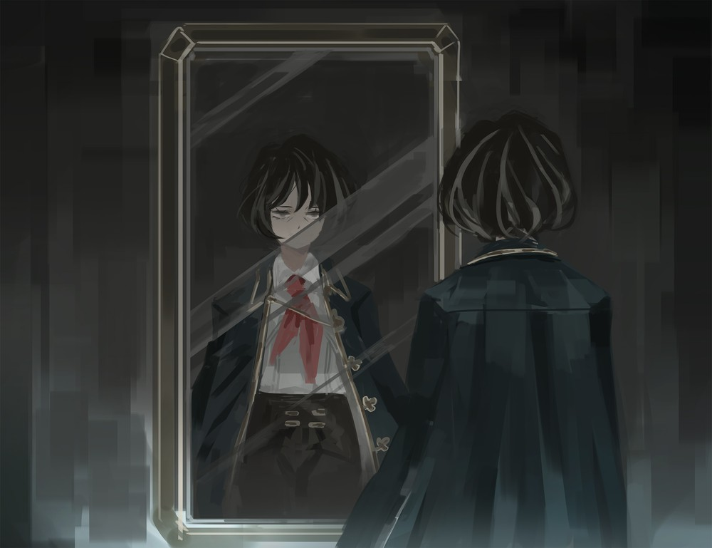

<h2 style="text-align:center;">1. Причина / 2. Объяснение / 3. Понимание / 4. Признание</h2>

Я вижу Искажение, и Искажение может произойти с кем угодно. Я не знаю точно, кто ввёл термин "Искажение" для этого феномена, люди просто в какой-то момент начали его так называть. Никто не знает, как оно работает, но имеющийся опыт говорит о том, что этот феномен — проявление сильных эмоциональных желаний и резких всплесков чувств.

"Статья на Вики</a> Печально известное Искажение, произошедшее за несколько лет до событий Limbus Company. Опустошило жилые кварталы Подворотен Района 9, в результате чего погибло 80% всего населения района, включая известного Цветного Корректировщика <a href='https://projectmoon.wiki.gg/ru/wiki/%D0%90%D0%BD%D0%B6%D0%B5%D0%BB%D0%B8%D0%BA%D0%B0_(%D0%91%D0%A0)' target='_blank'>Анжелику</a>, 'Чёрная Тишина'  <i>Это большое и величественное пианино, сделанное из ста тысяч человек...</i> <i>Прекрасный звук, создаваемый каждым движением сухожилий.</i> <i>Это заставило меня понять, как прекрасны звуки, которые человек может издавать в руках правильного исполнителя~</i>">Пианист", который, или, вернее, то, что устроило хаос в 9-ом Районе, известен как один из самых примечательных случаев Искажения. Немногим известно, что даже сейчас по всему Городу то-тут-то-там происходят менее масштабные случаи Искажения. Человек, превратившийся в рыбу, и другой, чьи глаза окрасились в цвета неба, — два таких примера.

Искажение предстаёт передо мной буквально как визуальные искажения на теле человека. Хотя я могу их видеть, они неосязаемы; в случае того человека, чья верхняя часть тела постепенно превратилась в рыбу, я могла ясно наблюдать, как на его теле растёт чешуя, но когда я касалась его кожи, то ощущала лишь обычную, гладкую кожу человека. Услышав всё это, можно решить, что Искажение — всего лишь иллюзия. Что ж, это означало бы, что я попросту брежу и страдаю от галлюцинаций, однако я взялась за эту работу именно потому, что это не так.

Я охочусь за Искажением. Оно скрытно, но явно, и движется медленно. Например, тот человек-рыба, о котором я упомянула ранее, получивший прозвище "Мерфолк", претерпевал постепенные изменения: у него вылезли глаза, появились жабры, а из кожи проступила чешуя. Когда его верхняя часть тела почти полностью превратилась в рыбу, изменение материализовалось в одно мгновение. Только тогда другие смогли увидеть, во что превратился "Мерфолк", и физически ощутить рыбьи черты его тела.

 
"Мерфолк" (Дело №5) изначально был жителем рыбацкой деревушки 19-го Района, который постоянно подвергался насилию. Похоже, он проводил большую часть времени, глядя на великое озеро, мечтая сбежать от своей нынешней жизни. Мой вывод таков: он желал освободиться от своих мук и видел в озере путь к спасению, и эта сильная тяга к воде в конечном счёте исказила его в "Мерфолка". Конечно, здесь замешано множество других сложных факторов, но я опущу детали, поскольку Мерфолк не является главным предметом моего рассказа.

Моя работа — выслеживать случаи Искажения и предотвращать их. На самом деле, процесс Искажения различен для каждого человека. С тех пор как я обрела эту способность видеть глазами предзнаменования Искажения, я не могу увидеть ни одного человека, который так или иначе не был бы искажён.

 
Повторюсь, у меня нет какого-то глубокого понимания этого феномена или чего-то подобного. Я просто начала видеть его однажды и могла замечать его раньше других. Поскольку я заранее вижу признаки, я делаю всё возможное, чтобы предупредить людей и принять превентивные меры до того, как Искажение проявится. Это моя работа.

Меня наняла фирма, которая потеряла нескольких сотрудников в так называемом "Инциденте Вознесения" и разыскивала работников, чьи глаза были наполнены цветами неба. Фирма посоветовала им носить солнцезащитные очки. Идея дать им очки, чтобы они не могли постоянно держать картину неба в глазах, была настолько диковинной, что вызвала у меня усмешку. Тот факт, что небо перестало быть для них голубым, не сильно улучшил их скучные жизни, но по крайней мере они больше не испарялись.

Люди, которые раньше смотрели на небо, стали смотреть вниз. Возможно, они всё ещё хотели приблизиться к небу, поднимаясь на крышу, а может, просто были одними из многих, кто прыгал насмерть. Город не слишком интересуется тем, что происходит после того, как дело решено. Им лишь нужно знать, были ли смерти понятными или нет. Я не благотворитель, поэтому не утруждаю себя расследованием случаев Искажения, которые меня не просили расследовать.

 
Дело №13 — "Люди-Воздушные Шары"

Это было достаточно... взрывное дело. Я назвала это дело "Люди-Воздушные Шары", потому что головы людей буквально раздувались, как воздушные шары, пока не лопались. Этот холодный взрыв покрывал всё в радиусе 10 метров кровью и также разрывал на куски всех, кто находился в его зоне действия. Компания в Гнезде Корпорации O наконец-то обратилась ко мне за помощью после пяти таких случаев с "Людьми-Воздушными Шарами". После расследования я выяснила, что у всех случаев этого Искажения было одно общее: все они работали в сфере услуг.

Чтобы интерпретировать Искажение, нужно собрать воедино несколько доказательств. Этот процесс состоит из четырёх этапов: причина, объяснение, понимание и признание. Сначала исследуй возможные причины Искажения и сформулируй чёткое объяснение, убедительно описывающее причинно-следственную связь. Затем заставь субъекта понять, почему с ним происходит Искажение, и добиться, чтобы он признал, что при таком раскладе может полностью исказиться. Если все эти этапы пройдены успешно, дело закрыто. Искажение считается "решённым", если субъект возвращается к форме, которая выглядит достаточно человечно на мой взгляд.

Те, кто становились "Людьми-Воздушными Шарами", работали в эмоционально напряжённых сферах, таких как курьеры, медсёстры и операторы колл-центров. В частности, у операторов колл-центров был самый большой средний радиус взрыва — 16 метров. Некоторые запросы выявили, что одна компания отдавала все звонки службы поддержки на аутсорсинг одному колл-центру. Работа операторов заключалась в записи претензий клиентов и отправке этих записей в ту компанию. Проблема крылась в этом процессе. Операторы колл-центра не обладали никакой экспертизой в предмете жалоб, однако им приходилось выдерживать груды оскорблений от клиентов, хоть и вымещать на них зло не имело никакого смысла. С операторами обращались как с эмоциональными мусорными вёдрами, они слышали от клиентов всяческие оскорбления и даже угрозы.

Работники сферы услуг вынуждены надевать улыбку и весёлый голос, будучи при этом грушей для битья, и у них нет способа выплеснуть собственный стресс. Такой стресс, естественно, накапливается со временем. Это привело к тому, что их головы раздувались, как воздушные шары, в то время как внешне они сохраняли маску невозмутимости. В итоге они взрывались, как только стресс достигал критической точки. С этого момента моя работа проста. Я составила список операторов, чьи головы казались мне раздутыми, и отправила его компании. Этих операторов затем уволили. Компания не стала тратить время и силы на то, чтобы "сдуть" их головы; моя работа часто заканчивается до того, как я могу перейти к этапам "понимания" и "признания".

Простое объяснение Искажения не решает фундаментальной проблемы. Их стресс так или иначе должен взорваться, однако подобные вопросы мало заботили моих клиентов. Всё, что их волновало, — это содержание этого ненормального положения вещей и уклонение от ответственности за Искажение, не его причина. Полагаю, то же самое можно сказать и обо мне. Я не могу не думать, что мы все упускаем что-то важное. Думаю, что я ещё долго буду охотиться за Искажениями, ведь в моих глазах искажена буквально каждая вещь.

Сейчас я смотрю в зеркало. В моих глазах я единственная, кто не кажется искажённым. В мире, полном искажённых людей, может ли та единственная, кто остаётся неизменной, быть "искажённой"? Когда я смотрю на всех искажённых людей, искажённые улицы и этот искажённый Город, я начинаю думать, что, возможно, искажён весь мир. Я не могу представить, что произойдёт, когда искажение этого мира продолжится и достигнет критической точки.

До тех пор я буду бдительно следить за Искажением. Я Детектив Искажения.

