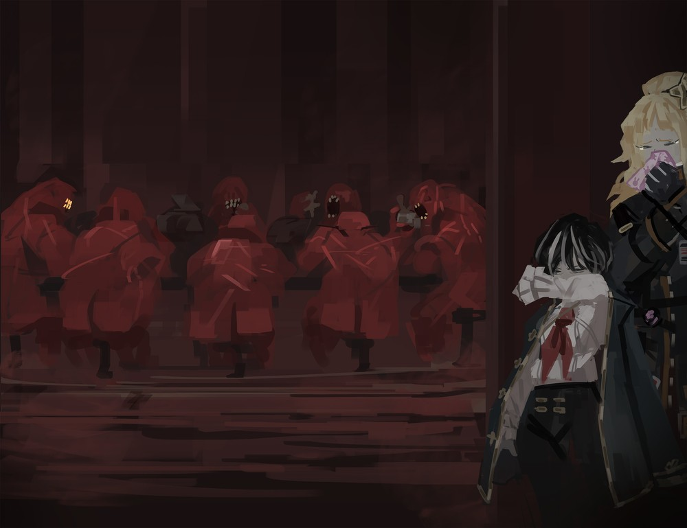

<h2 style="text-align:center;">Мозес и Эзра</h2>

"Идиотка..."

Тихо прошипела я, стиснув зубы. Эзра снова отличилась. Я тысячу раз говорила ей не задавать щекотливых вопросов субъектам Искажения. Эзра тут же прошептала мне.

"Уаааааа... Детектив! Детектив! Что нам делать?!"

"Хахаха, простите, шеф. Моя племянница ещё не очень уличная, понимаете! О, ты мой милый юный росточек~ Что за 'детектив'? У тебя опять галлюцинации? Бедняжка..."

"...Хм, значит, вы просто парочка психованная. Если ещё раз устроите истерику и помешаете моему бизнесу, я вызову охрану!"

— крикнул на нас шеф-повар. Хотя для такого заведения этот ресторан был слишком мал и потрёпан, чтобы носить столь роскошные звания...

"Конечно~ Я научу свою девочку себя вести~!

...Ты с ума сошла? Неужели обязательно было так громко говорить: 'Вау~ Еда здесь отвратительна на вкус, как и санитария! Кто вас учил готовить?' — в маленьком ресторанчике, который и так не ломится от гостей?"

"Но на вкус это и правда было ужасно..."

"Думаешь, мы здесь ради гастрономического удовольствия? Твоя задача — осторожно осматриваться в поисках улик. Просто впихивай еду в рот, пока шеф не заподозрил неладное."

"Эта еда наверняка и есть причина исчезновений. Спорим, этот отвратительный вкус сводил людей с ума и заставлял их скитаться."

"Урезаю тебе зарплату."

"Чего?!"

"На 25%."

"Уаааххх, детектив, пожалуйста!"

 
 
Я достала трубку из внутреннего кармана пальто. Дело, возможно, зашло в тупик, но как-нибудь всё должно разрешиться. С этим оптимизмом я закурила. Я — Статья на Вики</a>  Корректировщики (Fixers) — посредники, готовые за достойную плату взяться за любые задания, начиная с поиска кошки и защиты клиентов, заканчивая убийством и шпионажем. Если в деле замешаны деньги, там в любом случае будут Корректировщики, представляющие интересы той или иной <a href='https://projectmoon.wiki.gg/ru/wiki/%D0%9A%D0%BE%D1%80%D1%80%D0%B5%D0%BA%D1%82%D0%B8%D1%80%D0%BE%D0%B2%D1%89%D0%B8%D0%BA%D0%B8#%D0%90%D1%81%D1%81%D0%BE%D1%86%D0%B8%D0%B0%D1%86%D0%B8%D0%B8-0' target='_blank'>Ассоциацией</a>  Главным отличием Корректировщиков от <a href='https://projectmoon.wiki.gg/ru/wiki/%D0%A1%D0%B8%D0%BD%D0%B4%D0%B8%D0%BA%D0%B0%D1%82%D1%8B' target='_blank'>Членов Синдиката</a> является наличие Лицензий, выдаваемых <a href='https://projectmoon.wiki.gg/ru/wiki/%D0%90%D1%81%D1%81%D0%BE%D1%86%D0%B8%D0%B0%D1%86%D0%B8%D1%8F_%D0%A5%D0%B0%D0%BD%D0%B0' target='_blank'>Ассоциацией Хана</a> и строжайшая иерархия: Каждый Корректировщик закреплён за определённым Офисом, а большинство Офисов управляется одной из двенадцати Ассоциаций, которые, в свою очередь, подчиняются Ассоциации Хана. Быть Корректировщиком - означает быть звеном в длинной бюрократической цепочке.  <i>Начиная от простого поручения по разведке и заканчивая убийством людей, они выполняют свою работу до тех пор, пока будет продолжаться финансирование.</i> — <a href='https://projectmoon.wiki.gg/ru/wiki/%D0%98%D1%81%D0%BF%D1%8B%D1%82%D0%B0%D0%BD%D0%B8%D1%8F_(%D0%9A%D0%9B)#%D0%A0%D0%B0%D1%81%D1%81%D0%B2%D0%B5%D1%82_2' target='_blank'>Ордеал 'Белый рассвет'</a>">Корректировщик из Статья на Вики</a>  Корпорация N, или Nagel und Hammer. Известна престижными университетами и необычным обликом городов с полностью белыми зданиями. Культура Корпорации N превозносит опыт как высшую ценность и нередко критикует использование протезов, считая боль неотъемлемой частью человеческого существования, из-за чего внутри Крыла возникли противоборствующие фракции, самая известная из которых — Инквизиция.  Помимо этого, в Районе существует целых 14 <a href='https://projectmoon.wiki.gg/ru/wiki/%D0%93%D0%BE%D1%80%D0%BE%D0%B4#%D0%A2%D0%B0%D0%B1%D1%83_%D0%B3%D0%BE%D1%80%D0%BE%D0%B4%D0%B0' target='_blank'>Табу</a>, самое известное из которых это запрет на съёмку на территории Района.  За нарушение Табу направляются высококлассные '<a href='https://projectmoon.wiki.gg/ru/wiki/%D0%9A%D0%BE%D1%80%D1%80%D0%B5%D0%BA%D1%82%D0%B8%D1%80%D0%BE%D0%B2%D1%89%D0%B8%D0%BA%D0%B8#%D0%9E%D1%81%D0%BE%D0%B1%D1%8B%D0%B5_%D1%80%D0%B0%D0%B7%D0%BD%D0%BE%D0%B2%D0%B8%D0%B4%D0%BD%D0%BE%D1%81%D1%82%D0%B8_%D0%BA%D0%BE%D1%80%D1%80%D0%B5%D0%BA%D1%82%D0%B8%D1%80%D0%BE%D0%B2%D1%89%D0%B8%D0%BA%D0%BE%D0%B2-0' target='_blank'>Охотники за табу</a>', чья задача — устранение последствий нарушения и задержание/убийство виновных. Охотники работают исключительно на территории Района, но иногда могут быть поручены преследовать нарушителя на территории другого Района, в таких случаях они не могут действовать свободно и обязаны получить разрешение у Крыла, которое контролируют эту территорию.  <i>Nagel und Hammer... Крыло, для которого опыт превыше всего.</i> — <a href='https://projectmoon.wiki.gg/ru/wiki/%D0%9C%D0%B5%D1%80%D1%81%D0%BE_(%D0%9A%D0%9B%D0%91)' target='_blank'>Мерсо</a>">14-го Района, достаточно опытная для Статья на Вики</a>  Ранги - способ оценивания сил и навыков Корректировщика, где самый низкий ранг - 9-ый, а самый высокий - 1-ый. Самых выдающихся Корректировщиков 1-го ранга награждают Цветом. Чем выше ранг Корректировщика, тем у него более широкий диапазон запросов и, соответственно - денег и славы. <a href='https://projectmoon.wiki.gg/ru/wiki/%D0%90%D1%81%D1%81%D0%BE%D1%86%D0%B8%D0%B0%D1%86%D0%B8%D1%8F_%D0%A5%D0%B0%D0%BD%D0%B0' target='_blank'>Ассоциация Хана</a> контролируют как систему рангов так и корректировщиков в целом, и может как понизить, так и повысить ранг в зависимости от совершаемых действий.">5-го Ранга, в настоящее время работаю на "Статья на Вики</a>  Одна из двенадцати <a href='https://projectmoon.wiki.gg/ru/wiki/%D0%9A%D0%BE%D1%80%D1%80%D0%B5%D0%BA%D1%82%D0%B8%D1%80%D0%BE%D0%B2%D1%89%D0%B8%D0%BA%D0%B8#%D0%90%D1%81%D1%81%D0%BE%D1%86%D0%B8%D0%B0%D1%86%D0%B8%D0%B8-0' target='_blank'>ассоциаций</a> Города, специализирующаяся в расследованиях и больше всего напоминает детективов или частных сыщиков. При этом они активно решают проблемы, которые расследуют, вплоть до наказания преступника, например за убийство. Основная деятельность связана с сбором информации, поэтому их Корректировщиков ценят за наблюдательность и умение сохранять секретность.  Ассоциация также владеет кафе, управляемыми сотрудниками, где Корректировщиков могут добровольно привлекать к работе бариста в свободное от миссий время.">Севен" — ассоциацию, специализирующуюся на разведке и расследованиях. Я зарабатываю на жизнь раскрытием тайн, хотя большинство этих "неразгаданных" дел, так или иначе, связаны с Искажением. Город, кажется, по-прежнему почти ничего не знает об Искажении; я просто раньше других прыгнула в эту нарождающуюся нишу благодаря своему проклятому дару: видеть искажения людей.

 
 
"Итак, детектив, как для тебя выглядел шеф-повар?"

"Нижняя половина его тела была змеиной. А на хвосте... хвостах... были прикреплены руки. Их было штук семь, если я правильно помню."

"Фууу~ А верхняя часть? Человеческая?"

"Ага. Я видела человека в грязной поварской форме."

"Значит, Искажение прогрессировало примерно наполовину? Может, оно проявится через неделю или около того..."

"Судя по обстоятельствам, это может случиться уже сегодня ночью. Рот на одном из хвостов довольно интенсивно дергался и пускал слюни."

"В любом случае, мы имеем дело с рептилией, верно? Дай подумать... Подойдёт продукт от Статья на Вики</a>  В ином переводе, Мастерская Клейма. Специализируется в создании снаряжения, которое нагревается.  Примеры использования снаряжения из этой мастерской это сотрудники <a href='https://projectmoon.wiki.gg/ru/wiki/%D0%9E%D1%84%D0%B8%D1%81_%D0%A0%D0%B0%D1%81%D1%81%D0%B2%D0%B5%D1%82%D0%B0_(%D0%91%D0%A0)' target='_blank'>Офиса Рассвета</a>, например <a href='https://projectmoon.wiki.gg/ru/wiki/%D0%A4%D0%B8%D0%BB%D0%B8%D0%BF_(%D0%91%D0%A0)' target='_blank'>Филип</a> и его <a href='https://projectmoon.wiki.gg/ru/wiki/%D0%A1%D0%B8%D0%BD%D0%BA%D0%BB%D0%B5%D1%80_(%D0%9A%D0%9B%D0%91)/%D0%9A%D0%BE%D1%80%D1%80%D0%B5%D0%BA%D1%82%D0%B8%D1%80%D0%BE%D0%B2%D1%89%D0%B8%D0%BA_%D0%BE%D1%84%D0%B8%D1%81%D0%B0_%D0%A0%D0%B0%D1%81%D1%81%D0%B2%D0%B5%D1%82%D0%B0' target='_blank'>зеркальная идентичность на Синклера</a>.">Мастерской Стигма!"

"Ты всегда выбираешь дорогие безделушки."

 
 
В последнее время паттерн Искажения меняется. Проявления происходят быстрее. Нет, если точнее, Искажение начало проявляться даже пока люди находятся без сознания. Верно, их тела искажаются во сне. Это, судя по всему, случается с теми, кого я вижу наполовину искажёнными. Небрежный монстр способен нанести лишь небрежный ущерб.

Ассоциация "Статья на Вики</a>  Одна из двенадцати <a href='https://projectmoon.wiki.gg/ru/wiki/%D0%9A%D0%BE%D1%80%D1%80%D0%B5%D0%BA%D1%82%D0%B8%D1%80%D0%BE%D0%B2%D1%89%D0%B8%D0%BA%D0%B8#%D0%90%D1%81%D1%81%D0%BE%D1%86%D0%B8%D0%B0%D1%86%D0%B8%D0%B8-0' target='_blank'>ассоциаций</a> Города, специализирующаяся в защите гражданских и соблюдении порядка, иными словами - полиция. Защита их главный приоритет, в первую очередь они стремятся защитить их клиента и убивают только в критических ситуациях.  Цвай делится на два филиала, Южная и Западная, где первая обычно работает под прикрытием, а вторая открыто носит тяжёлую броню, устрашая убийц прежде чем они нападут.  <i>Мы Цвай, 'Ваш Щит'</i> — Слоган Цвай">Цвай" дала нашему Офису запрос. Люди пропадают по ночам в определённом отеле на территории, которую ассоциация взяла под охрану. В Подворотнях Района 14 ведение записей было запрещено, поэтому видеофрагментов нет. В отеле всего два входа: главные ворота и чёрный ход через кухню. Ни один из пропавших постояльцев не был замечен выходящим через главный вход. На отель также не нападал Синдикат, что было очевидно, учитывая, что за этот район отвечали "Цвай".

 
 
"Детектив, детектив. Может, с кухней и правда что-то не так?"

"Её шеф был самым искажённым человеком поблизости, так что это вероятно."

Солнце садится, наступает ночь. Мы проникаем в ресторан отеля. "Корпорации F</a> (6-ой Район), чья Сингулярность сосредоточена на создании Фей, обладающих способностью 'открывать' что угодно — как в буквальном, так и в концептуальном смысле.  Феи это физические создания маленького размера, помещающиеся в карман, способные залетать в замок и открывать его изнутри. После использования, их необходимо заряжать, что стоит немало денег, как и покупка самой Феи. Пока что неизвестно как именно Феи открывают что-либо в 'концептуальном' смысле.">Фея", на которую я потратила целое состояние, входит в замочную скважину и открывает нам дверь. Порой Статья на Вики</a>  Уникальные технологии, что позволяют нарушать законы мироздания. Ими владеют Крылья и Мастерские, однако у последних они слабее. Сингулярности являются основным источником дохода для крыльев и мастерских и могут быть использованы как в коммерческих, так и военных целях.  <i>Люди просто тратят деньги и получают то, что хотят. Нет причин задумываться о том, как все устроено.</i> — <a href='https://projectmoon.wiki.gg/ru/wiki/%D0%A0%D0%BE%D0%BB%D0%B0%D0%BD%D0%B4_(%D0%91%D0%A0)' target='_blank'>Роланд</a>">Сингулярности кажутся куда более чудовищными, чем недоделанные существа, рождённые Искажением.

"Вау~ У них что, вечеринка?"

"Что они едят?"

 
 
Под красным светом бесшкурные глыбы плоти сидели вокруг стола и что-то ели. Единственным блюдом на столе было нечто, похожее на большой кожаный мешок. Они поочерёдно выхватывали что-то из мешка и ели. Гнилостный запах резанул мне в нос. Сознание на мгновение поплыло.
 
 
 

 
 
"Отвернись! Не смотри на то, что они едят. Не дыши!"

"Это сводит меня с ума, детектив... Но там так уютно выглядит? Похоже на спальный мешок..."

"Тебя съедят и превратят в навоз, как только ты окажешься в этом 'спальном мешке'."

"......"

Эзра была полностью заворожена. Я ударила её по груди так тихо, как только могла.

"Гхек."

Я дала Эзре носовой платок, чтобы она могла закрыть нос.

"Плотно прижми. Мы направляемся на кухню."

Оставив пиршество позади, мы поползли к кухне. Перед ней выстроилась длинная очередь людей. Это были те, о чьём исчезновении сообщалось. Они по одному заходят на кухню, а затем выходят глыбы плоти в форме человека, каждая с кожаным мешком. Они относят его к своему столу и едят из него.

"Еда, которая завораживает людей, значит..."

"Что же они едят, детектив?"

"Пора выяснить. Готовься, ассистент."

Эзра достала из сумки меч от Мастерской Стигмы. Я вынула свою курительную трубку. Дверь, ведущая на кухню, распахнута настежь. Люди, выстроившиеся в очередь за своим мешком, не обращают на нас внимания. Они просто что-то бормочут себе под нос. Мы продвигаемся медленно.

"...Заходим."

 
 
Я слышу звук работающей кухонной утвари. Шеф занят приготовлением чего-то, удерживая множество кухонных приборов руками на своих хвостах. Что же он готовит? Чем он кормит этих людей...

 
 
"Детектив. Люди кланяются шефу, подставляя головы... Шеф раскалывает их и... что-то достаёт? Не похоже на мозг..."

"Он извлекает не сам мозг. Он вытаскивает что-то из него... Может быть... мысли...?"

"Как это возможно?"

"Искажение как раз об этом. Незримые вещи материализуются."

"Значит, они отдают свои мысли шефу, чтобы тот мог их приготовить... И..."

"Шеф ещё и сдирает с них кожу, чтобы использовать её как мешок. Довольно подло."

 
 
Мой взгляд встретился со взглядом шефа.

"Эй, да это же те психованные, которых я видел сегодня днём! Если хотите есть, тогда встаньте в очередь! Вкус будет не чета́ тому, что вы пробовали раньше!"

"Чем ты кормишь этих людей?"

"Я даю им то, чего они хотят. Я готовлю мысли. Люди в наши дни даже не знают, о чём они думают, поэтому им нужен кто-то другой, чтобы приготовить эти мысли и накормить ими."

"Ты уже убил этих людей..."

"Случай Искажения, способного на убийство, будет... согласно стандартам, установленным нашим Офисом, эм... Искажение 3-го уровня риска."

"Убийство? Они не мертвы. Они пируют, разве не видите? Обычной еды уже недостаточно, чтобы сделать людей счастливыми. Нужно знать, кто ты и в каком мире живёшь, чтобы по-настоящему насладиться вкусом."

"Это почти как дешёвый Статья на Вики</a>  Уровни угрозы, выдаваемые Ассоциацией Хана всем существующим группам, офисам, ассоциациям и т.д. на территории города, начиная с обычных бандитских группировок и заканчивая 'нечистотой', выдаваемой тем кого сама Глава считает нечистью которая должна быть вычищена с лица Города.  Всего существует 7 уровней угроз: Слух (Canard), Городской миф (Urban Myth), Городская легенда (Urban Legend), Городская чума (Urban Plague), Городской кошмар (Urban Nightmare), Городская звезда (Star of the City), и Городская нечистота (Impuritas Civitatis).  Как пример, одно из первых Искажений, Пианист, имел уровень угрозы Городского кошмара.">Городской Миф. Ты зашёл слишком далеко."

"Вааах, детектив! Все мясистые твари из ресторана зашли сюда!!"

"Вы просто ещё не пробовали... Я покажу вам, какой вкус у ваших мыслей..."

"Эзра, разберись с ними."

Меч из Мастерской Стигмы излучает оранжевое свечение. Проволока на его лезвии раскаляется. Каждый раз, когда Эзра взмахивает мечом, одна из глыб плоти падает на пол. Раскалённая проволока оставляет красивые символы на разрезанных участках — отличительная черта продуктов Мастерской Стигмы. Вскоре кухню наполняет запах горелого мяса.

 
 
Разумный случай Искажения, который сознательно причиняет вред другим, в конечном счёте подлежит ликвидации. Порой мы сталкиваемся с Искажениями, которых не можем одолеть самостоятельно, но с большинством из них всё же можно справиться тем или иным способом. Такой вид особенно прост.

"А ты сам пробовал своё блюдо?"

Противоречие в самой сути. Искажения, которые вредят другим, утверждая, что заботятся о них, обречены столкнуться с иронией.

"......"

"Значит, ты кормишь других блюдом, которое даже сам не пробовал? Что даёт тебе такую уверенность в его вкусе, а?"

"...Моя еда должна быть вкусной! Все клиенты выглядели грустными и угрюмыми, даже когда я подавал им самую вкусную еду раньше. Всё потому, что они не думали самостоятельно!"

"Ты можешь определить, вкусна ли еда, просто по лицу человека? Тот, кто не пробует собственное блюдо, не является настоящим шефом."

"Мммрг... Ладно! Я съем её! Я съем свою собственную еду!"

"Вот и хорошо. Это дух настоящего шефа."

 
 
Шеф расколол свою собственную голову.

Он запустил руку в свой мозг и вытащил что-то светящееся.

Как только шеф закончил извлекать все "мысли", он рухнул на пол.

Вот так, шеф скончался, так и не успев попробовать вкус своих собственных мыслей.

 
 
"Детектив! Я со всеми разобралась!"

"Я со своей частью тоже закончила."

"Стоит ли нам теперь связаться с ассоциацией 'Цвай'?"

"Да, просто составь краткий отчёт. Они всё равно не поверят во всю эту историю с приготовлением мыслей. Я пойду сначала посплю."

"Поняла~"

 
 
 
"Доброе утро, детектив Мозес! Вы сегодня чуть позже обычного, да?"

"А, да, сегодня была длинная очередь в Статья на Вики</a>  Сеть ресторанов во вселенной Project Moon, взявшая своё начало в <a href='https://projectmoon.wiki.gg/ru/wiki/%D0%93%D0%BE%D1%80%D0%BE%D0%B4#%D0%A0%D0%B0%D0%B9%D0%BE%D0%BD_13' target='_blank'>13-ом Районе</a> и вскоре распространившаяся по всему Городу. Также существует в реальном мире в Южной Корее где есть множество декораций и предметов отсылающиеся на игры и вселенную Project Moon в целом.  <i>Встречая страх, пейте кофе</i> — Девиз НямНям-ПэнПэн">НямНям-ПэнПэн. Наверное, все хотят заглянуть, раз это первый открывшийся на севере Города."

"О... НямНям-ПэнПэн... А мне что-нибудь принесла?"

"Да, на всякий случай взяла и для тебя. Тебе же нравится с горчицей?"

"Хе-хе, горчичный вкус отличный! А, 'Цвай' только что прислали нам награду."

"Так быстро? У них на это ушёл всего день. Уверена, они схалтурили на бумажной работе."

"В общем, если подытожить это дело, речь шла о непризнанном поваре, который хотел приносить людям радость по-своему, извращённым способом!"

"Это была грубая история. Если задуматься, в последнее время нам всё чаще приходится разбираться с Искажением своими силами"

"Почему Крылья и другие Ассоциации так пассивны в этом вопросе? Монстры же действительно появляются!"

"Потому что ни один из них не был достаточно значительным, чтобы считаться даже Городской Чумой, ну, за исключением разве что 'Пианиста'."

"И всё же, разве кто-то не должен что-то с этим делать?! Это как бомба с часовым механизмом!"

"Готова поспорить, от рук Синдикатов гибнет куда больше людей, чем от Искажения."

"Кстати, ты ведь не собираешься на самом деле урезать мне зарплату, да? Еда того тупого шефа и правда была причиной!"

"Пф, попробуй использовать эту хорошую память для чего-нибудь получше."

"Я всё слышу!"

 
 
 
<h2 style="text-align:center;">Что ждёт в следующей главе...</h2>

Эта комната дышит. 
Я чувствую её дыхание. Её ритм. 
Никто не знает, сколько людей поглотила эта комната. 
Передо мной стоит умирающая старуха. Одинокая старуха, чьё дыхание слабее, чем у комнаты. 
Забытая другими, этот дряхлый человек приводил и принимал людей. По мере того как эта старуха стиралась из памяти всех, стирались и люди, которых она принимала. 
Ни единый человек не знает о них. 
Они были здесь, умирая в полном одиночестве.
