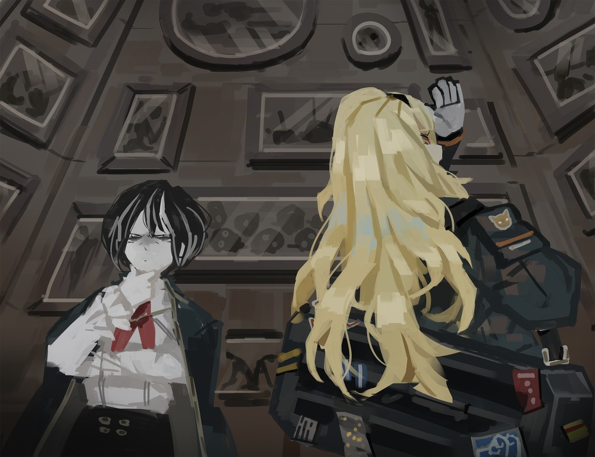

<h2 style="text-align:center;">А я просто помню.</h2>

Детективное бюро по нераскрытым делам, расположенное в 3-этажном здании где-то на улицах 14-го Района.

Загадка, как люди вообще находят дорогу в мой скромный Офис.

"Ходят слухи о заколдованном переулке. Люди, которые проходят мимо него, исчезают."

"А как именно они исчезают?"

— с любопытством спросила Эзра у клиентки.

"Никто не знает, кто исчез и как. Всё, что известно — это то, что кто-то и как-то исчез."

"Тогда это либо Манипулятор Памяти, либо Исказитель Реальности."

"Но детектив, я думала Исказители Реальности лишь ваша теория?"

"Возможно, это наш шанс увидеть одного впервые."

"Что это всё вообще значит?"

"Ахаха, это просто наш жаргон. Кстати, где именно они пропадали?"

Эзра сменила тему, прежде чем клиентка успела задать ещё вопрос.

"Где-то возле Площади Заветных Надежд."

"Это не слишком далеко отсюда."

"А как вы узнали, что люди пропали?"

"Найденные брошенные на улице использованные транспортные средства и предметы, вроде велосипедов и машин. И больше всего — мебель на моём чердаке была расставлена так, будто там кто-то жил вплоть до сегодняшнего дня."

"Значит, пропал один из членов вашей семьи."

"А? Но в моей семье всего три человека, и все в порядке. Я, мой муж и мой ребёнок."

"Это выяснится в ходе расследования."

"...Что если на самом деле существовал ещё один член семьи, о котором я забыла, как вы говорите? И если он мёртв...

*...Виновника следует убить.*"

"Довольно сурово."

"Что ж, тогда~ Пора обсудить гонорар за запрос!"

Глаза Эзры заискрились, когда она заговорила. Я поручила ей финансовое управление нашим Офисом. У неё достаточно сообразительности, чтобы оценить, насколько серьёзным или сложным будет запрос, поэтому я могу доверить ей ведение подобных переговоров. Я вышла на террасу, пока Эзра и клиентка торговались.

Я курю из трубки, чувствуя едкий ветерок Подворотен. Всё же этот воздух куда чище по сравнению с грязной атмосферой во время Статья на Вики</a>  В ином переводе, Дымная война. Один из крупнейших военных конфликтов из числа произошедших в новейшей истории Города.  Причиной войны была <a href='https://projectmoon.wiki.gg/ru/wiki/%D0%9A%D1%80%D1%8B%D0%BB%D1%8C%D1%8F#%D0%9F%D0%B0%D0%B2%D1%88%D0%B8%D0%B5_%D0%9A%D0%BE%D1%80%D0%BF%D0%BE%D1%80%D0%B0%D1%86%D0%B8%D0%B8' target='_blank'>Старая Корпорация L</a>, а именно её плохая репутация среди горожан и других Крыльев, поскольку почти не делилась вырабатываемой энергией и загрязняла своей <a href='https://projectmoon.wiki.gg/ru/wiki/%D0%A1%D0%B8%D0%BD%D0%B3%D1%83%D0%BB%D1%8F%D1%80%D0%BD%D0%BE%D1%81%D1%82%D1%8C' target='_blank'>Сингулярностью</a> окружающую среду.  Во время Войны, союзниками Старой Корпорации L являлись Корпорации <a href='https://projectmoon.wiki.gg/ru/wiki/%D0%9A%D1%80%D1%8B%D0%BB%D1%8C%D1%8F#%D0%9A%D0%BE%D1%80%D0%BF%D0%BE%D1%80%D0%B0%D1%86%D0%B8%D1%8F_%D0%95' target='_blank'>E</a>, <a href='https://projectmoon.wiki.gg/ru/wiki/%D0%9A%D1%80%D1%8B%D0%BB%D1%8C%D1%8F#%D0%9A%D0%BE%D1%80%D0%BF%D0%BE%D1%80%D0%B0%D1%86%D0%B8%D1%8F_F' target='_blank'>F</a>, и более известная <a href='https://projectmoon.wiki.gg/ru/wiki/%D0%9A%D1%80%D1%8B%D0%BB%D1%8C%D1%8F#%D0%9F%D0%B0%D0%B2%D1%88%D0%B8%D0%B5_%D0%9A%D0%BE%D1%80%D0%BF%D0%BE%D1%80%D0%B0%D1%86%D0%B8%D0%B8' target='_blank'>Старая Корпорация G</a>, использовавшая биомодифициорованных солдат-насекомых, но в конце концов павшая вместе с Старой Корпорацией L.  Оппозиционерами Старой Корпорации L были многочисленные элитные Офисы, Корректировщики, а основными силами являлись Корпорации <a href='https://projectmoon.wiki.gg/ru/wiki/%D0%9A%D1%80%D1%8B%D0%BB%D1%8C%D1%8F#%D0%9A%D0%BE%D1%80%D0%BF%D0%BE%D1%80%D0%B0%D1%86%D0%B8%D1%8F_I' target='_blank'>I</a>, <a href='https://projectmoon.wiki.gg/ru/wiki/%D0%9A%D1%80%D1%8B%D0%BB%D1%8C%D1%8F#%D0%9A%D0%BE%D1%80%D0%BF%D0%BE%D1%80%D0%B0%D1%86%D0%B8%D1%8F_K' target='_blank'>K</a>, и <a href='https://projectmoon.wiki.gg/ru/wiki/%D0%9A%D1%80%D1%8B%D0%BB%D1%8C%D1%8F#%D0%9A%D0%BE%D1%80%D0%BF%D0%BE%D1%80%D0%B0%D1%86%D0%B8%D1%8F_R' target='_blank'>R</a>  В результате войны, Старые Корпорации L и G пали (участь Корпораий E и F неизвестна), а на месте Старой Корпорации L возникло новое Крыло — <a href='https://projectmoon.wiki.gg/ru/wiki/%D0%9E_%D0%9A%D0%BE%D1%80%D0%BF%D0%BE%D1%80%D0%B0%D1%86%D0%B8%D0%B8_%D0%9B%D0%BE%D0%B1%D0%BE%D1%82%D0%BE%D0%BC%D0%B8%D1%8F' target='_blank'>Корпорация Лоботомия</a>, быстро зарекомендовавшая себя как поставщик <a href='https://projectmoon.wiki.gg/ru/wiki/%D0%AD%D0%BD%D0%BA%D0%B5%D1%84%D0%B0%D0%BB%D0%B8%D0%BD' target='_blank'>экологически чистой энергии</a> и надёжный партнёр, несмотря на секретность производства.">Туманной войны. Искажённые существа, как обычно, бродят по улицам. Размышляя, сколько ещё мне этим заниматься, я выпускаю табачный дым.

"Детектив! Я закончила составлять контракт. Клиентка ушла домой."

"Площадь Заветных Надежд, значит... Готовься."

"Есть, шеф~ Приборчики брать как обычно?"

— спросила Эзра, пихая снаряжение в свою пространственную сумку.

"Ага."

 
 
 
Я иду по улице вместе с Эзрой. Время — два часа дня.

"Та-даа~ Вот мы и на Площади Заветных Надежд! Чего теперь делаем? Ждём, пока стемнеет?"

Судя по описанию клиентки, это дело похоже на Локационное Искажение. Мощное Искажение может влиять и на своё окружение, ассимилируя близлежащие объекты.

"Следует поискать искажённые здания."

"Но ведь только ты можешь видеть эти странные домики, детектив~ А мне что делать?"

"Посмотри, не валяются ли здесь брошенные велосипеды, например."

 
 
Окна с глазами, парящие в воздухе квартиры, двери с зубами, комнаты, заполненные водой... Искажённых зданий гораздо больше, чем кажется. Было бы зрелище, если бы они все проявились разом.

Итак, какое здание исследовать первым? У меня нет никаких конкретных критериев. Обычно достаточно небольшой дедукции и интуиции, чтобы разобраться. Этот случай — Искажение, которое поглощает людей целиком. Жертвы вскоре забываются другими. Что же привлекло их к этому Искажению? Мне нужны профили пропавших, но если никто не знает, кто исчез, будет трудно выявить их общие черты.

"Эзра, поищи здесь место, где раздают товары или услуги бесплатно."

"Чегоо~? Бесплатно? Разве такие места вообще бывают..."

"В идеале — место, куда бы пошли люди без работы."

Именно поэтому это легче выяснить. Искажения этого Города на самом деле довольно просты для понимания.

"А! Вот оно. Место под названием 'Благотворительная столовая Лумир'."

"Есть у него спонсор?"

"Неа, похоже, им управляет частное лицо."

"Веди."

 
 
Люди, которым суждено быть забытыми в Городе, естественным образом потянутся к бесплатной еде.

 
 
"Разве это не фотостудия?"

"Чего? Выглядит как потрёпанная палатка, не?"

"...Это Искажение."

"Она и правда выглядит для тебя как фотостудия, детектив?"

"Угу. Старая студия. Значит, это и есть та самая столовая, да?"

"Агась. В описании сказано, что они раздают бесплатную еду детям или пожилым, которые слишком бедны, чтобы позволить себе что-либо ещё."

"Используем Фею, чтобы войти?"

"Чего?? Ты разве не знаешь, как дорого перезаряжать Фею?! Это же обычный палаточный лагерь. Всё что нужно сделать это просто войти."

"Я спросила, потому что вижу дверь, запертую на замок. Мне не нравится, как ты огрызаешься. Урежу тебе зарплату."

"Чегооо?!"

"Я просто шучу."

"А не слишком ли много удовольствия ты от этого получаешь?! У меня сердце ёкает, даже если это шутка... Скажи, может до ночи подождём?"

"Мы всё ещё можем вмешаться в это Искажение, даже если оно уже так сильно проявилось."

"Так чего же мы ждём тогда!"

"Погоди. Не стоит просто врываться в закрытую часть чужого сознания."

Я подошла к двери и легонько постучала. Вскоре дверь отперли.

"Заходим."

"Что ты только что сделала? Вход открылся сам по себе!"

"Я просто проявила вежливость. Ты сказала не использовать Фею и всё такое, так что всё, что оставалось — это постучать в запертую дверь."

 
 
Фотостудия, устроенная внутри деревянного здания. От всего здания исходит запах древесины. А стены заполнены большими рамками.

"Вау... Она намного больше внутри? Теперь я понимаю, почему ты сказала, что это похоже на фотостудию, детектив."

"Полагаю, теперь и ты её видишь."

"Могут ли эти фотографии на стенах быть пропавшими людьми?"

"Возможно."

В каждой рамке находилась фотография трупа. Различные снимки мёртвых людей. Общая черта — все они умерли в помещении.
 
 
 

 
 
Эта комната дышит. Я чувствую её дыхание. Её ритм. Никто не знает, сколько людей поглотила эта комната. Передо мной стоит умирающая старуха. Одинокая старуха, чьё дыхание слабее, чем у комнаты. Забытая другими, этот дряхлый человек приводил и принимал людей. По мере того как эта старуха стиралась из памяти всех, стирались и люди, которых она принимала. Ни единый человек не знает о них. Они были здесь, умирая в полном одиночестве.

 
 
"Это место поминовения."

Человек, чья голова принимала форму фотоаппарата, заговорил с нами из глубины комнаты. Четыре объектива на его голове беспорядочно вращались, фиксируя взгляд на мне.

"Мамочки!"

Испугавшись, Эзра плюхнулась на пол.

"Я помню каждого человека на этих фотографиях. Я фотографирую их и помещаю в рамки."

"Кто вы такой?!"

"Я фотограф. Вообще-то, это мне следует спросить, кто вы такие?"

"Это Мозес, Детектив Искажений, а я — её талантливая напарница, Эзра!"

Она говорит с уверенностью, так бесстыдно раскрывая наши личности...

"Мы Корректировщики. Вообще, мы получили запрос о недавних случаях исчезновения."

"Значит, они всё же осознают, что некоторые люди пропали. Какой в этом смысл, однако? С ними и до исчезновения обращались как с невидимками..."

"Вы заманивали их сюда бесплатной едой, чтобы убить?"

Эзра допрашивает человека, смотря на него с подозрением.

"Нет, не заманивал. Я просто помню людей, которых обречены забыть, как миссис Агнес вон там. Я фотографирую их, чтобы они могли остаться в памяти в этой комнате."

Пожилой человек, стоящий перед нами, должно быть, Агнес. Она смотрит на фотографии, висящие на стене, тяжело дыша.

"Так много людей умирает в одиночестве. Я понял это, работая, поэтому хочу помнить о них."

"Какой работой, похищением людей?"

"Нет, вовсе нет. Моя работа сопровождалась ужасным смрадом. Когда соседи сообщали о запахе, я шёл и забирал тело."

"Значит, вы были гробовщиком, который обычно имел дело с людьми, умершими одинокой смертью."

"Да. Моя работа заключалась в поиске таких тел на улицах 14-го Района и организации похорон для них, в рамках программ социального обеспечения Гнезда Корпорации N. Я организовал похороны для 253-ёх человек, и ни на одни из них не пришёл ни один соболезнующий. Я решил делать последний снимок умершего перед тем, как забрать его тело, чтобы хотя бы я мог их помнить."

"Значит, вы не с самого начала управляли этой 'благотворительной столовой'?"

"Меня уволили. Гнездо Корпорации N заявило, что им не нужен бесполезный гробовщик вроде меня... В конце концов, похороны проводятся с участием живых, как свидетелей. Меня ждала бы та же участь, ведь меня некому помянуть. Чтобы жизнь имела смысл, воспоминания должны как-то передаваться. Поэтому мы решили помнить друг о друге, помнить, что мы существовали и жили в этом Городе."

"Ты искажён. То, чем ты занимался — это похищение людей, приходящих в твою палатку за бесплатной едой, и ничего больше. Не тебе решать, умерли бы они в одиночестве или нет."

"Но это очевидно! Это так явно, что они все умрут в своих комнатах, брошенные и забытые всеми... Мы будем помнить друг о друге, и нас забудут с миром. Мы имеем право не быть так жестоко проигнорированными всеми!"

"И лишать памяти тех, кто их всё ещё помнит? Ты просто похищал людей, оказавшихся в такой же ситуации, как ты, потому что сам боялся быть забытым. Ты отнял у них шанс быть упомянутыми."

Объективы на его голове внезапно начали вращаться.

*Уиииии...*

Я отпрыгнула в сторону, как только услышала звук чего-то запускающегося.

 
 
*Щёлк!*

Я упала на колени и пошатнулась на полу. Всё тело онемело, острая боль пронзила голову.

"Детектив!"

"Держись подальше от объектива! Не дай ему сделать свой полный снимок!"

Слышны звуки вращающегося объектива и перезарядки плёнки.

Когда он фотографирует кого-то, он что-то вытягивает из этого человека.

Я чувствую острое покалывание по всему телу, будто в меня впиваются многочисленные шипы.

Я помню нескольких, кто причинял подобную боль.

"Эзра! Я ставлю дымовую завесу!"

"Есть, шеф!"

Я достала курительную трубку из пальто и дунула в неё что есть мочи.

 
 
*Пшшииии*

 
 
Дым окутал всю комнату.

*Уииии... Щёлк.*

*Уииии... Щёлк.*

*Уииии... Щёлк.*

Вспышка фотоаппарата срабатывает в случайных направлениях с каждым щелчком.

"Детектив! Что нам теперь делать?!"

Ха-ах...

Тип, которому нельзя позволять видеть.

Я не должна позволить ему заключить нас в свой фокус.

"Что у тебя сегодня в сумке?!"

"Как всегда! Меч Мастерской Стигмы, перчатки Статья на Вики</a>  Мастерская Алласа производит снаряжение и оружие с мини-Сингулярностью, позволяющей ускорять движения в пять раз. Продукцию этой мастерской также использовал Цветной Корректировщик, <a href='https://projectmoon.wiki.gg/ru/wiki/%D0%A0%D0%BE%D0%BB%D0%B0%D0%BD%D0%B4_(%D0%91%D0%A0)' target='_blank'>Чёрная Тишина</a>.">Мастерской Алласа, перчатки Статья на Вики</a>  Мастерская Коори производит перчатки с помощью мини-Сингулярности, позволяющей при касании замораживать любые объекты.">Коори, молот Статья на Вики</a>  Мастерская Нестера производит одноручные молоты, способные вызвать сильные повреждения плоти и костей.">Нестера... и..."

"Кидай мне перчатки Коори!"

"Поняла!"

Только Эзра может видеть меня сквозь этот густой дым.

Пара небесно-голубых перчаток пролетела через комнату, и я тут же схватила их.

Я надела перчатки и ударила рукой по стене.

Стена начала покрываться льдом.

 
 
*Щёлк.*

 
 
*Щёлк.*

 
 
Я глубоко вдохнула через свою трубку.

 
 
*Уииии...*

 
 
Дым, заполнивший комнату, втянулся обратно в трубку.

Сверкающая ледяная стена предстала перед нами.

 
 
*Щёлк.*

 
 
Объектив вспыхнул, фотографируя собственное отражение в ледяной стене.

 
 
*Бах!*

 
 
Фотограф упал, на его голове и объективах появились трещины.

"Ха-ах... Ты заставил других быть забытыми, потому что не хотел погрузиться в забвение в одиночестве."

"Вероятно... Может, это я был единственным, кто полностью потерял шанс быть упомянутым, в конце концов..."

"Сколько людей ты здесь запер?"

"57..."

"Можешь их вернуть?"

"Да... Могу..."

"Тогда твоя жизнь по крайней мере сохранена. Возвращай их сейчас же."

"Но кто теперь будет помнить обо мне?"

"...Мы будем."

"...Спасибо."

Голова Фотографа вернулась к нормальному виду, лишь один глаз сохранил форму объектива.

Студия регрессировала в палатку, теперь заполненную людьми.

Искажение было решено.

 
 
"Мы нашли пропавшего члена семьи. Это он, верно?"

Клиентка выглядит не слишком счастливой.

"Ох... Да... Мой отец вернулся. Ха-ха, неудивительно, что я забыла."

"Ну тогда что ж! Расчитаем остаток?"

Эзра с улыбкой пересчитывала деньги, в то время как клиентка и её отец уходили обратно, выглядя подавленными.

 
 
Никто не был бы рад исходу этого запроса.

Они бы предпочли просто забыть о людях, которые в итоге вернулись.

Они бы бормотали себе под нос, как хотели бы, чтобы эти люди исчезли навсегда.

Позже я услышала, что одним днём из крематориев из Подворотен Корпорации N тихо поднялся дым, равный 58 человеческим жизням.

А я просто помню.

 
 
 
<h2 style="text-align:center;">Что ждёт в следующей главе...</h2>

"Приветствую, доктор Мозес. Давно не виделись."

Меня посетил нежеланный гость. Ассоциированный Корректировщик из 2-го Отдела южного филиала "Севен", и мой бывший помощник, Хи-Джун.

Его глаза такие же надменные, как я помню.
