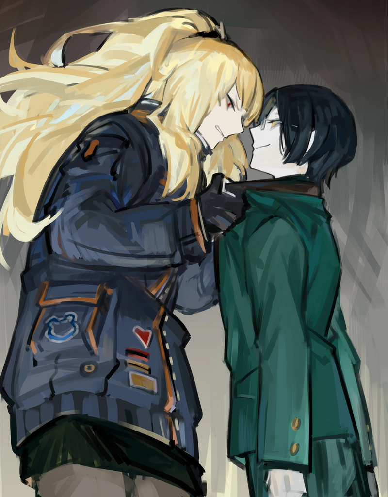
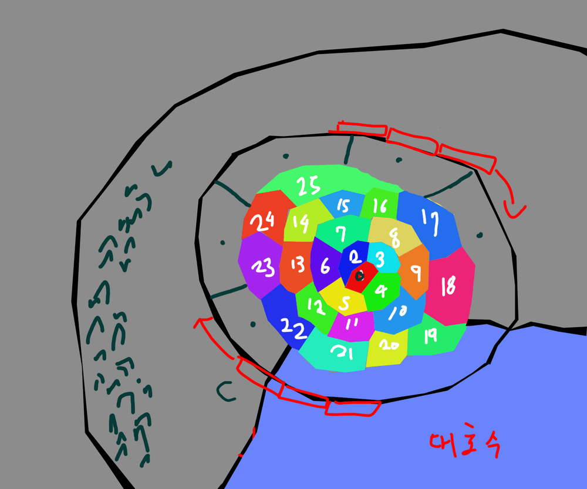

<h2 style="text-align:center;">Хан Хи-Джун</h2>

"Приветствую, доктор Мозес. Давно не виделись."

Меня посетил нежеланный гость. Корректировщик из 2-го Отдела южного филиала "Севен", и мой бывший помощник, Хи-Джун.

Его глаза такие же надменные, как я помню.

"Должно быть, приятно играть в высшей лиге далеко надо мной, не так ли, Хи-Джун?"

"О, нет, вовсе нет."

"Привет~ Хи Джун-сёнбэ!"

Эзра, ты бестактная дура. Надеюсь ты поймёшь, насколько высокомерно он теперь на нас смотрит.

"Что ты здесь делаешь, приехав так далеко на север с юга Города? Должно быть, там полный хаос после краха Корпорации L."

"Вы всё так же проницательны, доктор. Я, собственно, здесь из-за этого."

"Что? Послушай, я уже слишком стара, чтобы ввязываться в дела Крыльев."

"Искажение... Вы всё ещё можете его видеть, верно?"

"...Иначе я бы закрыла этот Офис."

"Интересно, как же я выгляжу в ваших глазах..."

Надменный мудак, вечно задаёт вопросы, от которых мне не по себе.

"Что ж... У тебя, кажется, рот зашит? Возможно, потому что его действительно вот-вот застегнут?"

На самом деле я совсем не вижу его лица, только два глаза, парящие в воздухе.

"Ха-ха, вы совсем не изменились. Вам не нужны средства?"

"Разве я выгляжу так, будто у меня финансовый кризис?"

"Тогда зачем же вам заниматься такой нелепой работой, как 'Детектив Искажений'...?"

"......"

"Понимаю, это потому что вы всё ещё не можете забыть о том, что совершили тогда. Вы до сих пор сожалеете об этом, не так ли?"

"Хватит! Заткнись, Хи Джун-сёнбэ!"
 
 

 
 

Эзра схватила Хан Хи-Джуна за воротник. Неестественная улыбка в его глазах не исчезала.

"...Пусть говорит."

"Только мы с Эзрой пережили ту вашу бойню в тот день. Вы, по сути, ответственны за наши жизни, доктор."

"Что ты хочешь чтобы я сделала? Прикусила язык и сдохла?"

"Я не могу позволить вам так легко умереть, нет. Вы всё ещё должны нам огромный долг."

"Давай ближе к сути. Зачем ты притащился сюда с юга."

"Я хочу, чтобы вы как раз отправились туда на некоторое время. Южный филиал разбирается с тревожными инцидентами, которые подозреваются в связи с Искажениями. Нам нужно ваше умение, доктор. И, пожалуйста, прекратите свои жалкие попытки в 'разрешении' этих дел. Нам нужно, чтобы Искажение проявилось полностью. Не пытайтесь восстановить их. Просто оставьте их, пока они полностью не исказятся."

"Что, Севен теперь занимаются экспериментами над людьми?"

"Полагаю, можно сказать и так. Я зарезервировал два билета на Статья на Вики</a>  Корпорация, предоставляющая услуги транспортировки людей из одного Района Города в любой другой через ВАРП-поезда, занимающими всего 10 секунд. Каждый Район имеет свою ВАРП станцию, внушительные вокзалы где пассажиры могут сесть на поезд, 'телепортирующий' их в точку назначения, как подсказывает название 'ВАРП'  На самом деле, поезда не имеют такой способности; они переносятся в другое измерение, где люди проживают долгие тысячителия, в то время как по прибытию на ВАРП станцию действительно проходит 10 секунд. Пассажиры на борту ВАРП-поезда не испытывают голода, жажды, и не могут умереть; в итоге, под тяжестью времени и клаустрофобии они сходят с ума.  Перед прибытием к точке назначения, внутри поезда пробуждается Отряд Зачистки ВАРП-поезда, нейтрализирующий всех тех, кто был на борту, после чего используя свою настоящую Сингулярность, восстанавливая пассажиров в их первоначальное состояние ('скопированное' состояние во время посадки на поезд, способное даже к откату Искажения), и те ничего не помнят.  Пассажиры первого класса получают доступ к Капсулам Гибернации, что замораживают человека, тем самым вводя их в временное состояние полу-смерти, не требующее проживания долгих лет и сопутствующей очистки с восстановлением.">ВАРП, отправляющиеся из Гнезда Корпорации N через два месяца, так что садитесь на поезд и навестите Офис нашей ассоциации, когда придёт время."

"Это запрос, напрямую назначенный Ассоциацией Севен?"

"Да, это уровень Городского Кошмара. Вы, конечно, свободны отказаться. Вам ведь не слишком важно принадлежать к ассоциациям. Но... Вы, возможно, сможете встретить определённого человека в конце этого запроса."

"...Оставляй билеты и уматывайся."

"Жду встречи с вами, доктор."

Хи-Джун ушёл, вновь усмехаясь одними глазами.

"Эзра! Засыпь порог солью или чего-нибудь!"

"Но у нас же нет соли в Офисе? Мне купить? А знаешь, пожалуй пойду куплю!"

"Ха-ах... Я знала, что этот день настанет..."
 
 

Офис ощущается как опустошённое поле боя после того, как этот сноб пронёсся здесь. Я продолжаю курить до самого вечера, сражаясь с воспоминаниями о своём прошлом.

"Эзра! Принеси мне карту города."

"Есть, шеф! Ах, но у нас нет официально напечатанной карты... Секундочку, пожалуйста! Я попробую нарисовать."

Она увлекается странными вещами. Но именно это её и делает подходящей для меня ассистенткой.

"Вот! Готова. Я сделала её с помощью Picturestore."

"Ты называешь это картой..?"

"Ну, этого достаточно!"
 
 
 

 
 
 

Мы живём в 14-ом Районе, который принадлежит Гнезду Корпорации N. ВАРП-Поезд — единственный осуществимый способ добраться до Статья на Вики</a>  Корпорация K, управляющая 11-ым Районом, специализирующаяся в медицинских технологиях. Сингулярность Корпорации K - 'Хилопнезис' (сокращённо ХП) которая продаётся как жидкость в ампулах, пулях и бинты, которая состоит из множества 'наноботов' заживляющих раны, что и придаёт ей вид жидкости.  Конечно, это то, что говорят гражданским; Сингулярность Корпорации K берёт начало с экспедиции бывшего директора Корпорации K, <a href='https://projectmoon.wiki.gg/ru/wiki/%D0%A1%D1%82%D0%B5%D1%84%D0%B0%D0%BD%D0%B5%D1%82%D1%82%D0%B0_(%D0%9A%D0%9B%D0%91)' target='_blank'>Стефанетты</a>, и её неназванного спутника на <a href='https://projectmoon.wiki.gg/ru/wiki/%D0%9E%D0%BA%D1%80%D0%B0%D0%B8%D0%BD%D1%8B' target='_blank'>Окраины</a>, где они встретили сущность, исполняющую искренние желания. Юноша, пожелав пролить пролить слёзы вместе с отчаянными людьми, страдающими в стенах Города, был затем превращён в 'Нечто, полное слез', чьи слезы были способны к восстановлению тела к состоянию, которое помнил мозг человека.  Пока Стефанетта была жива, она читала трогательные истории, что заставляло 'Нечто' плакать и вырабатывать слёзы, но с её смертью от старости были разработаны новые, неэтичные способы заставлять сущность лить слёзы, постоянно транслируя человеческую агонию.  <i>Если намерен быть лидером, запомни: любые возникающие проблемы нужно пресекать в зародыше. Чем быстрее, тем лучше.</i> — <a href='https://projectmoon.wiki.gg/ru/wiki/%D0%90%D0%BB%D1%8C%D1%84%D0%BE%D0%BD%D1%81_(%D0%9A%D0%9B%D0%91)' target='_blank'>Альфонс</a>, новый директор Корпорации K">11-го Района в Гнезде Корпорации K. Честно говоря, я не хочу иметь ничего общего с белыми воротничками-Корректировщиками с юга, но в конце концов, у меня нет выбора, кроме как поехать. Всё из-за того, что я совершила непоправимый проступок.

"Через два месяца, значит..."

"Хи Джун-сёнбэ сказал, что это связано с Статья на Вики</a>  12-ый Район, находившийся под управлением Корпорации L, где происходили действия игр <a href='https://projectmoon.wiki.gg/ru/wiki/%D0%9E_%D0%9A%D0%BE%D1%80%D0%BF%D0%BE%D1%80%D0%B0%D1%86%D0%B8%D0%B8_%D0%9B%D0%BE%D0%B1%D0%BE%D1%82%D0%BE%D0%BC%D0%B8%D1%8F' target='_blank'>Lobotomy Corporation</a> и <a href='https://projectmoon.wiki.gg/ru/wiki/%D0%9E_%D0%91%D0%B8%D0%B1%D0%BB%D0%B8%D0%BE%D1%82%D0%B5%D0%BA%D0%B5_%D0%A0%D1%83%D0%B8%D0%BD' target='_blank'>Library of Ruina</a>. До <a href=https://projectmoon.wiki.gg/ru/wiki/%D0%A2%D1%83%D0%BC%D0%B0%D0%BD%D0%BD%D0%B0%D1%8F_%D0%92%D0%BE%D0%B9%D0%BD%D0%B0'' target='_blank'>Туманной войны</a>, <a href='https://projectmoon.wiki.gg/ru/wiki/%D0%9A%D1%80%D1%8B%D0%BB%D1%8C%D1%8F#%D0%9F%D0%B0%D0%B2%D1%88%D0%B8%D0%B5_%D0%9A%D0%BE%D1%80%D0%BF%D0%BE%D1%80%D0%B0%D1%86%D0%B8%D0%B8' target='_blank'>Старая Корпорация L</a> вырабатывала энергию используя <a href='https://projectmoon.wiki.gg/ru/wiki/%D0%A1%D0%B8%D0%BD%D0%B3%D1%83%D0%BB%D1%8F%D1%80%D0%BD%D0%BE%D1%81%D1%82%D1%8C' target='_blank'>Сингулярность</a> создающую пар, что и было причиной войны и падением корпорации. После войны, теперь 'Корпорация Лоботомия', вырабатывала экологически чистую энергию, <a href='https://projectmoon.wiki.gg/ru/wiki/%D0%AD%D0%BD%D0%BA%D0%B5%D1%84%D0%B0%D0%BB%D0%B8%D0%BD' target='_blank'>Энкефалин</a>, путём работы с <a href='https://projectmoon.wiki.gg/ru/wiki/%D0%90%D0%BD%D0%BE%D0%BC%D0%B0%D0%BB%D0%B8%D0%B8_(%D0%9A%D0%9B)' target='_blank'>Аномалиями</a> — монстрами, содержащимися на территории её <a href='https://projectmoon.wiki.gg/ru/wiki/%D0%9E%D0%B1%D1%8A%D0%B5%D0%BA%D1%82_X-394_(%D0%9A%D0%9B)' target='_blank'>комплексов</a>.  Помимо выработки энергии, Корпорация Лоботомия изучала проект '<a href='https://projectmoon.wiki.gg/ru/wiki/%D0%A1%D1%8E%D0%B6%D0%B5%D1%82_(%D0%9A%D0%9B)#%D0%9F%D1%80%D0%BE%D0%B5%D0%BA%D1%82_%C2%AB%D0%A1%D0%B5%D0%BC%D1%8F_%D0%A1%D0%B2%D0%B5%D1%82%D0%B0%C2%BB' target='_blank'>Семя Света</a>', что в конце концов привело к высвобождению всего накопленного света и началу самого значимого события '<a href='https://projectmoon.wiki.gg/ru/wiki/%D0%91%D0%B5%D0%BB%D1%8B%D0%B5_%D0%BD%D0%BE%D1%87%D0%B8,_%D0%A7%D1%91%D1%80%D0%BD%D1%8B%D0%B5_%D0%B4%D0%BD%D0%B8' target='_blank'>Белые дни, Чёрные ночи</a>', из-за которого появились такие явления как <a href='https://projectmoon.wiki.gg/ru/wiki/EGO' target='_blank'>ЭГО</a> и <a href='https://projectmoon.wiki.gg/ru/wiki/%D0%A4%D0%B5%D0%BD%D0%BE%D0%BC%D0%B5%D0%BD_%D0%98%D1%81%D0%BA%D0%B0%D0%B6%D0%B5%D0%BD%D0%B8%D1%8F' target='_blank'>Феномен Искажения</a>. С высвобождением света последовало падение Корпорации Лоботомия и формирование <a href='https://projectmoon.wiki.gg/ru/wiki/%D0%91%D0%B8%D0%B1%D0%BB%D0%B8%D0%BE%D1%82%D0%B5%D0%BA%D0%B0_(%D0%91%D0%A0)' target='_blank'>Библиотеки</a>, сокрытой густым туманом что окутывал павшее Гнездо. В настоящее время, в Районе царит хаос и битва за территорию между Синдикатами, а именно <a href='https://projectmoon.wiki.gg/ru/wiki/%D0%91%D0%BE%D0%BB%D1%8C%D1%88%D0%BE%D0%B9_%D0%9F%D0%B0%D0%BB%D0%B5%D1%86' target='_blank'>Большого</a> и <a href='https://projectmoon.wiki.gg/ru/wiki/%D0%A3%D0%BA%D0%B0%D0%B7%D0%B0%D1%82%D0%B5%D0%BB%D1%8C%D0%BD%D1%8B%D0%B9_%D0%9F%D0%B0%D0%BB%D0%B5%D1%86' target='_blank'>Указательного</a> пальца.  <i>Столкнись со страхом, создай будущее</i> — Слоган Lobotomy Corporation">Корпорацией L, так почему бы нам тогда не поехать прямо в 12-ый Район, где раньше была Корпорация L?"

"Я слышала что Гнездо Корпорации L уже погрузилось в полную анархию. Они, вероятно, вызвали нас, чтобы мы оставались в безопасном месте которое также находится относительно близко к нему. Платформа ВАРП в Гнезде Корпорации L наверняка уже перестала работать."

"Детектив, вы правда бросите решение Искажений, когда мы туда доберёмся? Мы просто будем их убивать?"

"Это не мне решать. Это будет зависеть от серьёзности Искажения."

"Но что, если мы столкнёмся с Искажением, которое можно обратить вспять, если попытаться?"

"...Об этом можно подумать позже. Время ещё есть, так что давай пока работать как обычно."

"Поняла! Я принесу наш следующий запрос!"
 
 
 

<h2 style="text-align:center;">Что ждёт в следующей главе...</h2>

"Уаааа! Детектив! Детектив! Это что, тоже Искажение?!"

"...Не могу в это поверить."

Кажется, пришло время обновить мою информацию о Феномене Искажения.

"Держитесь, детектив! Пока нам нужно бежать!"
