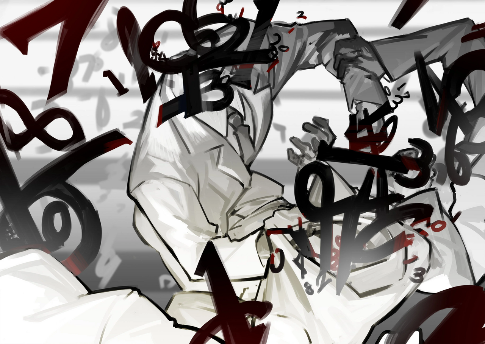

<h2 style="text-align:center;">Экзамен начался.</h2>

Прошла неделя с тех пор, как Хан Хи-Джун устроил шторм в моей голове. Не имеет смысла быть нерешительной по поводу этой поездки, ведь я знаю, что у меня нет другого выбора. Так чего же я тогда так мучаюсь?

"Детектив, этот запрос о старшей школе!"

Эзра говорила обычным бодрым тоном.

"Школа? Его подал её персонал или директор?"

"Эм, не... Вот эта ученица — наша клиентка."

"Здравствуйте... Меня зовут Мэрил."

Скромная девочка стоявшая позади Эзры, представилась. Одна из её ног состоит из цифр.

"Какая у тебя школа? Не уверена, что у ученицы из Подворотен вообще хватит денег, чтобы сделать запрос в наш Офис."

"Детектив! Вообще-то! Она клиентка из... то есть, ученица частной старшей школы внутри Гнезда Корпорации N!"

Ученица частной школы в Гнезде... Карманные деньги, которые эти дети регулярно получают от родителей, должно быть, более чем достаточно, чтобы заплатить нам. Я готова поиграть с этими богатенькими детьми в их детективные игры, если гонорар будет выплачен.

"И какую же проблему хочет решить наша юная клиентка?"

"Вообще-то... В нашей школе происходит что-то странное. Впереди важный экзамен, и все на нервах, готовятся к поступлению в колледжи."

Ученики старших классов в Гнезде должны, само собой разумеется, стремиться в университеты Гнезда. Ежегодный вступительный экзамен в колледжи, проводимый в большинстве Гнёзд; этот единственный экзамен определяет множество вещей. Получить низкие баллы и пойти в колледж в Подворотнях — не принесёт тебе никакой пользы. Поступление в любой колледж Гнезда — это практически базовое требование для вступления в Крыло.

"Значит, странные события в школе мешают твоей учёбе. И ты хочешь, чтобы мы это разрешили, верно?"

"Дело не только в моих оценках...! Мои друзья стали странными... Вся школа странная! Ученики... И учителя тоже..."

"Нам нужно, чтобы ты рассказала, какие именно странные происшествия имеют место, прежде чем мы сможем помочь."

"Они совсем не возвращаются домой. Уроки не заканчиваются!"

"Все ученики?"

"Да, все..."

"А ты?"

"Я... Только мне удалось сбежать. Я очнулась в классе. Было далеко за полночь. Учитель наблюдал за нами с передней части класса, а все мои друзья были поглощены учёбой, решали задачи в рабочих тетрадях."

"Разве родители не беспокоятся, что их дети не возвращаются домой?"

Эзра спросила, сбитая с толку очевидной странностью ситуации.

"Скоро Сунын... Средние баллы нашей школы на пробных тестах вошли в первую десятку нашего Гнезда."

Родители, должно быть, были не против насчёт того, как школа обращается с их детьми, лишь бы оценки улучшались.

"Как долго продолжается эта аномалия?"

"Последнее, что я помню, прежде чем себя потеряла, было два месяца назад... Это был день, когда школа объявила о создании стипендиального класса. Сказали, что отберут учеников с наивысшими оценками."

Искажение, которое длится два месяца...

"Нам стоит самим отправиться туда и посмотреть, что происходит. Эзра! Мы направляемся в Гнездо."

"Есть, шеф! Я возьму лицензию Корректировщика и сертификат Ассоциации~"
 
 
 

Мне не очень хочется оставаться в Гнезде Корпорации N дольше необходимого. Место, полное зданий, выкрашенных в чистый белый цвет. Я бы сошла с ума в мгновение ока, если бы жила там.
 
 
 

Квадратное пятиэтажное школьное здание тоже белое. За белыми воротами — белый школьный двор. В школе мёртвая тишина. Затем что-то инородное привлекает мой взгляд. Красное число, парящее над крышей школы. "5".
 
 
 

"Мэрил! Что это за число наверху школьного здания?"

"А, оно показывает, сколько дней осталось до последнего пробного экзамена этого года."

"Оно выкрашено угрожающим кроваво-красным."

"Но, детектив! Число же белое, как и вся остальная школа?"

"...Это Искажение."

С цифры капает красная жидкость.

"Есть ли какие-то процедуры для нас, посторонних, прежде чем войти?"

"Есть, но я не думаю, что сейчас кого-то это волнует."

Когда мы входим в школьное здание, слышен шум.
 
 
 

*Шкряб... Царап...*
 
 
 

Шум становится громче и чаще.
 
 
 

*ШкрябШкрябШкрябШкрябШкрябШкрябШкрябШкрябШкрябШкрябШкрябШкрябШкрябШкрябШкрябШкрябШкрябШкрябШкряб*
*ШкрябШкрябШкрябШкрябШкрябШкрябШкрябШкрябШкрябШкрябШкрябШкрябШкрябШкрябШкрябШкрябШкрябШкрябШкряб*
*ШкрябШкрябШкрябШкрябШкрябШкрябШкрябШкрябШкрябШкрябШкрябШкрябШкрябШкрябШкрябШкрябШкрябШкрябШкряб*
 
 
 

У меня болит голова.

"Что это за скрежещущий шум?"

"Это звук учеников в каждом классе, решающих задачи на рабочих листах... Они так сильно прижимают карандаши к бумаге, когда пишут..."

Я заглядываю в окно класса под номером 1-7. Сорок учеников склонили головы в нескольких сантиметрах над партами, только их руки быстро двигаются.

"Как выглядят эти ученики для тебя, детектив?"

"Наборы цифр в школьной форме."

"Брр! Значит, Искажение сильно прогрессировало, да?"

"Они можно сказать уже и так искажены..."

"Эмм... Что вы имеете в виду под 'искажёнными'?"

"Это значит, что странные события, которые вы описали, происходят в реальности."
 
 
 

Из дальнего конца коридора появилось нечто. Это была движущаяся стена, достаточно большая, чтобы полностью заблокировать коридор.
 
 
 

"Внимание! Внимание! Ученики, которые не на уроке, будут подвергнуты дисциплинарному взысканию!"
 
 
 

"Детектив! Это Искажение! Я тоже его вижу!"

На стене написана формула. Искажение, состоящее из математических задач. Этому миру никогда не бывает недостатка в странностях, не так ли? Это, кажется, задача по математическому анализу...

"Эзра! Можешь решить эту задачу для нас?"

"Эхехе... Не-ааа..."

Тц, зачем я вообще спросила. Бухгалтерия — единственный вид вычислений, в котором она хороша.

"А ты, Мэрил?"

"Ну... Я скорее гуманитарий..."

"Хо-ох..."

Позади нас тупик. Так или иначе, нам нужно прорваться. Всё, что нужно сделать, — это решить математическую задачу на стене, но никто не справляется.
 
 
 

Похоже, теперь дело за мной.
 
 
 

Я достала свою шариковую ручку и написала ответ на приближающейся стене.
 
 
 

"Неправильный ответ! Вы будете посещать дополнительные занятия! Немедленно!"
 
 
 

Так и знала. Стена прижала нас. Вот так всё и закончится. В следующий раз мне стоит взять себе помощника поумнее...
 
 
 

Сознание померкло.
 
 
 

Когда я очнулась, то обнаружила себя сидящей за партой в классе, одетой в школьную форму. Ученики вокруг всё ещё заняты решением задач на рабочих листах. Сколько времени прошло? В центре класса парит красное число "30". Последнее, что я видела, было "5"... Значит ли это, что мы вернулись в прошлое? Может, это случай Искажения, способного обратить течение времени вспять?
 
 
 

Внезапный толчок прижал мою голову сзади.

Моё лицо врезалось прямо в парту.
 
 
 

"Решай задачи."

Приказ прозвучал угнетающим голосом.
 
 
 

Я пробежалась глазами по рабочему листу на парте.
 
 
 

'17) Смешивание 3 людей в блендере генерирует 10 единиц энергии. При данных условиях, каково оптимальное решение для расчленения 2-х людей, чтобы сгенерировать 15 единиц энергии?'
 
 
 

'23) Чхольсу хочет быть художником. Крылу, в которое должен попасть Чхольсу, художники не нужны. При данных условиях, сколько мечт должен убить Чхольсу?'
 
 
 

'45) Существует куб, состоящий из крошечных людей. Фабрика кубов должна выполнять определённую квоту каждый день. Глазное яблоко можно спрессовать в шестиугольник. Когда О — внешний центр левого глаза, сколько правых глаз потребуется, чтобы сделать куб с длиной стороны 4 метра?'
 
 
 

Искажённая школа, раздающая искажённые задачи. Они, должно быть, постоянно печатают бессмысленные задачи, которые будут решены без какого-либо значения.
 
 
 

"Бу-хуу... Детектииив... Я понятия не имею, о чём тут речь..."

Парта Эзры была прямо рядом с моей. Она смотрела на меня, её лицо было на грани слёз. Я едва приподнимаю голову и снова смотрю на число. "17"... Значит, это были минуты, а не дни.

"Подождём, пока начнётся экзамен. А пока просто пиши в лист что попало."

"Поняла..."
 
 
 

Снова послышался голос.

"У вас есть десять минут до начала пробного экзамена. Вы должны стремиться решить как можно больше задач. Всё это ради вашего будущего. Задачи, которые вы решаете сейчас, станут вашим оружием в дальнейшей жизни."
 
 
 

Число достигло нуля.
 
 
 

*Динь дон дань дон~*
 
 
 

"Начало пробного экзамена."
 
 
 

С этим объявлением школа рассыпалась.

Всё, что осталось, — это ученики на белой равнине.

Затем из середины поля поднялась высокая лестница.

На её вершине был поставлен трофей.
 
 
 

Экзамен начался.
 
 
 
 
 

"Уаааа! Детектив! Детектив! Это что, тоже Искажение?!"

"...Не могу в это поверить."

Кажется, пришло время обновить мою информацию о Феномене Искажения.

"Держитесь, детектив! Пока нам нужно бежать!"
 
 
 
 
 

Кажется, что массивный мир сам по себе может быть создан, когда интересы и желания большой группы людей совпадают. Я впервые вижу Искажение такого масштаба.
 
 
 

Массовое Искажение... Вся эта школа искажена. Нет, не само школьное здание; каждый ученик в ней искажён. Все ученики бегут к лестнице, пытаясь взобраться на неё. Некоторые пытаются пригвоздить учеников впереди себя, другие отталкивают тех, кто сзади. Числа складываются и вычитаются друг из друга; они умножаются и делятся друг на друга. Десятичные знаки сыплются из их тел.
 
 
 

Это поле боя, для очень жестокой битвы...
 
 
 

 
 

Война, где все признают друг друга числами. Никакие другие слова не нужны. В этой сцене численного насилия они должны прибавлять к себе и делить других. Задачи, которые они решали до сих пор, становятся оружием для убийства друг друга. Когда ученик атакует другого числами, цифры на голове жертвы отваливаются.
 
 
 

Ученики-числа не будут нападать на нас. Возможно, ничтожные числа, сидящие внизу лестницы, как мы, не стоят их внимания.
 
 
 

"Эй, Корректировщики! Я наверху!"

Это Мэрил. Её искажение сильно прогрессировало за короткое время, что мы были от неё отделены. Она была уже на полпути к вершине лестницы.

"Мэрил! Тебе следует спуститься сюда!"

Крикнула Эзра.

"Мэрил! Нет причины взбираться по этой лестнице. Эта война — азартная игра. Сражение друг с другом с знаниями и оценками на кону. Если ты спустишься, ты будешь в безопасности!"

"Нет...! Я остаюсь. Мы все согласились на это, чтобы решить, кто перейдёт в стипендиальный класс!"

Ответила Мэрил, убивая других учеников.

"Ты участвуешь в этой резне?"

"Но ведь я уже на полпути? Я могу пройти выше!"

Цифра "7" вдруг ударила по голове Мэрил. Числа в голове Мэрил разлетелись, когда она упала на пол.
 
 
 

*Бух. Бух. Бух.*
 
 
 

Я слышу звуки многочисленных учеников, ударяющихся о пол. Шум учеников, убивающих друг друга. Эзра отвернулась от этого зрелища, глядя в пол. Я молча продолжаю наблюдать за лестницей.
 
 
 

Ученик с гигантским числом вместо головы наконец достиг вершины лестницы.
 
 
 

"Экзамен окончен! Знания и оценки будут перераспределены среди учеников в зависимости от того, насколько высоко они находятся на лестнице. Верхние 20% будут назначены стипендиальным классом и получат честь представлять нашу школу!"
 
 
 

Со вспышкой школа вернулась к нормальному состоянию. Ученики сидели на своих местах, как будто ничего не произошло. Я вижу Мэрил среди них.

"Мэрил! Ты в порядке?"

Эзра подбежала к Мэрил, чтобы проверить её.

"Ох... Ах... Э-э..."

Мэрил уставилась на нас пустым взглядом, бормоча бессмысленные слова.

"У неё забрали всё..."

"Это абсурд..."

"Это было следствием собственного выбора Мэрил. Не нужно чувствовать себя виноватой."

"Но..."

"...Давай просто вернёмся."
 
 
 
 
 

"Мы не смогли решить это Искажение..."

"Мы не можем рассчитывать на то, что решим все проблемы в мире."

Я достала трубку из внутреннего кармана пальто.

"Почему искажённые люди все такие нелогичные? Они заходят слишком далеко!"

"...Они искажаются, потому что их разум загоняют в угол. Это нетерпение и приводит к скачкам в логике."
 
 
 

Говорят, что 40 процентов выпускников этой школы живут в затворничестве, не сумев поступить ни в один колледж. Однако стипендиальный класс продемонстрировал беспрецедентное количество успешных поступлений в престижные университеты, принеся школе известность и множество новых запросов на зачисление.
 
 
 

Ученики, успешно взобравшиеся по лестнице, убивая друг друга, вырастут в перья Крыльев. Взмахивая этими Крыльями, Город взлетает.
 
 
 
 

<h2 style="text-align:center;">Что ждёт в следующей главе...</h2>

"Сегодня мы идём за покупками на бульвар мастерских! Значит, мы ещё и поедим на улице, да?"

"Ха-ах... Мы идём туда не для отдыха."

"Я знаю! Наша цель визита — заказать в мастерских оборудование и приспособления, которые нужны в нашем Офисе!"
