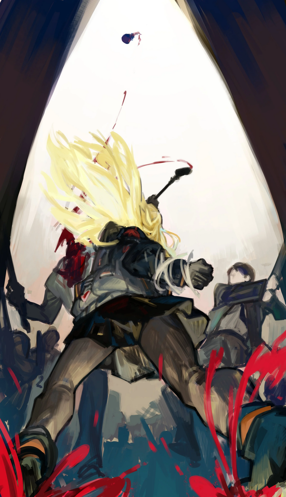

<h2 style="text-align:center;">Я пустила багряно-красный пар.</h2>

У нас есть ещё месяц до отъезда в 11-ый Район. Я уже смирилась с тем, что предложение Хан Хи-Джуна — это реальность, с которой придётся считаться, и представляю, что поездка будет долгой. Возможно, мы даже не вернёмся.

"Сегодня мы идём за покупками на бульвар мастерских! Значит, мы ещё и поедим на улице, да?"

"Ха-ах... Мы идём туда не для отдыха."

"Я знаю! Наша цель визита — заказать в мастерских оборудование и приспособления, которые нужны в нашем Офисе!"

Эзра говорила с энтузиазмом.

"Это может быть наш самый последний шанс сделать покупки."

"...Я тоже это знаю. Нам нужно уезжать через месяц."

"Ты можешь остаться здесь, если хочешь."

"Но я же не могу позволить тебе съесть там все вкусняшки в одиночку~"

Мастерские на бульваре продают различные предметы первой необходимости и снаряжение для Корректировщиков. Поэтому, важно выбирать подходящие мастерские в соответствии с вашими потребностями. Конечно, мастерские тоже пытаются рекламировать себя; некоторые становятся известными через сарафанное радио. Несмотря на то, как сложно бывает разобраться в продукции мастерской, сама я не трачу усилий на поиски подходящих товаров. Моя ассистентка Эзра — просто маньяк по продукции мастерских. У неё, кажется, есть странная склонность предпочитать более дорогие мастерские, но она много исследует различные снаряжение и гаджеты, и те, что она покупает, всегда оказываются достаточно надёжными. Наверняка, её пространственная сумка уже забита её личной коллекцией гаджетов.

"Детектив! Все мои часто-посещаемые мастерские остались без товара на продажу или без свободных слотов для заказа! Интересно, что случилось?"

"Не знаю. Может, Пальцы устроили погром в каком-то месте, о котором мы не знаем. Так тебе не удалось достать снаряжение, которое нам было нужно?"

"Угу, так и есть... Мы не получим гаджеты вовремя, если я закажу их позже..."

Пробормотала Эзра.

Я шла по улицам, в надежде, что так или иначе всё образуется.
 
 
 

"Детектив...! Сзади..."

"Да... За нами увязалась кучка назойливых типов."

Может, они из Синдиката... возможно, Офиса Корректировщиков... или, может, Крыла...? Кем бы они ни были, в сущности, они все одинаковы. Они хотят выудить из меня информацию. Что ж, чтобы по-дружески побеседовать с ребятами, которые следуют за нами через улицы, нам нужно углубиться в переулки. Мы медленно прошли через переулки, переплетённые как лабиринт. Стальные двери выстроились вдоль стен, охраняя жилища, которые не выглядят столь ухоженными. Время — полдень. Шум пешеходов стихает, в то время как шаги наших преследователей становятся громче. Мы вышли к тупику. Наше любимое место для бесед. Уголок на улицах без свидетелей. И даже если бы свидетель существовал, он бы отсюда не выбрался.

"Итак, что же вас так заинтересовало, друзья? Настолько, что проследовали за нами аж сюда?"

Я достала свою трубку из внутреннего кармана пальто и зажала её губами. Народу-то сколько. Я вижу около тридцати человек? Все они в зелёных костюмах. Искажение не выглядит слишком сильным. Все они держат оружие вроде бит и ножей. Один в зелёной фетровой шляпе подходит к нам и начинает говорить.

"Вы Мозес, Корректировщик с Печеньевой улицы?"

"Так и есть."

Ответила я с улыбкой.

"Мы хотели бы приобрести ту длинную курительную трубку, что вы держите."

Это было неожиданно. У кого-то уже есть данные о моей трубке?

"За сколько?!"

Эзра спрашивает с искрящимся энтузиазмом в глазах.

"100 миллионов Анн."

"Нееее~ Эта штука стоит как минимум 500 миллионов, никаких переговоров о такой низкой цене! Верно, детектив?"

Эзра сказала довольно разочарованным тоном.

"Даже за 500 миллионов Анн её не купить. Она, видите ли, по сути часть меня. Я никогда и не думала о том, чтобы продавать её кому-либо. Кто рассказал вам об этой трубке, кстати?"

"...Какая досада. Мы рассчитывали на изящную сделку."

Тот, что в шляпе, отошёл назад и растворился в группе.

"Эзра, справишься со всеми в одиночку?"

"Конечно, шеф~!"

Крикнула Эзра, ставя свою пространственную сумку на землю.

"Уличный боевой комплект!"

В ответ на команду Эзры, молот Нестера влетел в её руку, пока она надевала перчатки Мастерской Аллас. Группа из тридцати человек начала атаковать нас все разом. Эзра в одиночку блокирует узкий проход, принимая на себя всю банду, одного за другим. Перчатки Мастерской Аллас могут ускорить движение её рук в пять раз по сравнению с обычной скоростью. Активировав перчатки, она размахивает своим молотом Нестера, небольшим одноручным молотом, подходящим для боёв в ограниченных пространствах, таких как переулок, в котором мы как раз сейчас находимся. Молот способен передавать удар на большую площадь объекта, с которым соприкасается.
 
 
 

 
 

Когда молот Нестера с такой ускоренной силой попадает в одного бандита в зелёном, он пробивает широкую дыру в его груди. Она яростно размахивает другой рукой, чтобы раздробить челюсть другого головореза, бросающегося на неё. Она ломает кости и размалывает плоть одного гангстера за другим, но даже её превосходная физическая форма не может помешать некоторым из них прорваться через проход. В основном из-за того, что Эзра придуривается.

"Эхехе~ Пожалуйста, разберитесь с теми, кого я пропустила, детектив!"

"...Урезаю тебе зарплату."

"Чегооо?!"

Я пустила багряно-красный дым. Курительная трубка издала алый свет, прежде чем принять форму меча. Я схватила его рукоять и приготовилась к "беседе". Я занимаю позицию и вонзаю лезвие в шею головореза, бегущего на меня. С изяществом и хладнокровием в каждом шаге, я прокалываю красное отверстие в теле каждого гангстера, идущего на меня. Сильный запах крови вскоре наполнил переулок.
 
 
 

"Детектив! Тот чувак в шляпе пытается сбежать!"

Крикнула мне Эзра, с ног до головы покрытая кровью.

Я вдохнула фиолетовый дым в свою трубку. Трубка начала извиваться, удлиняясь. Вскоре она превратилась в фиолетовый, шипастый кнут. Я взмахнула своей трубкой, чтобы схватить за ногу человека в шляпе. Он споткнулся и упал лицом в лужу крови. Эзра притащила упавшего бандита, бросив его передо мной.

"Говори. Кто дал тебе информацию о моей трубке? Я старалась не использовать её слишком часто, чтобы не привлекать ненужного внимания."

"Боюсь, я не могу сказать."

"Эзра! Проведи милую сердечную беседу с этим товарищем."

Оставив допрос Эзре, я одиноко закурила в тупике.
 
 
 

Спустя не так много времени Эзра вернулась с человеком, чьё лицо теперь было хорошечно размазано.

"Детектив! У этого, кажется, стоит замок на мозгу или что-то такое! Я не могу заставить его расколоться, что бы ни делала."

Я подняла голову бандита и взглянула на затылок. На нём выжжен крошечный логотип Статья на Вики</a>  Корпорация J, контролирующая 10-ый Район, известная своей Сингулярностью способной 'блокировать' всё, что угодно, как физически, так и концептуально, например, блокировка памяти через татуировки. Способность блокировки также использовалась в боевых целях Арбитрами <a href='https://projectmoon.wiki.gg/ru/wiki/%D0%93%D0%BB%D0%B0%D0%B2%D0%B0' target='_blank'>Главы</a>, в частности <a href='https://projectmoon.wiki.gg/ru/wiki/%D0%91%D0%B8%D0%BD%D0%B0_(%D0%91%D0%A0)' target='_blank'>Биной</a>  Корпорация J также владеет второй, менее известной Сингулярностью, которая распространена лишь в пределах её Района — извлечение Силы Желаний, и её дальнейшее преобразование во временные татуировки, способные значительно увеличивать удачу человека. Обширный культурный и исторический фон, практически превративший Силы Желаний в альтернативную валюту, вызвал необходимость найти способ помешать другим людям насильно извлекать её, из-за чего и была создана их основная сингулярность.">Корпорации J.

"Действительно, он заблокирован Сингулярностью... Клиент, должно быть, потратил немало денег. Тем не менее, выход есть, пока это не более дорогой тип замка."

Я выдохнула белое облачко через трубку. Дым обвивает тело бандита.

"Давай, вдыхай."

Он начал дрожать, вдыхая дым.

"Ты больше не действуешь по своей воле. Ты подчиняешься моей воле. Замок больше не будет препятствовать твоим мыслям."

Он наконец медленно заговорил.

"Ателье ЮРиа... Хотела изучить механизмы той трубки... Сказала, что нам можно убивать, лишь бы мы её принесли..."

"О...!"

Глаза Эзры расширились от шока от услышанного.

"Эзра, ты знаешь что-нибудь о Ателье ЮРиа?"

"Разумеется! Это премиальная мастерская, доступная только людям с их членством! Это наверное одна из десяти лучших мастерских в 14-ом Районе, думаю?"

Глаза маньяка-по-мастерским заискрились, пока она мне всё объясняла.

"Тогда почему бы нам не вступить в это членство?"

"Условия немного хитрые... Не думаю, что они нас примут..."

Они хотят изучить механизмы моей курительной трубки, хах...

А мне и самой интересно узнать, как работает эта штука.

"Как думаешь, эта мастерская сможет обеспечить нас тем снаряжением, которое нам было необходимо?"

"Да! Ещё бы! У них определённо есть навыки."

"Эзра! Веди меня в это Ателье ЮРиа. Давай поздороваемся с тем, кто попытался нас убить, и возьмём этого головореза с собой на всякий случай."
 
 
 
 

<h2 style="text-align:center;">Что ждёт в следующей главе...</h2>

"Это место — просто нечто. Неудивительно, почему мы не могли получить членство."

"Ага... Такого я не ожидала..."
