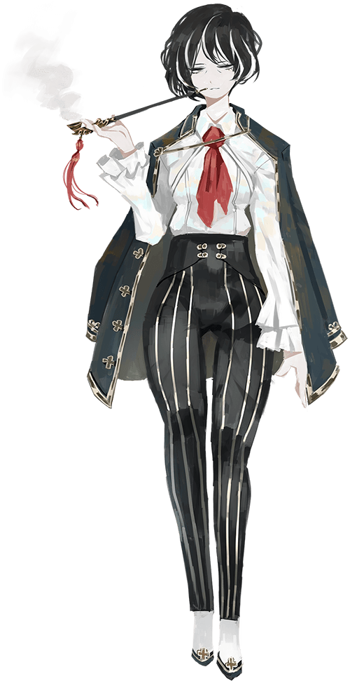
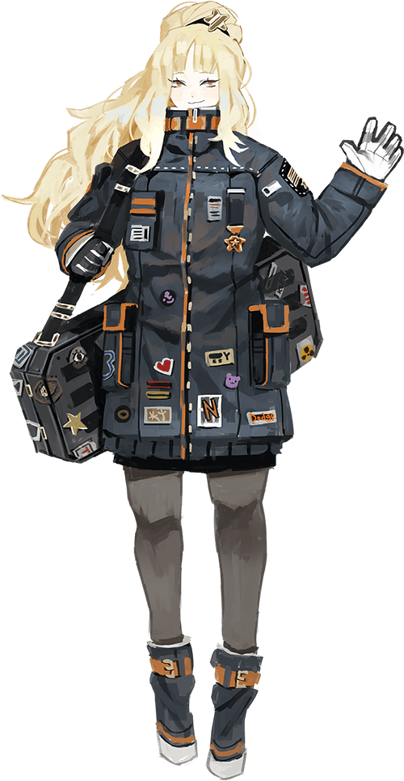

<h2 style="text-align:center;">- Офис Мозес -</h2> 
<h3 style="text-align:center;">Занимаются загадками и нераскрытыми делами.</h3> 
 
 

Отчёт Корректировщиков Офиса Ассоциации "Севен" - N182301

Автор: Хан Хи-Джун

 
 
 
 

 

Имя: Мозес (Moses, 모제스)

Возраст: 49

Пол: Женский

Принадлежность: Ассоциация "Севен"

Ранг: Корректировщик 5 Ранга

Рост: 156 сантиметров (~5'1" в футах)

Увлечения: Закрывать глаза и предаваться глубоким размышлениям; Чистка своей курительной трубки.

Особые навыки: Концентрация, Быстрота ума.

День рождения: 30 ноября

Нравится: Табак; Спокойное времяпрепровождение в размышлениях.

Не нравится: Нытики; нетерпеливые люди; шум.
 
 
 
 
 

 

Имя: Эзра (Ezra, 에즈라)

Возраст: 28

Пол: Женский

Принадлежность: Ассоциация "Севен"

Ранг: Корректировщик 3 Ранга

Рост: 187 сантиметров (~6'2" в футах)

Увлечения: Коллекционирование оружия из мастерских; Перекусы печеньем, пока детектив не видит.

Особые навыки: Переговоры о гонорарах за запросы; Хаотичные потасовки.

День рождения: 27 января

Нравится: Дорогое и мощное оружие; Сладости, такие как сладкий кофе и торт; Маленькие животные, дома; Сэндвичи с горчицей от НямНям-ПэнПэн.

Не нравится: Ждать, пока Мозес закончит думать (справедливо); Цветы (у неё на них аллергия).
