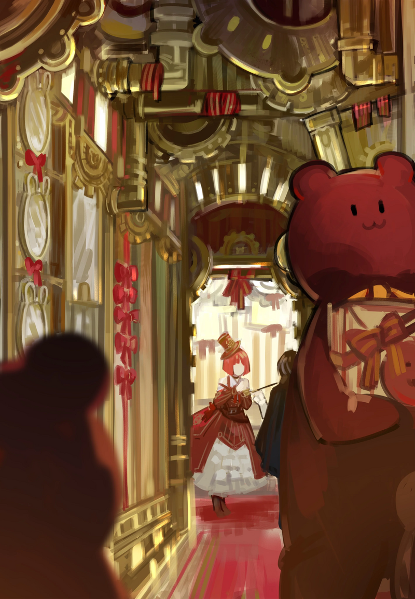
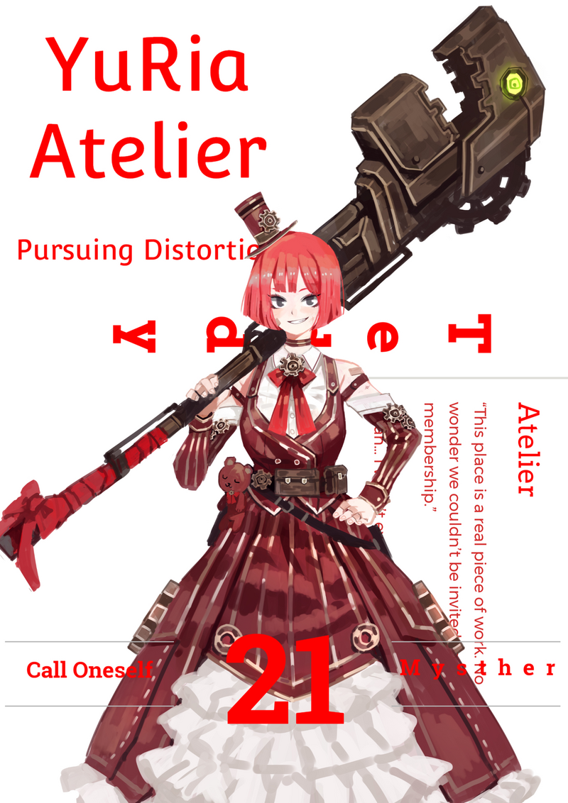

<h2 style="text-align:center;">Узрите. Ваши грациозные манёвры и этот изящный дым.</h2>

Эзра ведёт за собой, таща на плече бандита в шляпе. Она, кажется, взволнована посещением уважаемой мастерской, в которую ей прежде не доводилось попасть. Бандит с разбитым лицом пытается договориться с нами.

"Эй! Не ведите меня к ЮРии, пожалуйста! Она же сделает из меня подопытную крысу, я уверен!"

"Разве нам должно быть дело до благополучия негодяя, который пытался нас убить?"

"...Ладно, убейте меня! Я лучше сдохну здесь и сейчас, чем буду передан этой больной извращенке!"

"Тем больше причин доставить тебя к ней."

Ответила я, куря из трубки.
 
 
 

"Вау~! Я раньше только проходила мимо, заглядывая сюда, а теперь мы наконец увидим, что внутри!"

"Это то самое место? Выглядит довольно маленьким для прославленной мастерской."

Квадратное здание высотой около 3-х метров стояло само по себе в центре улицы. Маленькие буквы на двери мастерской гласили: 'Ателье ЮРиа'. Под ними была любезная инструкция: "Пожалуйста, стучите, только если вы состоите в нашем членстве."

"Я читала в каталоге, что 'Ателье ЮРиа' управляет один человек! Думаю, поэтому она такая маленькая."

"Значит, она производит товары лишь в небольших количествах?"

"Вообще-то нет! Я слышала что эта мастерская ценит и качество, и количество!"

"Это довольно подозрительно, но перед этим... Как нам туда попасть..."

Я могла бы послать Эзру выбить дверь таких размеров. Но, как и с большинством вещей в Городе, никогда не стоит судить что-либо только по внешнему виду. Дверь вполне может быть оснащена каким-нибудь безрассудным охранным устройством, которое расплавит любого, кто коснётся её без разрешения.

"Эй, шляпа. Как мне попасть в эту мастерскую?"

"...Нужно иметь членство."

"Ну, а у тебя оно есть?"

"Наш Синдикат взялся за работу, чтобы его и получить..."

"Хм...

Как же ты познакомился с ЮРией, тогда?"

"Детектив! Вообще-то, ээ... Ателье ЮРиа сама выбирает своих клиентов. Мастерская рассылает приглашения на членство потенциальным покровителям, но нам пока ничего не приходило."

"По каким таким тупым критерям этот придурок в шляпе выходит более подходящим, чем мы?"

"Хнык... Это вы мне скажите..."

"Шляпа. Иди открывай."

"Что?? Ни за что, кто знает какая там может быть система безопасности..."

"Тогда как насчёт этого: если сделаешь, как я говорю, я не передам тебя ЮРии."

"...Обещаете?"

"Кнш."

Шляпа подходит к двери. Он покрывается холодным потом, колеблясь прикоснуться к двери, прежде чем наконец тянется к дверной ручке. Пока ничего не происходит. Он поворачивает ручку и медленно тянет.
 
 
 

*Скрииип*
 
 
 

Дверь открывается, обнажая лестницу, ведущую под землю. Кажется, она уходит довольно глубоко. Я знала, что мастерская не может быть такой маленькой.

"Вау~ Детектив! Полагаю, настоящая мастерская внизу!"

"Я свободен...?"

"Веди."

"Бля..."

Мы спускаемся вниз. Снизу ощущаются толчки. Мои инстинкты подсказывают, что это не простая тряска; что-то приближается к нам, и быстро.

"Детектив! Что это?!"

И в правду, что это? Кабан? Медведь? Гигантское существо бежит на нас.

"Это плюшевый мишка! Какой милый!"

Ликующе проговорила Эзра с блеском в глазах.

"...То, что оно собирается с нами сделать, вообще не будет мило."

Гигантский плюшевый медведь бросился на нас на всех четырёх лапах. Это часть охранной системы мастерской? Любопытно. Или, возможно, это...

"Эзра! Останови эту штуку!"

"Дааа~."

Плюшевый медведь замахнулся своей лапой на бандита в шляпе перед нами, одним чистым движением отделив верхнюю половину его тела.

"Режим острых кулачков!"

Эзра экипировала Статья на Вики</a>  Мастерская Намира производит перчатки для ближнего боя, используя Сингулярность <a href='https://projectmoon.wiki.gg/ru/wiki/%D0%9A%D1%80%D1%8B%D0%BB%D1%8C%D1%8F#%D0%9A%D0%BE%D1%80%D0%BF%D0%BE%D1%80%D0%B0%D1%86%D0%B8%D1%8F_G' target='_blank'>Корпорации G</a> в качестве увеличителя веса для усиления ударов. Также известно, что Корпорация G предоставила лицензию, разрешающую мастерской Намира использовать их Сингулярность.">перчатки Мастерской Намира на обе руки.
 
 
 

*БДУУУМ*
 
 
 

От столкновения Эзры с плюшевым медведем по подвалу прокатилась ударная волна. Тело Эзры усилено Статья на Вики [ENG]</a>  В Городе возможны различные варианты усиления тела, называемые Аугментацией, что является важнейшей инвестицией для Корректировщиков. Процесс Аугментации отличается от протезов тем, что не требует полной замены конечности; это процедура, напрямую усиливающая её природные способности. Аугментации могут применяться к самому широкому спектру частей тела, включая кожу, <a href='https://projectmoon.wiki.gg/ru/wiki/%D0%92%D0%B5%D1%80%D0%B3%D0%B8%D0%BB%D0%B8%D0%B9_(%D0%9B%D0%B5%D0%B2%D0%B8%D0%B0%D1%84%D0%B0%D0%BD)#%D0%A1%D0%BF%D0%BE%D1%81%D0%BE%D0%B1%D0%BD%D0%BE%D1%81%D1%82%D0%B8' target='_blank'>мышцы</a> и даже отдельные органы.  Самым распространённым аугментированием является тату-аугментации, которые используют синдикаты <a href='https://projectmoon.wiki.gg/ru/wiki/%D0%A1%D1%80%D0%B5%D0%B4%D0%BD%D0%B8%D0%B9_%D0%BF%D0%B0%D0%BB%D0%B5%D1%86' target='_blank'>Среднего Пальца</a> и <a href='https://projectmoon.wiki.gg/ru/wiki/%D0%9A%D0%BB%D0%B0%D0%BD_%D0%9A%D1%83%D1%80%D0%BE%D0%BA%D1%83%D0%BC%D0%BE_(%D0%91%D0%A0)' target='_blank'>клана Курокумо</a>.">аугментацией — дорогой и необычной процедурой. Должна сказать, что этот плюшевый медведь впечатлил меня тем, что выдержал её чистую силу.

"Храааахх!"

С криком Эзра оттолкнула медведя и активировала свои перчатки. Сингулярность Корпорации G применена к перчаткам Мастерской Намир; вес "сферы", встроенной в центр перчаток, можно свободно контролировать. Эзра увеличила вес своих перчаток и ударила несущегося плюшевого медведя по голове.
 
 
 

*ПУМФ*
 
 
 

С громким звуком набивка из ваты разлетелась в воздухе.

Кулак Эзры прорвал большую дыру в голове плюшевого медведя. Она продолжала колотить медведя обеими руками, проделывая ещё больше дыр в его теле. Набивка вылетала из медведя и заполняла воздух с каждым ударом, пока медведь не был разорван до неузнаваемости.

"Хуху... Я хорошо потрудилась, да?"

Торжествующе проговорила Эзра.

"Безусловно."

Меня всё ещё беспокоил тот факт, что внутри плюшевого медведя не было ничего, кроме ваты.
 
 
 

Спускаясь дальше, мы вышли к большому коридору, и то, что ждало там, застало нас врасплох.

"Это место — просто нечто. Неудивительно, почему мы не могли получить членство."

"Ага... Такого я не ожидала..."

Вся эта мастерская — Искажение. Плюшевые медведи разных размеров усердно двигаются. Это место похоже на автоматизированную фабрику. Тот, кто управляет этой фабрикой, должен избегать нас, если он хоть что-то знает о нашей работе. Они используют Искажение для работы своей мастерской, поэтому очевидно, что они не захотят, чтобы его "решили".

"Всё равно они милашки!"

"Хм. Для тебя, разве что. У тебя хотя-бы есть сила, чтобы дать отпор этим медведям, если они попытаются тебя убить."

Пройдя мимо трудолюбиво работающих плюшевых медведей, мы достигаем конца коридора. Там стоит большой верстак. Помимо своих огромных размеров и использования слишком ярких цветов, он выглядит как обычный верстак. И кто-то стоит перед ним, будто ждал нас всё это время.
 
 

"О божечки! ЮРиа!"

Эзра аж запрыгала от волнения. Затем она достала что-то из своей сумки и приблизилась к ЮРии размашистой походкой. Чего она удумала?

"Распишитесь вот в этой книге, пожалуйста!"

Умоляла Эзра, склонив голову.

"Видите ли, я собираю автографы Мейстеров мастерских в этой книге!"

ЮРиа подошла ко мне, не обращая никакого внимания на Эзру.

"Вы, должно быть, Мозес. Я с нетерпением ждала вас. И вашу трубку тоже."

ЮРиа заговорила юным голосом. Чистым и ярким. Блеск в её глазах отличался от того, что у Эзры.

"Существует множество снаряжения из мастерских, способного менять свою форму. Но ваша трубка фундаментально иная. Уверена, вы и сами это осознаёте. Она даже изменяет физическую структуру без каких-либо операций или процедур. Когда вы получили эту трубку? Как вы научились ей пользоваться? Я так долго искала подобный объект."
 
 
 

 
 

"Э... Вот-вот, да?! Курительная трубка детектива такая загадочная, верно?"

Подхватила Эзра, быстро запихнув свою книжечку обратно в сумку, а её лицо покраснело.

"Как отвлекает..."

Я никак не ожидала, что талантливый Мейстер окажется такой высокомерной болтушкой. Она не тот человек, с кем мне хотелось бы связываться.

"Вы знаете о 'Статья на Вики</a>  Красный Туман (Red Mist), Кали, прежде Корректировщик 2-го Ранга родом из Подворотен, была вознаграждена титулом <a href='https://projectmoon.fandom.com/ru/wiki/%D0%9A%D0%BE%D1%80%D1%80%D0%B5%D0%BA%D1%82%D0%B8%D1%80%D0%BE%D0%B2%D1%89%D0%B8%D0%BA%D0%B8#%D0%A6%D0%B2%D0%B5%D1%82%D0%BD%D1%8B%D0%B5_%D0%9A%D0%BE%D1%80%D1%80%D0%B5%D0%BA%D1%82%D0%B8%D1%80%D0%BE%D0%B2%D1%89%D0%B8%D0%BA%D0%B8' target='_blank'>Цветного Корректировщика</a> из-за её отважности и способности противостоять сильнейшим обитателям Города.  До того как получить цвет, была 'героем' подворотен и защищала слабых, хоть и твердила обратное, что соответствовало её грубому характеру. Присоединившись к <a href='https://projectmoon.fandom.com/ru/wiki/%D0%9B%D0%B0%D0%B1%D0%BE%D1%80%D0%B0%D1%82%D0%BE%D1%80%D0%B8%D1%8F' target='_blank'>группе учёных</a> работавших над проектом '<a href='https://projectmoon.wiki.gg/ru/wiki/%D0%A1%D1%8E%D0%B6%D0%B5%D1%82_(%D0%9A%D0%9B)#%D0%9F%D1%80%D0%BE%D0%B5%D0%BA%D1%82_%C2%AB%D0%A1%D0%B5%D0%BC%D1%8F_%D0%A1%D0%B2%D0%B5%D1%82%D0%B0%C2%BB' target='_blank'>Семя Света</a>' по приглашению <a href='https://projectmoon.fandom.com/ru/wiki/%D0%9A%D0%B0%D1%80%D0%BC%D0%B5%D0%BD_(%D0%9A%D0%9B)' target='_blank'>Кармен</a>, она заполучила свой культовый меч, <a href='https://projectmoon.fandom.com/ru/wiki/%D0%97%D0%B4%D0%B5%D1%81%D1%8C_%D0%BD%D0%B8%D1%87%D0%B5%D0%B3%D0%BE_%D0%BD%D0%B5%D1%82_(%D0%9A%D0%9B)/%D0%9E%D1%80%D1%83%D0%B6%D0%B8%D0%B5' target='_blank'>Мимикрию</a>, что превращал своих жертв в облако крови, за что она и получила титул Красный Туман.  <i>Я никогда не была ни к кому «добра».</i> — Кали">Красном Тумане'? Легендарном Корректировщике."

"Да. Встречалась с ней пару раз."

"Легендарные героические сказания о Красном Тумане появились не с пустого места. Оружие, которым она размахивала, и одежда, которую носила, на самом деле были снаряжением того же рода, что и курительная трубка, которой вы пользуетесь."

ЮРиа сделала паузу.

"Уверена, вы тоже чувствуете это, может и смутно. Эта курительная трубка... резонирует с вашими эмоциями."

Она права. Эта трубка нисколько не проста, как, например, механическая рука, движущаяся по команде. Она резонирует с моими чувствами; словно трубка — часть меня.

"Я управляла этой мастерской не только ради заработка, но и чтобы собирать информацию из окрестностей. Все места, где я бывала прежде, оказывались пустышками. Но взгляните."
 
 
 

*Пш-щщщ*
 
 
 

На экране позади ЮРии начинается воспроизведение видео. Это запись нашего боя с бандами Синдиката в переулке сегодня утром.

"А...!"

Шокированная, Эзра прикрыла рот руками.

"Записанное видео... У тебя хватило наглости нарушить табу 14-го Района? Неужели вся молодёжь в наши дни такая смелая и дерзкая, как ты?"

ЮРиа продолжала, не обращая внимания на наши реакции.

"Узрите. Ваши грациозные манёвры и этот изящный дым. Я сейчас влюблюсь. Мои ожидания оправдались; Мозес, вы та, кого я так долго искала."

"Давай ближе к делу и просто скажи мне. Ты знаешь, как работает моя трубка, или нет?"

"Нет, не знаю. Пока что, во всяком случае. Но я могу попробовать изучить её сейчас. Возможно, я даже смогу улучшить её, превратив во что-то большее. Если мы будем работать вместе, конечно."

Она определённо обуза, но мне нужно узнать больше. Я должна знать больше об этой силе, данной мне...
 
 
 

"Так, и как ты собираешься её изучать?"

"Заглянув в ваш разум. Мне нужно будет узнать вас поближе. Чтобы познакомится, нужно время. Как насчёт этого, Мозес? Готовы ли вы открыть мне своё сердце?"

"Детектив! Вы правда доверяете ей? То есть, разве она не звучит подозрительно?!"

В панике крикнула Эзра.

"Мозес, вы доверитесь мне, несмотря ни на что. Я знаю, что вы это и так понимаете."

"Ладно... И что же я могу для тебя сделать?"

Мягко ответила я.

"Детектииив!!!"

Эзра отчаянно пыталась заставить меня передумать. ЮРиа медленно подошла ко мне и прошептала на ухо.

"Я буду вашим ассистентом. Я хочу наблюдать за вами вблизи. Я буду создавать снаряжение и оборудование специально для вас. Я хочу быть вам полезной. Всё это для того, чтобы вы открыли мне своё сердце."

ЮРиа улыбнулась.
 
 
 

Я на мгновение приложила руку ко лбу. Это напоминает мне некоторые неприятные воспоминания из прошлого. Я помню, как встречала кого-то вроде неё. У меня не было выбора тогда, и у меня нет выбора сейчас. Это как спасательный круг, который опускается ко мне, когда у меня нет выхода; верёвка, за которую я должна ухватиться. Такие возможности появляются лишь единожды.
 
 
 

"Эзра! Возвращаемся в Офис."

"Есть, шеф!"

"С ЮРией. Освободи для неё кладовку."

"Чегооо?!"

ЮРиа последовала прямо за мной, в то время как Эзре потребовалось немного времени, прежде чем сдвинуться с места.
 
 
 
 
 

Кладовая в нашем Офисе была переделана в личное пространство Юрии. Она пообещала создавать для нас снаряжение при одном условии: что мы будем брать её с собой всякий раз, когда отправляемся расследовать дела.

"Детектив, это так странно! Почему ты не решаешь её искажение? А ещё она нарушила табу района!"

Жаловалась Эзра, набивая рот сэндвичем с майонезом из НямНям-ПэнПэн.

"Я просто использую сильные стороны ЮРии. И на тебя можно положиться, так что не волнуйся."

Успокоила я Эзру. Полагаю, она ещё какое-то время будет дуться.
 
 
 
 
 

Я, Мозес, не доверяю другим людям.
 
 
 

Я не доверяю словам ЮРии, незнакомке.
 
 
 

Я просто доверяю своим глазам.
 
 
 

Она не искажена.
 
 
 

Я не вижу никакого искажения в ЮРие.
 
 
 

 
 
 
 

<h2 style="text-align:center;">Что ждёт в следующей главе...</h2>

"Не пробуждаются от своих снов, значит..."

"Какие же сны им снятся, чтобы делать такие лица?"

Сказала Эзра, склонив голову набок.

"Кажется, они сбежали в свои сны. Нам следует взглянуть на их недавние рабочие записи."

С улыбкой проговорила ЮРиа.

"Да. Я тоже так подумала."

Согласилась я.

"Ииииииии...!"

Обидчиво простонала Эзра.

Боже, а я-то последнее время пыталась успокоить Эзру...
