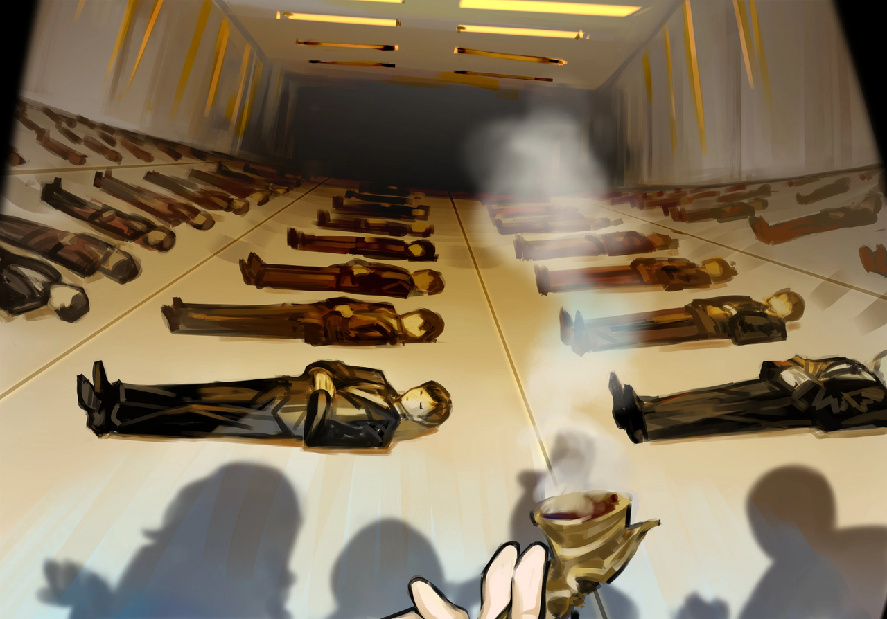

<h2 style="text-align:center;">"Если эту проблему не решить вовремя, меня уволят, и всех моих подчиненных тоже!"</h2>

Три человека сидели вокруг обеденного стола, рассчитанного на двоих.

"Хнннннх..."

Было ещё раннее утро, а Эзра уже сверлила взглядом ЮРию. Должно быть, её раздражает этот маленький незваный гость, ворвавшийся в нашу повседневную жизнь.

"Любопытно, как ты можешь завтракать и пялиться на меня непрерывно уже тридцать минут. Детектив, вы так не думаете?"

ЮРиа произнесла с улыбкой.

"Т-ты...! Ты мелкая...!"

"Детектив Мозес. Похоже, Эзра издевается над нами из-за нашего роста?"

"Э-это не...!"

Шум. У меня гудит в голове. Рис хорошо приготовлен, и всё же я теряю аппетит из-за шумной возни, которую устраивают эти двое. Это продолжается уже неделю. Не хотелось бы иметь дело с этим каждое утро до конца своих дней.

"Тихо!"

"Ай-яй!"

"Гхе."

Они вскрикнули, когда я стукнула их по ногам.

"Не могли бы вы вести себя потише хотя бы когда мы за едой?"

Эзра и ЮРиа кивнули.
 
 

Мой аппетит наконец вернулся в новообретённом покое. Я кладу перепелиное яйцо, сваренное в соевом соусе, на тёплый рис и ем. Еда, купленная нами в "Лавке закусок Ран", продуктовом магазине недавно открывшемся рядом с нашим Офисом, оказалась вкусной. Стоит почаще туда заходить. Закончив трапезу, я вышла на террасу покурить, следуя своему обычному распорядку дня.

"Эзра, помой посуду."

"Есть, шеф~"

Под звуки того, как Эзра моет посуду, я выпускаю табачный дым и смотрю вниз. Искажённые существа, как обычно, направляются на искажённые рабочие места. Этот вид улицы навсегда останется неизменным.

"ЮРиа, снаряжение всё готово?"

"Конечно. Всего одиннадцать предметов, верно, детектив Мозес?"

Одиннадцать единиц снаряжения всего за неделю — довольно впечатляюще. Кроме того, снаряжение заказала Эзра, а не я. Вероятно, она, назло, попросила сложные и замысловатые гаджеты. Их качество ещё предстоит продемонстрировать, но скорость производства определённо на уровне мейстера.

"...Эзра, здесь всё?"

Эзра на мгновение перестаёт мыть посуду и кивает, уставившись на тарелку, которую держит.

Похоже, эти двое ещё нескоро будут нормально разговаривать друг с другом.

"Если вы продолжите отказываться сотрудничать, я урежу зарплату вам обеим."

"...Ик."

"Меня это не волнует. Я ведь работаю здесь не ради денег."

Беззаботно отвечает ЮРиа.

"...М-меня это тоже не волнует! Детектив! Можете вообще мне не платить целый месяц!"

Не могу поверить, что Эзра готова зайти так далеко. Детский сад. Я приложила руку ко лбу.

"Хфф... Мне плевать, какой хернёй вы маетесь друг с другом, просто не позволяйте своим перепалкам мешать нашей работе."

"Да."

"Поняла..."
 
 
 

С тех пор, как мы приняли ЮРию, у нас не было ни одного значимого запроса. Все они были пустяковыми делами, где мне не приходилось использовать свою трубку, и большинство из них вообще не были случаями Искажения. Я ожидала, что ЮРиа разочаруется этой бессобытийностью, но её это почти не беспокоит. Я спустилась вниз, всё ещё держа трубку во рту, и порылась в ящике с запросами. Там ждал конверт. Я вскрыла его и прочитала бумагу внутри.
 
 
 

...Это дело пахнет чем-то крупным.
 
 
 

Мы втроём идём по улице.

"Вы получаете запросы и от компаний?"

Спрашивает ЮРиа.

"На самом деле, компании в Подворотнях — наши самые частые клиенты. Они любят скидывать проблемные инциденты на Офисы, специализирующиеся на их решении."

Ответила я, придерживая трубку зубами. Эзра следовала за нами в нескольких шагах позади, в полной тишине. Полагаю, мне стоило бы попытаться её как-нибудь приободрить сегодня.
 
 
 

Мы прибыли к зданию компании. Это довольно крупное предприятие, занимающее целое 10-этажное здание. Возможно, это субподрядчик Крыла... Эзра и я предъявили наши удостоверения Корректировщиков, а также письмо-запрос в холле, в то время как ЮРиа показала свой сертификат союза мастерских. Мы получили по гостевому пропуску и надели их на шеи. Охранник, ждавший у лифта, проверил пропуска и спросил о нашем пункте назначения. "Восьмой этаж." Дав краткий ответ, мы поднялись на лифте до этажа, указанного в письме.
 
 
 

Когда двери лифта открылись на восьмом этаже, нас кто-то встретил.

"А, здравствуйте, дорогие Корректировщики! Я ждал вас. Вот моя визитная карточка."

На карточке было указано: Канг Джин-сил, менеджер отдела добывающей компании «Тэ-Юнг».

"Я уже обращался в три Офиса по этому поводу, но ни один из них не смог решить проблему. Если эту проблему не решить вовремя, меня уволят, и всех моих подчиненных тоже!"

"Вам больше не о чем беспокоиться. Детектив Мозес здесь, и она изящно разберётся с этим делом."

Вмешалась ЮРиа, в то время как Эзра всё ещё молчала.

"Здравствуйте. Я Мозес из Офиса Мозес, занимаюсь загадками и нераскрытыми делами. Могу я спросить, кто порекомендовал вам наш Офис?"

"Это, эээ... Амэ! Офис 'Амэ' порекомендовал вас. Они сказали, что Офис Мозес идеально подойдёт для такого дела!"

Офис 'Амэ', должно быть, там, где Каору. Мальчик ворчливый, но по-своему заботится о нас.

"Перейдём к сути. Где люди, страдающие от симптомов, описанных в письме?"

"Ах, эти сотрудники на самом деле находятся в спальной камере на четвёртом подземном этаже, не здесь."

"Спальная камера? Что делает спальная камера в здании компании?"

С любопытством спросила ЮРиа.

"Значит, это коррумпированная компания, которая заставляет своих сотрудников работать сверхурочно так часто, что у них нет времени возвращаться домой, чтобы поспать."

Эзра ответила ровным тоном.

"Ох..."

"Хахаха... Ну, вообще, не только мы так делаем. Большинство фирм сейчас поступают так же."

Менеджер Канг казался несколько озадаченным словами Эзры.

"Тогда, пожалуйста, проводи нас."

"Конечно. Сюда, пожалуйста."
 
 
 

Мы снова вошли в лифт. Менеджер Канг приложил свой пропуск с чипом к панели управления лифтом, открыв набор кнопок, ведущих на подземные этажи. Это здание компании уходит на глубину вплоть до пятнадцати подземных этажей. На такой глубине вполне можно наткнуться на какие-нибудь скрытые Руины.

"Что это за производственная компания, которая уходит так глубоко под землю?"

Спросила Эзра.

"Хаха, боюсь, я не могу ответить настолько подробно. Можете просто считать это подземное пространство нашим складом."

Ответил менеджер Канг, нажимая кнопку четвёртого подземного этажа.
 
 
 

С маленьким звоночком лифт прибыл к месту назначения. Когда мы вышли, нас встретила полная темнота.

"О боже, почему здесь так темно?"

"Потому что здесь люди спят, дурёха!"

Эзра снова ответила на вопрос ЮРии. Менеджер Канг ощупал стену в поисках выключателя, и вскоре оранжевые лампочки на потолке зажглись, один ряд за другим.

*Щёлк.*

*Щёлк.*

*Щёлк.*

С каждым зажжённым рядом лампочек становилось видно больше людей.

Многочисленные люди лежали на полу, аккуратно расположенные в ряд.
 
 
 

 
 

"Хаха, как вы можете видеть... Эти сотрудники совсем не просыпаются."

"Не пробуждаются от своих снов, значит..."

"Какие же сны им снятся, чтобы делать такие лица?"

Сказала Эзра, склонив голову набок.

"Кажется, они сбежали в свои сны. Нам следует взглянуть на их недавние рабочие записи."

С улыбкой проговорила ЮРиа.

"Да. Я тоже так подумала."

Согласилась я.

"Ииииииии...!"

Обидчиво простонала Эзра.
 
 
 

Боже, а я-то последнее время пыталась успокоить Эзру...
 
 
 

"На самом деле, это ещё не всё..."
 
 
 

АлстБеррьюМаксалкМыДронРаксаРилоВассаДенгКресодЖдёмТуфоКласкВиоуХорреАлстБеррью
ТотМаксалкДронРаксаРилоВассаДенгДеньКресодТуфоКласкВиоуХорреАлстКогдаБеррьюМаксалк
ДронРаксаТотРилоВассаДенгКресодТуфоДеньКласкВиоуХорреПридётАлстВсеБеррьюМаксалкУзрят
ДронРаксаРилоВассаДенгКресодЕгоТуфоКласкВиоуХорреСветАлстБеррьюМаксалкДронМыРаксаРило
ВассаДенгКресодТуфоКласкВиоуХорреАлстБеррьюМаксалкДронРаксаРилоВассаДенгКресодТуфоОбрящут
КласкВиоуХорреАлстБеррьюМаксалкДронРаксаРилоВассаДенгСпасениеКресодТуфоКласкВиоуХорре
 
 
 

Все люди, лежащие на полу, открыли глаза и начали хором скандировать невнятные слова. Обширный подземный этаж вскоре наполнился многими голосами.

"Ииик!"

Эзра перепугалась.

"Мне кажется, в том что они произносят есть какое-то скрытое послание."

Проговорила ЮРиа с закрытыми глазами, сосредоточившись на звуке.
 
 
 

АлстБеррьюМаксалкМыДронРаксаРилоВассаДенгКресодЖдёмТуфоКласкВиоуХорреАлстБеррью
ТотМаксалкДронРаксаРилоВассаДенгДеньКресодТуфоКласкВиоуХорреАлстКогдаБеррьюМаксалк
ДронРаксаТотРилоВассаДенгКресодТуфоДеньКласкВиоуХорреПридётАлстВсеБеррьюМаксалкУзрят
ДронРаксаРилоВассаДенгКресодЕгоТуфоКласкВиоуХорреСветАлстБеррьюМаксалкДронМыРаксаРило
ВассаДенгКресодТуфоКласкВиоуХорреАлстБеррьюМаксалкДронРаксаРилоВассаДенгКресодТуфоОбрящут
КласкВиоуХорреАлстБеррьюМаксалкДронРаксаРилоВассаДенгСпасениеКресодТуфоКласкВиоуХорре
 
 
 

Голоса вновь пронеслись по этажу.

"Менеджер, мы хотели бы проверить их рабочие записи за последний месяц..."

Я повернулась, обращаясь к менеджеру Кангу, который, как я думала, должен был быть прямо за нами.
 
 
 

*Вжжжж-*
 
 
 

Но Канг Джин-сил уже был внутри лифта.
 
 
 

*К-чиньк!*
 
 
 

Затем стальная решётка заблокировала вход в лифт.
 
 
 

"Прошу прощения, Корректировщики. Хаха, я уверен, что вы достаточно способны чтобы справиться с этим, верно ведь?"
 
 
 

Двери лифта начали закрываться.
 
 
 

"Скажи мне... Что случилось с Каору из Офиса 'Амэ'...?"

"Довольно скоро вы и сами всё узнаете... Надеюсь, вы сможете пережить этот ад..."

Двери лифта полностью закрылись.
 
 
 

"Ну и надули же нас..."

Лампочки на потолке начали мерцать.
 
 
 

Каждый раз, когда лампочки мерцали, можно было видеть сотни глаз, всё ещё лежащих на полу, устремлённых на нас.

*Дз-дзззт — Морг...*

*Дз-дзззт — Морг...*

*Дз-дзззт — Морг...*

*Дз-дзззт — Морг...*

*...Морг.*
 
 
 
 

<h2 style="text-align:center;">Что ждёт в следующей главе...</h2>

"Эзра... То, с чем нам предстоит столкнуться, совершенно отличается от всего, с чем мы имели дело раньше."

"Да, детектив!"

Эзра ставит свою пространственную сумку на пол.

"ЮРиа, смотри сколько душе угодно."

"Конечно же, буду~"

Я зажала свою трубку губами.

Я закрыла глаза и начала вдыхать...
