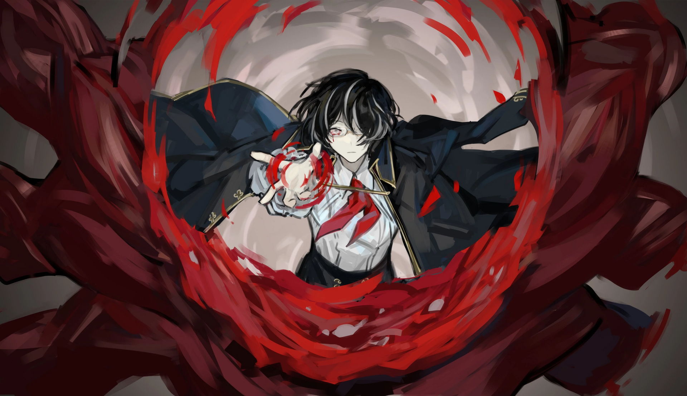

<h2 style="text-align:center;">Каждый ужасный миг из моего прошлого кружится вокруг меня.</h2>

"Уууу... Детектив... Я так безнадёжна с подобными штуками..."

Эзра укрылась за мной, говоря слабым, писклявым голосом.

"Похоже, она не поможет. Тогда, начнём с поиска выхода, детектив?"

"Ииииии!"

У неё всё ещё хватает наглости подкалывать Эзру в такие моменты. Должна задаться вопросом, не устаёт ли она от этого.

"У тебя есть очки ночного видения или что-то в этом роде?"

"А, точно! В моей пространственной сумке есть несколько!"

"Это я создала очки, кстати"

"Ну а я продумала их функции!"

"Я похвалю вас обеих, просто дайте мне чёртовы очки уже."

Эзра порылась в своей пространственной сумке, достала три пары очков и протянула по паре каждой из нас. Дужки очков украшены ленточками. Типичная мода северных мастерских... Неужели им обязательно нужно украшать всё, что они делают, такими орнаментами? Надев очки, я смогла чётко видеть помещение, словно оно ярко освещено солнцем. Даже когда лампочки на потолке бешено мигали, очки автоматически компенсировали резкие изменения яркости, позволяя видеть вещи с постоянной степенью освещённости. Довольно впечатляюще. В старые дни, когда работали только мы с Эзрой, мне пришлось бы полагаться на зажигалку, чтобы с трудом разглядеть то, что прямо перед нами. Определённо удобно, когда в нашем Офисе работает мейстер.

"Детектив, что мы будем делать, если они все на нас набросятся?"

Беспокойно спрашивает Эзра.

"Я тоже размышляю, что делать."

Оглядевшись, я насчитала здесь в общей сложности 108 сотрудников. Они все моргают одновременно, скандируя одни и те же слова. Что это может означать? С какой целью? Возможно...

"...Кажется, будто сознания этих людей связаны."

"Детектив! Вон там...!"

Эзра указала на размозжённую груду плоти, лежащую в углу спальной камеры. На самом деле, их было несколько по всей камере. Я вижу как минимум восемь, все образованные в разное время. Мы подошли к груде, которая выглядела самой свежей.

Это мёртвое тело, как я и предполагала... Труп, который был жестоко раздавлен. Что-то в этой комнате размазало людей.

"Их швырнули с огромной силой. Прошло как минимум тридцать три часа с момента, как была пролита эта кровь, судя по её состоянию. Это тело, кажется, получило серьёзные внешние повреждения."

Сказала ЮРия, разглядывая груду плоти через лупу.

"...Каору."

Этот меч принадлежал Каору. Значит, у нашего противника достаточно физической силы, чтобы размозжить Корректировщика 4 ранга. Остальные комки плоти поблизости, вероятно, — это то, во что превратились другие Корректировщики из Офиса Амэ. Однако в поле нашего зрения нет ничего, что выглядело бы виновником. Единственные другие объекты в этом пространстве — сто восемь спящих сотрудников производственной компании, всё ещё одетых в костюмы, и мы трое.

"Детектив! Как выглядят эти сотрудники в твоих глазах?"

Спрашивает Эзра.

"Что ж, очевидно... У них все разные формы Искажений..."

Нет, что-то не так. У сотрудников и правда были свои Искажения, без каких-либо общих черт — совсем как те, что я вижу на улицах. Однако их Искажения начинают исчезать. Тот, у кого отсутствовало лицо, обретает его вновь. У того, чья правая рука была обожжена, рука восстанавливается. Цилиндрические предметы извлекаются из другого человека. Все Искажения собираются в определённую точку.
 
 
 

Я посмотрела в точку, куда сходились все Искажения.
 
 
 

Дым клубился от того, что выглядело как алтарь.
 
 
 

Тогда их песнопение должно быть каким-то кодом и ритуалом для призыва чего-то. Дым постепенно конденсируется в определённую форму. Стоит ли убить всех сотрудников, спящих здесь? Мы даже не знаем, что может проявиться из этого дыма. Трудно судить о том, о чём ничего не знаешь. У меня плохое предчувствие. Это может оказаться благоприятным феноменом. Это может быть возможностью. В то же время, это с такой же вероятностью может быть чем-то, способным убить нас всех. Я не могу вынести никакого суждения о феномене, с которым сталкиваюсь впервые. Должна ли я убить сто восемь человек по собственному усмотрению, основываясь на неопределённой возможности? Жизни Эзры и ЮРии зависят от моего решения. Мои мысли ускоряются. Эзра и ЮРия что-то говорят мне. Чёрт, я знаю. Я должна что-то придумать. Если я использую своё белое дыхание, смогу ли я контролировать более ста человек одновременно? Я ещё не пробовала что-то такого масштаба. Однако в худшем случае я лишь разрушу себя. Да, это самый разумный вариант, который у меня есть. Приняв решение, я открыла глаза.
 
 
 

Пол под каждым сотрудником раздвинулся, поместив их в пространство внизу. Словно их использовали как батарейки разума.
 
 
 

...Слишком поздно.
 
 
 

В пространстве в 100 пхёнов остались только мы трое.

Пока мы не заметили нечто, стоящее перед нами.

Как минимум 3 метра ростом. Шесть рук. Массивные мускулы, которые выглядят так, будто вот-вот лопнут. Череп вместо головы. Синие языки пламени, вырывающиеся из его разинутой пасти. Алые глаза, уставленные на меня. Завершённая форма. Существо принимает причудливую позу.
 
 
 

Это полностью враждебная сущность.
 
 
 

Инстинктивный страх охватывает нас. ЮРия крепко ухватилась за мой рукав. Взгляд Эзры изменился.

"Эзра... То, с чем нам предстоит столкнуться, совершенно отличается от всего, с чем мы имели дело раньше."

"Да, детектив!"

Эзра ставит свою пространственную сумку на пол.

"ЮРия, смотри сколько душе угодно."

"Конечно же, буду~"
 
 
 

Я зажала свою трубку губами.
 
 
 

Я закрыла глаза и начала вдыхать...
 
 
 

Это Искажение имеет тот же запах, что и 'Пианист'.
 
 
 

Искажение, намеренное лишь убивать...
 
 
 

Один момент невнимательности означает смерть.
 
 
 

И всё же я начинаю чувствовать волнение.
 
 
 

...Полагаю, эта старая привычка умрёт не скоро.
 
 
 

"Режим штурма Всё-Сразу, Марк 3!"

Пространственная сумка Эзры испустила оранжевое свечение, когда она крикнула. Эзра вооружила себя экзоскелетами различных форм по всему телу. Огромное, громоздкое тело Эзры стало еще более массивным, и теперь размер её тела был примерно равен существу, с которым мы столкнулись. Я заметила, что экзоскелеты, которые она носит, не совсем похожи на те, что я видела у неё раньше. Это, должно быть, работа ЮРии, хотя, кажется, Эзра нашла время, чтобы обклеить их наклейками, как она делает со всем, чем владеет.

"Когда ты облепила моё снаряжение такими дурацкими наклейками!"

ЮРия пожаловалась, как и следовало ожидать.
 
 
 

"...Если покажется, что мы вот-вот умрём, не оглядывайся и просто беги. Уверена, ты сможешь как-нибудь починить тот лифт. Я выиграю для тебя время."

Эзра обратилась к ЮРие спокойным тоном.

"Чего... О чём ты говоришь!"

ЮРия вдруг утратила свою обычную дерзость.
 
 
 

Ха-ах... Я приложила руку ко лбу.
 
 
 

"Не накликайте, вы обе. Мы все вернёмся живыми."
 
 
 

*БАХ-!*
 
 
 

С оглушительным ударом ноги о пол гигант прыгнул на меня. Его череп оказался прямо передо мной в мгновение ока, одна из его рук занесена для удара. Чистый удар этим кулаком мог превратить меня в месиво. Я стояла на месте и закрыла глаза.
 
 
 

*БУМ!*
 
 
 

Эзра немедленно вступила в бой и отбросила гиганта так же быстро, как он приблизился ко мне.
 
 
 

"Я не позволю тебе и пальцем тронуть детектива!"
 
 
 

*СВИИИСТ*
 
 
 

Врезавшись в стену, гигант вскоре выпрыгнул и замахнул свой кулак в Эзру.
 
 
 

*БАХ-БАМ-*
 
 
 

Эзра высоко подняла руки и развернула силовой щит, чтобы блокировать его атаку. Мои волосы и пальто развевались от взрывной волны, созданной его ударом.
 
 
 

Тот гигант — чисто физическое существо. Сомневаюсь, что психологические атаки окажут на него какой-либо эффект. Я могла бы попытаться ограничить его движения, чтобы помочь Эзре. Но даже если бы я сделала это, сможет ли она нанести решающий удар тому монстру? В этом я тоже сомневаюсь.
 
 
 

"Эзра! Защищай меня изо всех сил."
 
 
 

"Есть, шеф!"

Эзра ответила громко и чётко.
 
 
 

Я вдохнула багряно-красный пар.

 
 

White glow (0.6)
Red glow (1.5)
Purple glow (2.2)
Cyan glow (0.8)

"ЮРиеобразный вращающийся бур!"

Три бура выдвинулись из экзоскелета на правой руке Эзры, когда она ударила в тело монстра. Они с трудом проникают в жёсткую кожу гиганта, разбрасывая искры во все стороны. Гигант использует две свои руки, чтобы схватить правую руку Эзры, и отталкивает её, в то время как накапливает силу четырьмя другими. Эзра продолжает бить левой рукой в его нижнюю часть тела.
 
 
 

*БУУУУМ*
 
 
 

Четыре прямых удара одновременно обрушиваются на Эзру; грубая сила четырёх рук отбрасывает Эзру через всё помещение, в стену.
 
 
 

Я вдохнула багряно-красный пар.

 
 

"Ты дурёха! Используй топор!"

Быстро выкрикнула ЮРия.
 
 
 

"ЮРиеобразный топор!"

Эзра вытащила длинный шест со спины, который превратился в двуручный боевой топор огромного размера.

"Никогда не думала, что этот чрезмерно длинный топор действительно пригодится..."

Пробормотала ЮРия.
 
 
 

Я вдохнула багряно-красный пар.

 
 

Эзра бросилась на гиганта с топором в руках.
 
 
 

В то же время колосс поднимает свои правые руки и бросается на неё в ответ.
 
 
 

*РАЗРЕ-Е-ЕЗ*
 
 
 

Три мускулистые руки гиганта взлетели в воздух, аккуратно отрубленные топором.
 
 
 

"Это топор, который мои плюшевые мишки в мастерской точили целых четыре дня. Спорим, он режет лучше, чем гипервибрирующие лезвия, а~?"

"И правда лучше!"

Глаза Эзры заискрились энтузиазмом.
 
 
 

Я вдохнула багряно-красный пар.

 
 

"Осторожно!"

ЮРия предупредила Эзру.
 
 
 

*ВЖУХ—*

*ХРЯСЬ*
 
 
 

Отрубленные правые руки превратились в острые колья и впились в тело Эзры. Вновь замахнувшись топором, она разрубила вонзённые в неё колья. Немедля, Эзра оттолкнула гиганта ногой, после чего нанесла ответный удар топором.
 
 
 

*КЛЯНГ!*
 
 
 

"Эзра! Топор затупился...!"

"Тц..."

Эзра бросила изношенный топор на землю.
 
 
 

Я вдохнула багряно-красный пар.

 
 

Эзра и гигант вступают в жестокую схватку. Титан безжалостно избивает Эзру тремя оставшимися руками и ногами, разрушая её экзоскелеты по кусочкам. Кровь хлещет из кольев, застрявших в её теле.
 
 
 

"Детектив Мозес, пожалуйста!"

ЮРия заплакала, обращаясь ко мне.
 
 
 

Я вдохнула багряно-красный пар.

 
 

Я не перестаю вдыхать.
 
 
 

Я закрываю глаза и погружаюсь в себя.
 
 
 

Каждый ужасный миг из моего прошлого кружится вокруг меня.
 
 
 

Воспоминания о жестокости, которые я никогда не хотела вспоминать. Кровь. Шрамы. Трупы. Боль. Война. Бойня.

 
 

Я концентрирую всё это зло в единственной точке.
 
 
 

"Хорошая работа, Эзра."
 
 
 

Курительная трубка стала алым, грубым цилиндром в моей руке.
 
 
 

Я нацелила цилиндрическую форму на монстра.
 
 
 

<strong>"Багровая Точка."</strong>

 
 

И вонзила цилиндр в гиганта.
 
 
 

 
 

Цилиндр вырос в 5 раз, стирая верхнюю часть тела существа.

Он проделал дыру в теле гиганта, дыру, созданную физической силой. Однако источник этой силы был ни внешним, ни внутренним.
 
 
 

То, что когда-то там было, просто исчезло.
 
 
 

Я упала на колени. Моё тело дрожало. Мои глаза были залиты кровью, а разум осаждали разрушительные импульсы. Я должна сохранить рассудок.
 
 
 

"Кха."
 
 
 

Я откашляла густой сгусток крови.
 
 
 

Затем я почувствовала знакомые объятия.
 
 
 

"Всё в порядке, детектив... Всё закончилось..."

Эзра обняла меня, всё её тело промокшее кровью.

ЮРия была рядом со мной, сидя на полу и плача.
 
 
 
 
 

И я смогла вернуться к себе.
 
 
 
 
 

"Вы все хорошо справились."

Я поднялась на ноги и поправила пальто.

"Пора бы уже выяснить, что, чёрт возьми, происходит в этой проклятой компании."
 
 
 
 
 

Я зажала свою трубку во рту.
 
 
 
 

<h2 style="text-align:center;">Что ждёт в следующей главе...</h2>

"Беловолосый человек в ханбоке..."

"Детектив... Может ли это быть...?"

Эзра бросила на меня тревожный взгляд.

"Тц, значит, этот мерзавец заглядывал в эту компанию."

"О чём это вы говорите?"

Спросила у нас ЮРия.
