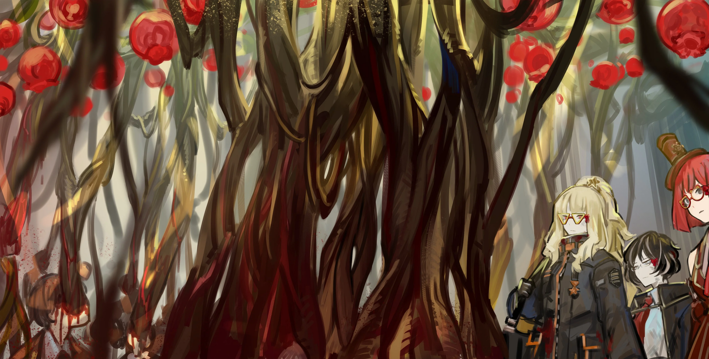

<h2 style="text-align:center;">...Искусственное Искажение, созданное по чьему-то замыслу.</h2>

"ЮРиа, ты более чем способна починить этот лифт, верно?"

"...Да."

"Пожалуйста, почини его как можно быстрее. Я пока немного позабочусь об Эзре."

"Хе-хе, не волнуйтесь, детектив. Я уже много раз проходила через подобное."

Было мало случаев, которые могли нанести Эзре такой серьёзный вред, хоть травмы в целом не являются для неё большой проблемой. Всё же не помешает проявить дополнительную осторожность, учитывая, что на этот раз мы имеем дело с Искажением. Я подошла к Эзре, отдыхающей на полу, и достала аптечку первой помощи из её пространственной сумки.

"Давненько я сама не перевязывала твои раны."

"Эхехе, и правда давно."

Колья, вонзившиеся в тело Эзры, испарились, когда скелетоподобный монстр пал. Я накладываю компрессионную повязку от Статья на Вики</a>  Мастерская Фанар производит бинты с помощью мини-сингулярности замедления кровотечения и ускорения регенерации.">Мастерской Фанар на открытые раны. Кровь всё ещё сочится, но, кажется, нет никаких признаков инфекции или заражения.

"Что это было за Искажение, детектив? Эти штуки становятся всё крепче и крепче. Не тот ли это тип, что был в деле с пробным экзаменом?"

"Без понятия... Ладно, позаботься об остальном сама."

Я встала и подошла к Антракт <a href='https://projectmoon.wiki.gg/ru/wiki/%D0%9E%D1%82%D0%B4%D0%B0%D0%B9_%D1%81%D0%B2%D0%BE%D1%8E_%D0%BF%D0%BB%D0%BE%D1%82%D1%8C_%D1%87%D1%82%D0%BE%D0%B1%D1%8B_%D0%B7%D0%B0%D0%B1%D1%80%D0%B0%D1%82%D1%8C_%D0%B8%D1%85_%D0%BA%D0%BE%D1%81%D1%82%D0%B8_(%D0%9A%D0%9B%D0%91)' target='_blank'>Уступаю плоть, дабы забрать их кости</a></i> <a href='https://projectmoon.wiki.gg/ru/wiki/%D0%A4%D0%B5%D0%BD%D0%BE%D0%BC%D0%B5%D0%BD_%D0%98%D1%81%D0%BA%D0%B0%D0%B6%D0%B5%D0%BD%D0%B8%D1%8F#%D0%9C%D0%BE%D0%BD%D0%BE%D0%BB%D0%B8%D1%82' target='_blank'>Статья на Вики</a>  Чёрный ящик, также известный как 'Монолит', является структурой неизвестного происхождения, способной насильно исказить окружающих его людей.  Согласно Данте, работа Монолита похожа на принцип работы <a href='https://projectmoon.wiki.gg/ru/wiki/%D0%97%D0%BE%D0%BB%D0%BE%D1%82%D0%B0%D1%8F_%D0%B2%D0%B5%D1%82%D0%B2%D1%8C_(%D0%9A%D0%9B%D0%91)' target='_blank'>Золотой Ветви</a>; оба высвобождают чувства и эмоции человека, с которыми ему предстоит столкнуться, но Золотая Ветвь высвобождает самые тёплые из них, в то время как Монолит высвобождает самые ужасные и холодные — из глубочайшей бездны их души.  Согласно <a href='https://projectmoon.wiki.gg/ru/wiki/%D0%93%D0%BE%D0%B3%D0%B5%D0%BD%D0%B3%D0%B5%D0%B9%D0%BC_(%D0%9A%D0%9B%D0%91)' target='_blank'>Гогенгейму</a> из научно-исследовательского отдела компании Лимбус, Монолит имеет 50/50 шанс превратить человека либо в Искажение, либо в Пекатулу.  <i>Ох, впервые я испытываю зависть ко всем вам. Хотелось бы мне стать свидетелем собственного Искажения...</i> — Гогенгейм">чёрному ящику, похожему на алтарь, в другом конце камеры. Искажения сотрудников этой компании были втянуты в этот ящик, который, в свою очередь, создал белый дым, проявившийся в одно гигантское Искажение. Это не было массовым Искажением, разделяемым многими людьми, как в случае с пробным экзаменом.
 
 

...Искусственное Искажение, созданное по чьему-то замыслу.
 
 

"Эзра! Подойди и забери эту странную штуку, когда закончишь с перевязкой."

"Поняла, шеф~!"

Эзра подняла сумку и отряхнулась, вставая.

"Детектив Мозес, лифт работает. Теперь мы можем попасть на любой этаж."

Эта компания намеренно погрузила своих сотрудников в сон в этой подземной камере и наняла Корректировщиков для борьбы с искусственным Искажением. Что они планируют с ним делать? Разработать в оружие? Если бы им удалось контролировать Искажение техническими методами, они определённо пошатнули бы баланс сил. Но как именно? Как возможно количественно измерить и манипулировать человеческим разумом с помощью одного-двух устройств? Технология, способная на такое, была бы ничем иным, как Сингулярностью. Это не достижение, которое какая-то никому неизвестная компания из Подворотен могла бы сделать самостоятельно. С этой компанией что-то не так.

"...Отправляемся на восьмой этаж."

"Поняла. Поднимаемся."

Эзра поспешно запрыгнула в лифт. К счастью, тот странный ящик, кажется, каким-то образом поместился в её пространственную сумку.

"...Сёнбэ. Ты в порядке?"

Тишина.

"...Эзра-сёнбэ!"

"М-м...? Я? Я твоя сёнбэ?!"

Воскликнула Эзра с удивлением.

"Раз мы обе ассистентки детектива Мозес, и ты здесь моя старшая, отныне я буду называть тебя сёнбэ."

ЮРиа, наконец, кажется, признала Эзру.

"О боже, детектив! Она, должно быть, искажена!"

"Оставим дружеские шуточки на потом, когда вернёмся в наш Офис. Мы уже почти на восьмом этаже."
 
 

*Динь-дон*
 
 

Когда двери лифта открылись, нас встретил сильный запах крови. Это запах свежей крови. Офис зарос зелёными лозами, на потолке висели бесчисленные красные плоды. Мой взгляд проследовал вдоль стеблей лоз, начиная с их кончиков на потолке. Они вели обратно к разинутым ртам сотрудников этой компании. Никто из них не был жив.
 
 

 
 

"Это..."

Тот же ящик, что мы видели в спальной камере, стоял посреди этого офиса. Ещё одно Искажение.

"Детектив! Значит ли это, что есть ещё такие, как тот, с которым мы только что сражались..."

Обеспокоенно спросила Эзра. Я приложила руку ко лбу. С нас хватит. И Эзра, и я на пределе. Мы будем мёртвым мясом, если столкнёмся с ещё одним Искажением того уровня, что встретили только что.

"Эзра! ЮРиа! Отныне, наша цель — выжить. Следуйте каждому моему приказу, которые я даю."

Обе кивают в ответ.
 
 

*Вииииивууууууу*
 
 

Завыла сирена, за которой последовало объявление.

"Аварийная блокировка. Аварийная блокировка. Добывающая компания «Тэ-Юнг» прекращает деятельность с данного момента. Повторяю: Добывающая компания «Тэ-Юнг» прекращает деятельность с данного момента. Уважаемые сотрудники, согласно условиям трудового договора, вы не можете покинуть здание компании. Повторяю..."
 
 

*Шшш-ка, шшш-ка, шшш-ка*
 
 

Стальные роллеты опустились на окна офиса, одно за другим.

"Эзра! Используй всю возможную силу, чтобы разбить это окно сейчас-же!"

"Да, шеф!"

Эзра экипировала перчатки Мастерской Намир и Мастерской Аллас на руки и рванула к окну для мощного удара. Огромная сила удара вызвала сотрясение в офисе, но оставила лишь вмятину на роллете. Это была не обычная сталь. Мы в полной ловушке. Я достала свою трубку и начала курить.

"Детектив Мозес. Лифт больше не работает. Основная система здания была полностью отключена."

ЮРиа докинула плохих новостей сверху.
 
 

*К-чиньк—К-чиньк. БАМ! К-чиньк—К-чиньк. БАМ!*
 
 

Я слышу, как что-то разбивается. Неужели окно не выдержало удара?

...Конечно, нет. Я была глупцом и дурой, чтобы сделать такое поспешные предположение.
 
 

"Эзра! Готовь свой клинок Стигмы! И ЮРиа! Можешь прямо сейчас сделать устройство, способное разжечь огонь?"

"Ничего, что я могла бы создать в данный момент. Но я могла бы попробовать использовать кое-что, что приготовила для вашей курительной трубки, детектив Мозес..."
 
 

*Киииииииииииииии~!*
 
 

Красные объекты, свисающие с потолка, не были никакими плодами; это были яйца. Мы были в своего рода инкубаторе. Сотрясение от удара Эзры заставило эти яйца вылупиться. Огромные комары с человеческими лицами медленно выползли из треснувших скорлупок.
 
 

"Детектив! Они приближаются!"

Выкрикнула Эзра.

"ЮРиа, давай попробуем что ты там предложила, чем бы это ни было."

Я передала свою трубку ЮРии. Эзра держала клинок и приготовилась к бою. Комары зависли в воздухе на мгновение, прежде чем броситься на нас. Пылающий меч Эзры рассек нескольких комаров, но этого было далеко недостаточно, чтобы остановить их всех. Насекомые кусали Эзру и начали высасывать из неё кровь.

"Ускорься, ЮРиа."

"Готово! Попробуй представить огонь, так же, как когда ты превращала свою трубку в красный меч!"

Она вернула мне мою трубку, теперь с красной лентой, обвязанной вокруг неё. Я впустила красное дыхание. Вспышки пламени поднялись из чаши трубки, приняв затем форму птиц. Горящие птицы влетают в гигантских насекомых, пирующих на Эзре, и поджигают их.

"Спасибо, детектив..."

Голос Эзры лишён энергии. Моё тело быстро холодеет. Словно тепло моей жизни высасывают. Полагаю, за всё нужно платить.

"Давайте возьмём лестницу здесь. Эта дверь, к счастью, не заперта."

На этот раз ЮРиа сообщила хорошие новости, распахнув дверь на лестничную клетку. Птицы из пламени дали нам достаточно времени, чтобы пробиться к двери.
 
 

"Боже мой..."

Тихо пробормотала ЮРиа, как только ступила в лестничную клетку.
 
 

Поток людей течёт вдоль лестницы. Это буквально река из людей. Они плывут вниз по лестничной клетке, их конечности переплетены друг с другом.

"Детектив... Это наш конец?"

Эзра с трудом вымолвила.
 
 

"Не сегодня..."

Слабо ответила я.
