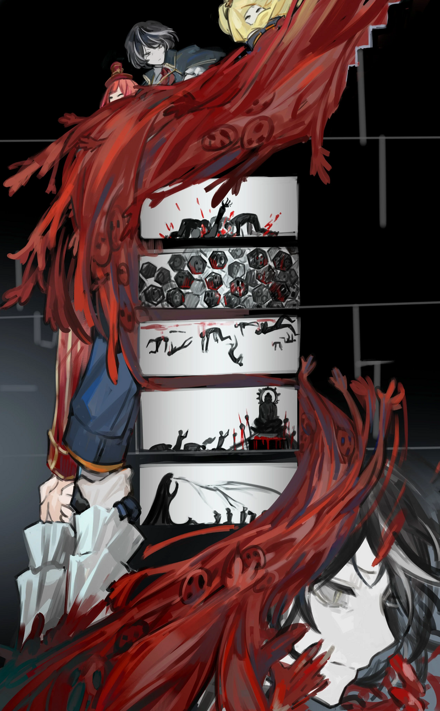

<h2 style="text-align:center;">В этом стремительном потоке я отчаянно сжимала руки Эзры и ЮРии.</h2>

Это быстрый поток людей, который выглядит так, словно может унести любого, кто неосторожно ступит в него. У нас нет других вариантов. Наш единственный выбор — позволить течению унести нас, куда бы оно ни привело.

"Эзра, ЮРиа. Мне нужно, чтобы вы доверились мне."

"Конечно, шеф!"

"Хорошо."
 
 
 

"Мы прыгаем в этот поток."

"Поняла."

"Чего?!"

Разница в отношении ощутима.
 
 
 

Я первой шагнула в реку. Меня засосало сразу, как только я погрузила ногу по лодыжку в поток плоти. Стремительно спускаясь вместе с волной, я мельком вижу каждый этаж.
 
 
 

 
 

Седьмой этаж, где сотрудники ползают на четвереньках, яростно нападая друг на друга.
 
 
 

Шестой этаж, где люди, сложенные в форме кубоидов, сложены в стопки.
 
 
 

Пятый этаж, где утонувшие сотрудники парят в воздухе.
 
 
 

Четвёртый этаж, где несколько человек приносят человеческую жертву тому, что выглядит как статуя человека, достигшего Статья на Вики</a>  Нирвана - высшая цель в Буддизме, означающая полное освобождение от страданий, желаний, привязанностей и цикла перерождений.">нирваны.
 
 
 

Третий этаж, где сознания сотрудников поглощаются тёмной тенью.
 
 
 

В бурном потоке людей, спутанных друг с другом, моё сознание медленно меркнет. Граница сознания рушится. Искажения людей соединяются в единый большой поток, уходя на подземные этажи. Я уверена, что смогу крепко удержать своё здравомыслие. Но смогут ли Эзра и ЮРиа сохранить себя в этом течении так же? Мои тревоги вскоре размываются на фрагменты и уплывают по течению. Воспоминания о прошлом всплывают в моём разуме. Воспоминания о моих прошлых заданиях. Соратники, которых я не смогла защитить. Моя некомпетентность, которая привела их к гибели. Словно все мои сожаления и тоска взбаламучены. Эмоции сливаются с потоком и уплывают. В этом стремительном потоке я отчаянно сжимала руки Эзры и ЮРии.
 
 
 

Как далеко я спустилась? Сколько времени прошло? Когда я пришла в себя, вокруг меня никого не было. Куда делись все люди? А что с Эзрой и ЮРией? Моя голова раскалывается.
 
 
 

'Ты, должно быть, уже проснулась.'

...Знакомый, но отвратный голос достигает моего уха.

'Если ты это слышишь, это, скорее всего, означает, что ты на пятнадцатом подземном этаже добывающей компания «Тэ-Юнг».'

"Ты всегда любил такие дурацкие игры."

'У тебя, наверное, много вопросов ко мне.'

Это предзаписанное сообщение. Теперь я понимаю, почему Хан Хи-Джун недавно навестил мой Офис. Я всё это время играла по его сценарию.

'Верно. Ты всегда доверяла мне и выполняла любую просьбу, о которой я просил.'

"Полагаю, ты стоял за тем инцидентом, который я устроила в тот день."

'Сейчас не время для этого, впрочем; у нас есть более важные вопросы. Зачем я оставил здесь сообщение, чтобы «поговорить» с тобой? Что случилось с твоими прелестными ассистентками? Как мне удалось использовать Искажение в своих интересах?'

"Я больше не позволю твоим хитрым словам влиять на меня, ты, коварный змей. Заботиться о моих напарниках — это моё дело... И свой путь я выбираю сама."

'Конечно. Я просто пытаюсь дать тебе небольшое предупреждение. Все аномалии, произошедшие в этой компании, были устроены по одной причине. Я хотел дать тебе знать, что нашёл зацепку. Об Искажении, за которым ты охотишься. Как ты могла здесь заметить, теперь я могу в некоторой степени управлять Искажением. Мозес, разве это не даёт тебе проблеска надежды, что ты наконец сможешь искупить то, что совершила?'

"Ты же знаешь, что я и так уже собиралась встретиться с тобой. Не было нужды устраивать всю эту ерунду."

'Но если бы я не пошёл на такие меры, как минимум, твоя ненависть ко мне не имела бы такого большого веса, не так ли?'

"Какая ничтожная забота. Я бережно коплю всю свою ярость специально для тебя. Почему бы тебе не подготовить в это время серебряное блюдо, чтобы я мог положить на него твою голову."
 
 
 

*Вжжжжж — Щёлк.*
 
 
 

'Если ты это слышишь, это, скорее всего, означает, что ты на пятнадцатом подземном этаже добывающей компания «Тэ-Юнг»...'
 
 
 

Этот сукин сын. Он слишком хорошо умеет мной манипулировать.
 
 
 

Сейчас я должна сосредоточиться на поисках Эзры и ЮРии.
 
 
 

Щёлк! Люминесцентные лампы освещают подземное пространство. Это был пятнадцатый подземный этаж; он полностью окружён чисто белыми поверхностями.

И Эзра смирно стояла посередине.

"Хфф... Эзра..."

Я достала свою курительную трубку и зажала её во рту. Затем я приложила руку ко лбу. Похоже, Искажение Эзры всё ещё в пределах моих возможностей решить. Она выглядит такой маленькой и беспомощной, стоя на противоположной стороне комнаты с опущенной головой.

"Детектив... Я не смогла защитить её... Это прямо как тогда... Я доверяла вам, детектив..."

ЮРиа неподвижно лежала у ног Эзры, без сознания.
 
 
 

"Хотя... На самом деле, я всё ещё вам доверяю..."
 
 
 

Красная лента ЮРии всё ещё обвязана вокруг моей курительной трубки. Я спокойно вдыхала дым, глядя на потолок.
 
 
 

Большие рога, напоминающие оленьи, выросли на голове Эзры. В моих глазах Эзра всегда носила маску на лице. Хотя я никогда не могла точно сказать, была ли эта маска истинным выражением её чувств. Но на этот раз многочисленные маски покрыли всё её тело. Река Искажений в итоге добралась и до неё.

Полагаю, решение Искажения моей драгоценной напарницы — это дело, за которое я могу взяться бесплатно.
 
 
 

Я вдохнула фиолетовый дым.
