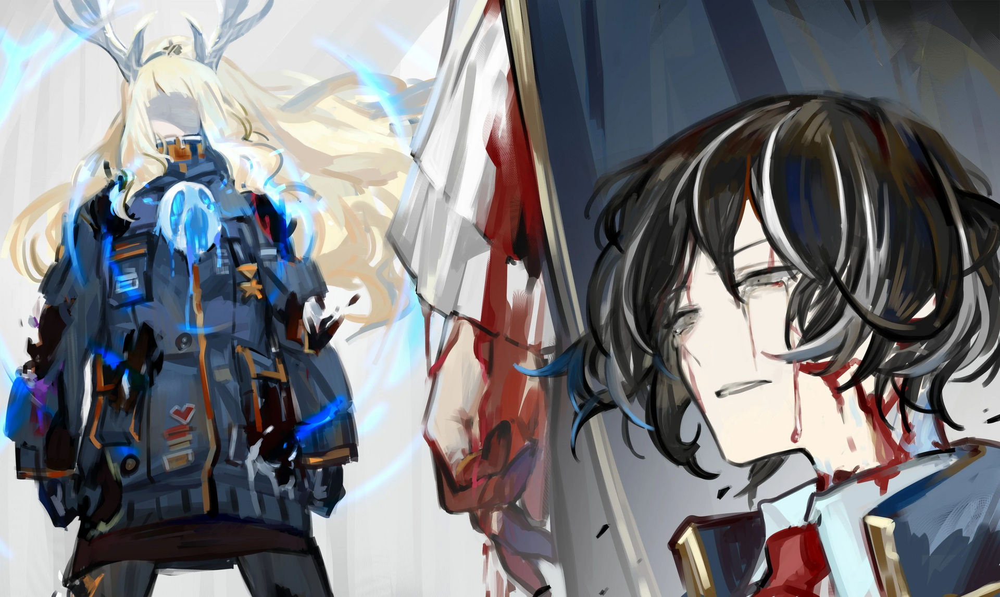

<h2 style="text-align:center;">Давай станцуем, Эзра.</h2>

Эзра. Старательное дитя, которое мало верит в себя. Эзра носила новую маску каждый день; я могла только читать выражение маски, скрывающей её лицо. Я не знаю, каким может быть её истинное выражение под маской, но я решила принимать то, что показано на маске Эзры, за её выражение. Я не утруждала себя насильственным разрешением её Искажения, до сих пор.
 
 
 

На этот раз, всё иначе. Она на грани потерять себя, унесённая чужими Искажениями. Всё её тело покрыто масками множества людей, зримым доказательством её опасного положения. Для каждого, с кем она сталкивается, Эзра готовит маску; для каждой маски, что носит, — отдельную эмоцию. Мне остаётся лишь гадать о буре, что разыгрывается в её разуме.
 
 
 

Пятнадцатый подземный этаж. Эзра и я стоим друг против друга в этой белой комнате. Громкие звуки доносились от масок Эзры. Голоса смеха, плача, гнева, тревоги, меланхолии, недоверия, отвращения и радости наполняли камеру.
 
 
 

Я обмотала свой фиолетовый кнут вокруг руки.
 
 
 

"Давай станцуем, Эзра."
 
 
 

Я ринулась на Эзру, моя первая цель: смеющаяся жёлтая маска на её правой ноге. Голос звенит в моей голове, когда я захватываю маску своим кнутом.
 
 
 

*'А какой твой любимый сэндвич, Мозес?'*

*"Мой — с горчицей."*

*'Тогда и мой любимый — с горчицей, тоже!'*
 
 
 

Я дёргаю кнут, чтобы оторвать жёлтую маску от её тела. От этого меня тошнит. Эзра издаёт крик.
 
 
 

"Пожалуйста, потерпи немного."
 
 
 

Красная маска на левом плече Эзры издаёт визг. Эзра хватает кнут и тянет меня к себе. Я ослабила напряжение в теле. В мгновение ока я отправлена в её сторону.
 
 
 

*'Рррааааааххх!!! Я убью их всех! Я сломаю каждого, кто должен умереть!'*

Эзра замахивается кулаком на меня, пока меня тащит по воздуху к ней. Используя импульс рывка, мне удалось оттолкнуть своё тело от траектории её кулака. Я обматываю кнут вокруг тела Эзры и запрыгиваю ей на плечи. Затем я хватаю красную маску рукой, чтобы оторвать её.

"Применяй насилие только тогда, когда это необходимо."
 
 
 

Визжа, красная маска вырывается и отбрасывается на пол. Моя рука покраснела от обжигающего жара маски. Эзра сильно билась, в процессе придавив меня в пол. Я почувствовала ноющую боль. Кость или десять, должно быть, дали трещину.

"Хннгх... Мне стоило целое состояние починить спину..."
 
 
 

Я противостояла маскам Эзры и срывала их одну за другой; с каждой маской, которую я снимала с неё, происходил всплеск эмоций Эзры. Ледяная маска, маска, разъедающая разум, маска с вбитыми в неё ржавыми гвоздями...
 
 
 

"Это не твои истинные эмоции. Это личины, лица, которые ты хочешь, чтобы другие видели в тебе."
 
 
 

Я была обожжена, истекала кровью от заноз, получила обморожения и блевала от тошноты.
 
 
 

Осталась только одна маска.
 
 
 

Это печаль. Самая последняя маска Эзры, с которой я хотела бы столкнуться.
 
 
 

"Я не смогла их спасти! Тогда, я... Я не смогла защитить их всех... Мне так грустно."
 
 
 

Синяя маска, вросшая в грудь Эзры, плачет, слёзы струятся из её глаз.
 
 
 

"Нет, милая... Эта печаль не твоя. Эта эмоция была навязана тебе другими. Если ты не чувствуешь грусти, нет нужды заставлять себя чувствовать грусть, независимо от того, как на тебя смотрят другие."
 
 
 

"Но... я и правда чувствую грусть...?"
 
 
 

"Тебе грустно не из-за того, что ты не смогла всех спасти в тот день..."

Было мучительной задачей заставить себя произнести следующую часть, но всё же, я продолжила.

"...Ты печалишься потому, что я всё ещё ношу в себе сожаление о произошедшем."
 
 
 

Маска открыла рот и начала громко рыдать. Я чувствовала, что моя голова вот-вот лопнет от этого крика. Неостановимый поток слёз начал течь из моих собственных глаз.
 
 
 

 
 

*Крах*
 
 
 

Маска разлетелась, и несколько осколков застряли у меня в груди. Раны истекали слезами вместо крови.
 
 
 

Эзра вернулась к своему обычному состоянию. Она стояла на коленях, уставившись в пол.
 
 
 

Я медленно подошла к ней.
 
 
 

"Всё закончилось, милая."
 
 
 

И нежно погладила её по голове.
 
 
 

"Хнык, хнык... детектив, простите..."
 
 
 

Эзра заплакала.
 
 
 

Следующая проблема — ЮРиа. Она, кажется, тоже в опасном состоянии. Хотя, судя по состоянию её тела, она, похоже, не была поражена потоком Искажений...
 
 
 

Я приложила руку ко лбу и затянулась из трубки.
