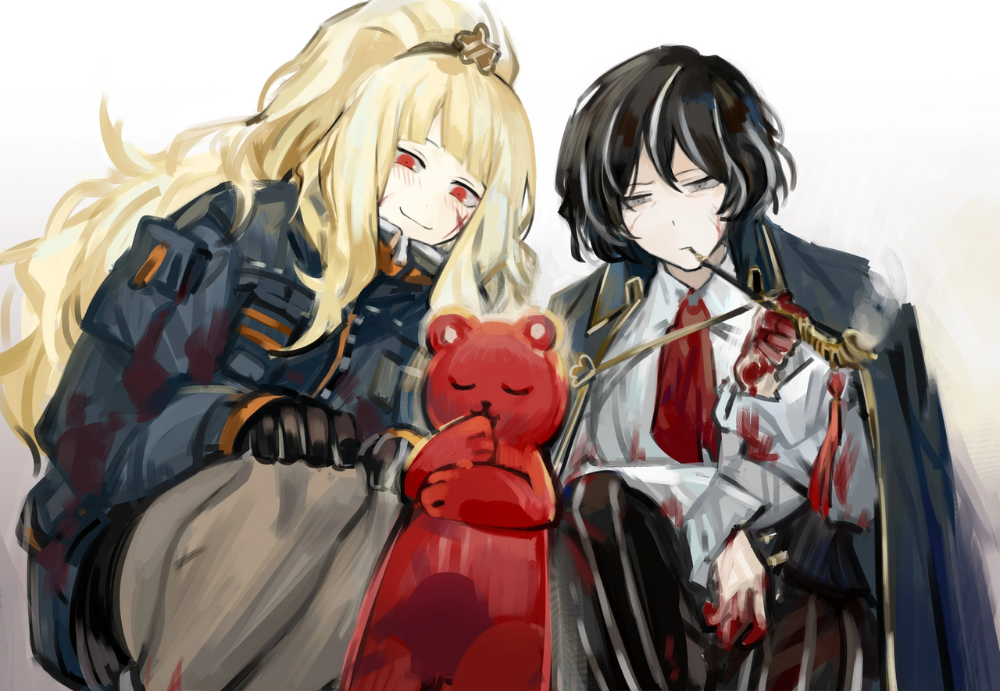

<h2 style="text-align:center;">"Я хочу видеть тот же пейзаж, что и ты."</h2>

Я мало что знаю о ЮРие как о личности.

Однако у этого дитя и меня есть одна общая черта.

Я не вижу никакого искажения от ЮРии.
 
 
 

ЮРиа лежала на полу с закрытыми глазами. Я открываю её веко, чтобы проверить, реагирует ли зрачок. Это не обычная кома; её "я" отделилось... Я видела такое состояние раньше. Тело живо, но разум мёртв. К счастью, её мозг всё ещё функционирует. Шанс ещё есть.

"Эзра! Принеси мне скальпель, стерильный. Мне нужен такой, чтобы мог резать кость."

"Поняла! Ты собираешься провести ту операцию, о которой я думаю, да? В таком случае я достану куб стазисного сохранения."

"Да, мы извлекаем её мозг."

Я вытащила пару стерильных перчаток из внутреннего кармана пальто и натянула их.
 
 
 

"Вы что, с ума сошли?!"

Маленький звук щекочет мои уши. Это голос ЮРии.

"Здесь! Я здесь!"

"Ах...! Детектив!!! Мишка шевелится...!"

Плюшевый мишка, пристёгнутый к поясу ЮРии, шевелил своим телом.

"Дамы. Не могли бы вы, пожалуйста, оставить мой мозг внутри моей головы? И заодно освободите меня от этого ремня."

"Оки-доки!"

Ха-ах... Во что мы ввязались на этот раз. Похоже, сознание ЮРии каким-то образом перенеслось в эту куклу. Я устремила взгляд на маленькую плюшевую игрушку, отряхивающуюся, пока курила из трубки.

"Я никогда раньше не переживала ничего подобного. Хотя у меня есть догадка."

Плюшевый мишка скрестил руки. Эзра выглядела умилённой этим зрелищем.
 
 
 

 
 

"Этот плюшевый мишка того же типа, что и ваша трубка; другими словами, он принадлежит только мне и никому больше. Вы же можете это понять, верно?"

"Значит, это что-то, что реагирует на твои эмоции."

"Верно. Когда меня уносил тот противный поток, я чувствовала, будто мысли других людей вторгаются мне в голову. Я хотела сбежать от этих мыслей любой ценой, и вот тогда мои мишки окружили меня и защитили."

"Вкратце, действие странной силы перенесло твоё сознание из тела в этого плюшевого мишку."

"Угу. Похоже, так и есть. В конце концов, эти наши инструменты резонируют с нашими эмоциями."

"...Так ты знаешь, как вернуться?"

"Неа."

"...Признаёшь это довольно прямо."

"Разве это не захватывающе? Мы открываем новый горизонт. Этот феномен... стоит исследовать дальше. Нам будет о чём поговорить, когда вернёмся."

Как она и говорит, у нас будет много чего обсудить друг с другом. Если, конечно, мы сможем благополучно вернуться...

"Эзра! Неси тело ЮРии."

Помещать человека в пространственную сумку может иметь непредвиденные последствия.

"Поняла!"

Эзра подняла безжизненное тело ЮРии и взяла его под руку.

"Пожалуйста, обращайтесь с ним осторожно, сёнбэ."

"Ага-ага!"

"ЮРиа, хочешь забраться в карман?"

"Пожалуйста, посадите меня себе на плечо, детектив Мозес. Я хочу видеть тот же пейзаж, что и вы."

Я приложила руку ко лбу и затянулась из трубки. Ха-ах... Кто бы мог подумать, что в своей жизни я буду заниматься чем-то подобным. Я наклонилась, чтобы поднять плюшевого мишку, и посадила его на левое плечо.

"О боже... Детектив! Тебе это оооочень идёт!"

Эзра подпрыгнула от восторга. Это не поможет с лечением её ран.

"Раз вы обе теперь в безопасности и невредимы, пусть и в разной форме, давайте выясним, как выбраться из этого подземного склада."

"Поняла!"

"Принято."

Потребуется время, чтобы привыкнуть к тому, что кто-то говорит прямо у меня в ухе. Знание о том, куда исчез поток Искажений, дало бы важную подсказку для выхода. В этой белой комнате не найти ни выхода, ни стока. Я осторожно ощупала стену и постучала по ней. Стена, кажется, сделана из материала, который на ощупь напоминает лабораторные стеклянные панели. Ясно...

"Эй! Я знаю, что ты наблюдаешь за нами из-за этой стены, приятель. Полагаю, тебе пора объяснить, что здесь происходит."

*Хлоп. Хлоп. Хлоп.*

Я слышу, как кто-то хлопает.

"Детектив! Позади тебя..!"

Крикнула Эзра.
 
 
 

Стена становится прозрачной, открывая тёмный силуэт, стоящий за ней.

"Великолепно, Мозес. Вам удалось добраться сюда в целости и сохранности. И в итоге вы загнали нас в угол. Вы способный человек, признаю. Вы даже спасли своих коллег и вдобавок сохранили себе жизнь. Благодаря вам, наша компания фактически обанкротилась."

"Что делает производственная компания в Подворотнях, возясь с монстрами? Это был тайный поставщик оружия под прикрытием?"

"Это скромная компания с мечтами, вот и всё. Добывающая компания «Тэ-Юнг» была амбициозной фирмой, которая стремилась стать Крылом."

"Это правда, что с тех пор, как на юге пала Корпорация L, в рядах Крыльев образовалась пустое место. Должна сказать, это всё ещё огромная мечта."

ЮРиа подметила.

"Как говорится, нужно мечтать о большем. Через невероятно трудный и изнурительный процесс... Мы получили зацепку о Сингулярности Корпорации Лоботомии, заплатив огромную цену. Об Энкефалине, так называемой экологически чистой энергии."

"...Энкефалин?"
 
 
 

Искажение и энергия... Комбинация, которую я не могла себе представить. И они вдруг упомянули Корпорацию Лоботомии, бывшее Крыло. О чём говорит этот человек?
 
 
 

"Уверен, у вас есть много чего, о чём хотелось бы узнать. Теперь позволь мне оказать вам услугу и ответить на один ваш вопрос, каким бы он ни был. Это награда за то, что вы добрались сюда живой, и вознаграждение за то, что привели нашу компанию к краху."

Хфф... У меня пульсирует в голове, тело вот-вот развалится. Сломанные рёбра ноют. Обожжённая рука жжёт. Левая щека замерзает. Кровь, сочащаяся из груди, теряет тепло. Столько всего с нами сегодня случилось. Эзра стоит рядом со мной, держа тело ЮРии. Она, казалось, едва держалась в сознании. Она так сильно истекала кровью, что под её ногами образовалась лужа. Обычно я бы спросила, кто они такие, откуда принесли тот странный ящик и что именно произошло в этой компании, однако...

"...Ха-ах. У меня нет времени на твоё очередное дерьмо и конспирологию. Всё, чего мы хотим, — это покинуть это место и отдохнуть. Меня больше ничто не интересует в данный момент."

"Вы уверены, что вас это устроит? Такие возможности выпадают нечасто."
 
 
 

"Уверена."

Ответила я, выпуская дым из трубки.

"Как жаль. Но если вы настаиваете."
 
 
 

*З-з-зиииинь*
 
 
 

Стены белой комнаты раздвинулись, открывая лифт.
 
 
 

"Вы можете воспользоваться лифтом там. Там нет никаких ловушек или трюков, которые могли бы вам навредить, так что не беспокойтесь. Если бы нашей целью было убить вас всех, вы бы уже давно были мёртвым мясом, прежде чем добраться сюда."
 
 
 

Мне нет дела до того, говорит ли он правду.

"Пошли, Эзра."

"Есть, шеф!"

Мы сели в лифт. Этот адский день наконец подходит к концу. Я хочу немедленно вернуться домой, обработать ранения и лечь. Уверена, Эзра разделяет мои чувства. И мне есть о чём поговорить с ЮРией. Полагаю, по возвращении предстоит разобрать кучу вещей.

Двери лифта закрываются.

Силуэтный человек пробормотал вдалеке.

"Я проиграл..."

Он разговаривает сам с собой?

"Ты... пра..."

С кем говорит этот человек?

"...Диаз.."
 
 
 

Как только я услышала это слово, мои глаза широко раскрылись. Кровь и ярость быстро приливают к голове. Я обязана спросить у этой сволочи, что он имел в виду, произнеся это слово. Двери ещё не полностью закрылись. Моё тело действует прежде, чем рассудок успевает что-либо обдумать. Я ринулась обратно.
 
 
 

"Детектив Мозес! Что такое?!"

ЮРиа спрыгнула с моего плеча.
 
 
 

Как только ЮРиа приземлилась на пол, Эзра встала у меня на пути и резко заблокировала проход, словно готовилась к этому. Она ударила меня по затылку.

"Простите... Детектив... Сначала мы должны выжить..."

Я потеряла сознание, рухнув в объятия Эзры.
