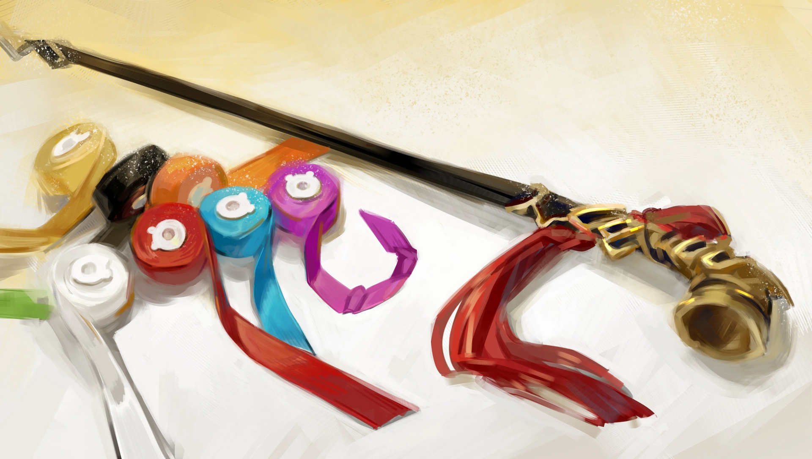

<h2 style="text-align:center;">"ЮРиа, знай, что с этого момента я буду искренне и основательно тебя использовать."</h2>

"Тебе не следовало меня останавливать!"

Я сорвалась на Эзру с трубкой во рту. Мы обе сидим друг напротив друга за столом в нашем Офисе.

"...Но! Не было никакой причины рисковать своей жизнью ради информации об этом человеке, детектив! Вы же всё равно уедете, чтобы встретиться с ней, через две недели!"

Эзра крикнула на меня взволнованным голосом, будто вот-вот готова была расплакаться.

"Ха-ах..."

Тц, нет смысла сожалеть об упущенной возможности. Моя рука потянулась ко лбу, и я выпустила цепочку дыма.
 
 
 

"Ну-ну, не теряйте самообладание, дамы. Уже большая удача, что мы выбрались живыми из той адской компании."

Перевязав мои раны, ЮРиа сползла на стол, чтобы успокоить нас.

"Детектив Мозес, ваши раны полностью перевязаны. И не забудьте принять эту HP-таблетку перед сном сегодня вечером."

Плюшевый мишка кладёт передо мной таблетку.

"А вот твоя, сёнбэ."

ЮРиа протопала через стол и положила одну перед Эзрой.

"...Спасибо."

Эзра опустила голову.
 
 
 

Полагаю, мне стоит сменить тему.
 
 
 

"ЮРиа. Почему бы тебе не рассказать мне, что произошло с твоим телом."

"Хорошо. Что ж, думаю, пора поговорить об этом. Подобно вашей курительной трубке, эта плюшевая кукла — предмет, который реагирует на эмоции; я называю такие инструменты: 'Психомент'."

"Снаряжение, запитанное и работающее на душе, значит."
 
 
 

 
 

"В общих чертах, да. Знаю, это глупо, что мастер из мастерской говорит о душах и духовности, когда моя работа целиком о технологиях, но таковы факты. Увидев, как вы сражались с тем чудовищным гигантом в подземном складе компании «Тэ-Юнг», и перенеся своё 'я' в этот плюшевый Психомент, я в этом убедилась."

"Что это была за лента, которую ты привязала к моей курительной трубке? Я никогда раньше не создавала огненных птиц своей трубкой."

"Это моя экспериментальная работа; я попробовала немного украсить ваш Психомент. Проще говоря, Психомент обладает большим потенциалом, чем любое другое снаряжение, существовавшее до сих пор. Можете ли вы поверить, что кто-то мог бы проявить персонализированное снаряжение, просто имея сильную решимость или чувство? Если бы Психомент стал более доступным для обитателей Города, это изменило бы экологию Города и его мастерских. Я сосредоточена на улучшении Психоинструмента, придавая ему форму и украшая. Один тип Психоментов — это инструменты или объекты, материализованные из эмоций, которые можно использовать напрямую, как ваша курительная трубка; другой тип — дистанционно управляемые Психоменты, такие как мой. Впрочем, я пока видела только пять Психоментов. Поскольку мне довелось увидеть лишь несколько, многое в них для меня всё ещё загадка."

"Ты имеешь в виду, что видела других, у которых он есть?"

"Да. Но ваш, если честно, был самым впечатляющим Психоментов из всех, что я видела. Тот красный цилиндр, который вы призвали в подземном складе... Он мог стирать само пространство. Я никогда раньше не видела такого могущественного Психомента. Я знала, что выбрала правильного человека."

Я мягко закрыла глаза и вспомнила моменты того мгновения.

"Вы не можете видеть то, что вы называете 'Искажением', во мне, не так ли, детектив?"

Я кивнула в знак согласия.

"Согласно моей теории, Психомент — это и есть Искажение, физически отделённое от человека. Вот почему Искажение нельзя увидеть в людях, владеющих Психоментом, таких как вы и я."

"...Имеет смысл."

"Теперь моя очередь. Как к вам попала эта курительная трубка, детектив Мозес?"

Спросила ЮРиа, скрестив руки.

"Ты правда хочешь знать? Если ты попытаешься копнуть в меня ещё глубже, чем сейчас... Ты можешь оказаться запутанной навсегда. Не так ли, Эзра?"

Эзра молча согласилась.

"Я поклялась посвятить всю свою жизнь Психоменту."

"Всю свою жизнь... Хох-окей."

Я затянулась дымом.

"Меня волнует ровно то же, что и тебя. Почему эта курительная трубка оказалась в моей руке... Как вышло, что я знаю, как пользоваться этой чёртовой штукой... Воспоминания разбросаны на осколки, а эмоции перепутаны."

И я выдохнула его.

"Вот почему я охочусь за Искажением. Мы скоро отправимся в путь, чтобы докопаться до истины. Я уйду в путешествие, из которого уже не вернусь."

"...Так ты и сама не знаешь."

ЮРиа проговорила разочарованным тоном.

"Я хочу узнать это отчаяннее, чем кто-либо другой. Проклятое явление и эта чёртова трубка стоили мне слишком многих жертв. ЮРиа, знай, что с этого момента я буду искренне и основательно тебя использовать."

"Я только рада, если это поможет мне лучше понять твой Психомент и эмоции, из которых он состоит. Пользуйся мной сколько угодно."

ЮРиа протянула свою плюшевую лапку для рукопожатия. Я не смогла сдержать лёгкий смешок, взяв маленькую лапку плюшевого мишки и мягко потрясла её.
 
 
 

"Что ж, тогда, полагаю, пора отправиться на покой. Завтра будет новый день."

Я оттолкнула стул назад и встала.

"Не забудьте принять вашу HP-таблетку, детектив Мозес."

"Приму. Эзра, ты ещё немного пободрствуешь?"

"...Да. Я хочу немного поговорить с ЮРией."

"Хорошо. Мне всё же следует дать молодёжи побыть наедине. Я пойду спать первой, тогда."
 
 
 

Эзра легко кивнула мне.

"Спокойной ночи, детектив."
 
 
 
 

Примечание переводчика

Неологизм «Психомент» предназначен для отражения составного слова, созданного автором: 신비 (神備; Sinbi). Русский вариант объединяет приставку "психо-" (от древнегреческого ψῡχή; psukhḗ), обозначающую связь с душой или разумом, и суффикс «-мент», указывающий на инструмент или устройство. В оригинальном корейском слово ближе к значению "душа/дух", нежели "разум", хотя может пониматься и как "разум".

