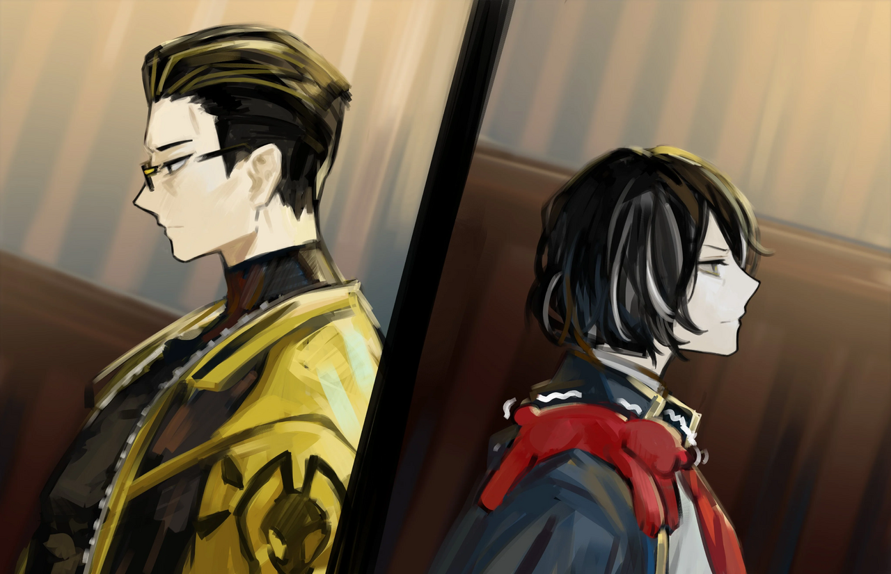
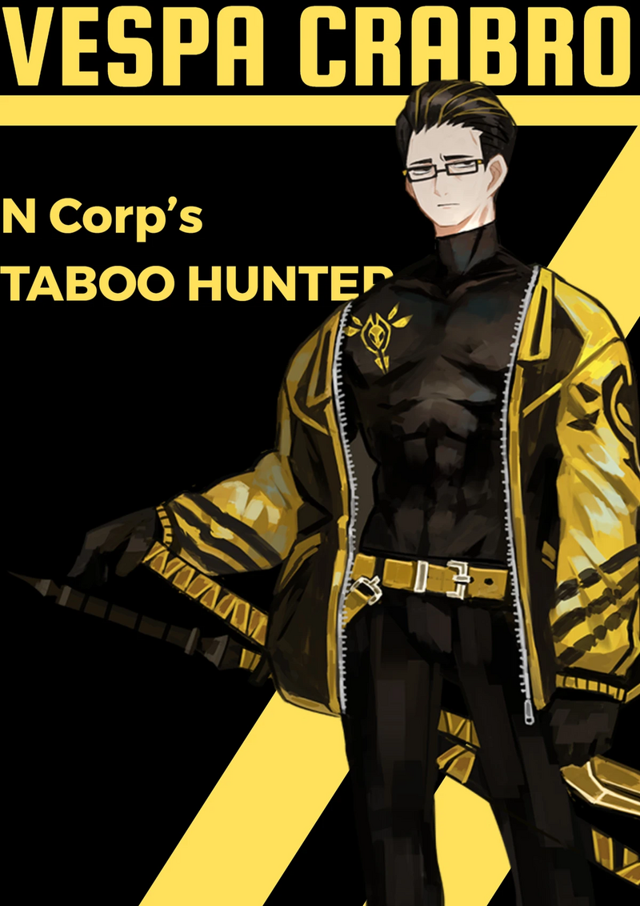

<h2 style="text-align:center;">"...И кто же может быть этим идиотом, нарушившим табу?"</h2>

Полуденное солнце светило в окно и на кровать, когда я проснулась. Я проспала довольно долго. Мне с трудом удалось подняться и размотать повязки на теле. Похоже, большинство моих травм зажили за ночь, благодаря HP-таблетке, которую я приняла. Первое, что я увидела, открыв дверь и выйдя из комнаты, была Эзра, завтракающая за столом.

"Детектив! Хорошо отдохнули?"

Эзра весело приветствует меня с места. Она вернулась к своему обычному, оживлённому состоянию, сбросив всю усталость и уныние, которые тяготили её вчера.

"Да. С твоим телом всё в порядке?"

"Ага! Я снова полностью в форме! Что бы вы хотели на завтрак, детектив?"

"Я не хочу есть."

Моя трубка вернулась на своё привычное место, и я направилась на террасу. Нужно разобраться с довольно большим количеством вещей.

"Эзра, ЮРиа в своей комнате?"

"Угу! Она сказала, что собирается исследовать чёрный ящик, который мы принесли из компании «Тэ-Юнг»."

Мне нравится её склонность проявлять инициативу.

"Наслаждайся завтраком, Эзра."

"Ладушки~!"
 
 

Оставив Эзру с её едой, я направилась в комнату ЮРии. Из-за двери доносились громкие звуки.

*Тук, тук.*

Я постучала в дверь ЮРии.

"ЮРиа! Не против, если я зайду?"

"Нет. Будьте моим гостем."

Когда я открыла дверь, мне на глаза попались знакомые ступеньки. Это та же лестница, по которой я поднималась, когда впервые посетила Мастерскую ЮРии. Комната, которую я отдала ЮРии, не имела ни лестницы, ни места для неё. Структурно было невозможно, чтобы там была лестница. Возможно, это один из эффектов Психомента, как называет это ЮРиа. Я спустилась по лестнице, к счастью, на этот раз на меня не набрасывались агрессивные медведи. Коридор украшен лентами, которые ярко демонстрируют вкус ЮРии. Интересно, украсила ли его она сама или приказала своим плюшевым мишкам сделать эту работу. Я добралась до зала в конце коридора. Пространство кажется меньше, чем в прошлый раз. Оно довольно компактное. Восемь плюшевых мишек стояли вокруг верстака, усердно занимаясь ремеслом, разлетаясь искрами.

"А вот и вы, детектив."

Один из плюшевых мишек повернулся, чтобы поприветствовать меня.

"Не припоминаю, чтобы я разрешала тебе по своему желанию изменять здание Офиса. У меня ещё много месяцев арендной платы за это пространство."

"Не волнуйтесь, детектив Мозес. Я могу вернуть всё в любое время."

"Хочешь сказать, это пространство — часть твоего Психомента?"

"Да. Это моя собственная мастерская. Я могу свободно здесь управлять плюшевыми мишками по своей воле."

"Так что, ты нашла способ вернуться в своё исходное тело?"

"...Нет. Кажется, всё плотно запечатано. Мы всё ещё знаем слишком мало о Психоментах. Поиск пути назад к моему старому телу — одна из вещей, которые нам ещё предстоит выяснить."

ЮРиа говорила небрежно, как будто для неё это не имело особого значения.

"Что произойдёт, если с твоим исходным телом что-то случится?"

"Если мои жизненные функции прекратятся и мой мозг остановится, я, вероятно, умру. Моё предположение: для работы Психомента требуется наличие разума пользователя. Но я же не могу попытаться раздавить своё собственное тело чтобы проверить эту гипотезу."

"Как ты справляешься с приёмом пищи в таком теле?"

"Со мной всё должно быть в порядке, пока моё тело подключено к аппарату жизнеобеспечения. Этот плюшевый мишка может нормально двигаться, ничего не употребляя в пищу. Скорее, это мой мозг нуждается в питании."

ЮРиа покачала головой.

"Меня больше беспокоит этот чёрный ящик; я никогда не видела такого типа материала. Тот человек из компании «Тэ-Юнг» упомянул Корпорацию L. Я думаю, это может быть как-то связано с её Сингулярностью."

"Ты намекаешь на то, что Сингулярность Крыла утекла?"

"Ну, она же всё равно обрушилась."

Остатки Сингулярности... Было несколько случаев, когда Сингулярность выходила из-под патента после краха владеющего ею Крыла.

"Или кто-то мог разграбить одну из запечатанных ветвей. Или, возможно, добрался до штаб-квартиры."

"ЮРиа, мне интереснее узнать о функциях и принципах работы этого ящика."

"Я могу сказать, что он делает. Этот ящик всасывает психику людей. Или их Искажения, если точнее."

"...Это что-то вроде Психомента?"

"По сути. Насколько я видела, по крайней мере. Это может быть Психомент, принадлежащий кому-то... Или сформированный из искусственно созданных умов и эмоций."

Искуственное создание ума и эмоций... Это действие, являющееся табу Города...

"В конечном счёте нам придётся больше узнать об Искажении и том, что ты называешь Психоментом."

ЮРиа естественным образом забралась мне на плечо.

"Вот поэтому вы и отправляетесь в долгий путь, не так ли?"

"...Кстати говоря, что нам делать с твоим телом, когда мы уедем?"

"Ммм... Это вопрос, над которым я всё ещё размышляю. У меня было несколько идей. Но сейчас мы должны сосредоточиться на охоте за Искажением. У нас уже есть несколько запросов, ожидающих прочтения."

ЮРиа протянула ручку, указывая на выход. Этот крошечный мишка с каждым днём становится всё наглее.

"Конечно, давай глянем."
 
 

Я вышла из комнаты и обнаружила посетителя в нашем Офисе. Атмосфера была зловещей. Эзра сидит на диване и смотрит на гостя, выглядя настолько встревоженной, насколько это возможно. Я вижу его спину отсюда; ярко-жёлтая куртка с вышитой чёрной осой. Пара оружия лежит рядом с ним. Иметь наглость носить такой ослепительно вызывающий цвет означает, что он настолько уверен в своих навыках. Это член Синдиката? Или Корректировщик? Гость заметил моё присутствие и повернул голову, чтобы посмотреть на меня. Затем из его рта послышался низкий голос.

"Приятно познакомиться, доктор Мозес."

"Эзра, кто этот человек? Он не выглядит как клиент, желающий дать нам запрос, хм?"

Я слегка поправила положение своей трубки.

"Детектив! Это... Это..."

Эзра замялась.

"Позвольте мне представиться."

Мужчина поднялся со стула и повернулся ко мне, продолжая речь.

"Я Веспа. Веспа Крабро; Корректировщик, работающий под прямым командованием Корпорации N, и охотник за табу."

Табу... Чёрт, это напоминает мне, что этот хитрый маленький мишка ЮРиа засняла нас, когда мы впервые встретились. Теперь она изо всех сил старалась изображать безжизненную плюшевую игрушку на моём плече.
 
 

 
 

"Мне поступила информация, что Офису Мозес может быть известно об определённом человеке, нарушившем табу 14-го Района."

"...И кто же может быть этим идиотом, нарушившим табу?"

Спросила я, выпуская дым из трубки.

"ЮРиа из Мастерской ЮРии. Таково имя нарушительницы."

Ответил он, поигрывая эфесом меча, обёрнутого в жёлтую ткань.

"...Вы её видели?"

"Нет..."

"Несколько людей на улице засвидетельствовали, что видели, как вы входили в Мастерскую ЮРии."

"У вас есть какие-либо конкретные доказательства? Ах, да. Ведение видеозаписей было запрещено в 14-ом Районе, не так ли?"

Веспа закрыл глаза на мгновение. Казалось, он погрузился в размышления. Вскоре он открыл глаза и заговорил со мной.

"...Благодарю за ваше содействие. Если вам когда-нибудь случится увидеть ЮРию, пожалуйста, напишите мне по этому адресу."

Он протянул мне свою визитную карточку.

"Обязательно, мистер Веспа. Эзра, наш гость уходит!"

"Ладушки, детектив!"

Эзра поднялась с дивана, чтобы открыть дверь Офиса для уходящего гостя. Когда Веспа проходил мимо меня, он прошептал мне на ухо.

"Довольно милая плюшевая игрушка у вас на плече."

"...Благодарю."
 
 

Веспа ненадолго остановился у входа, кивнул нам и закрыл дверь.

"Эзра, собирай манатки. Сейчас."

Спокойно проговорила я.
 
 
 

