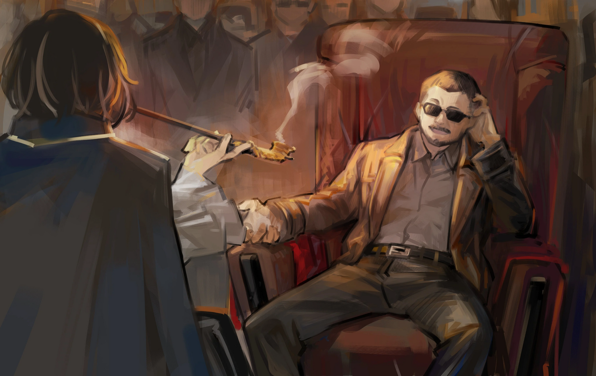

<h2 style="text-align:center;">Нам просто нужно продержаться две недели.</h2>

Обычный отель в Районе 14. Я заселилась в самую обычную комнату с двумя кроватями, какую только могла найти. Эзра и я сидели на одной кровати, а тело ЮРии лежало на другой. А рядом со мной — ЮРиа в теле плюшевой куклы.

"Разве здесь не слишком влажно? Я так заплесневею."

Вот ведь маленький хитрый мишка. Возможно, она сознательно нарушила табу, чтобы удержать нас в заложниках. Я бы стукнула её по голове, если бы это могло причинить ей боль. Мы покинули наш Офис, чтобы скрыться от глаз охотника за табу. Он определённо заметил, что мы что-то скрываем, как только встретил нас. Таких Корректировщиков просто не избежать. Хотя, почему они сразу же отправили за нами Корректировщика, который выглядит как минимум 2-го Ранга? Нечасто Крыло направляет подчинённого ему Корректировщика разбираться с такой мелочью, как съёмка драки в Подворотнях.

"...ЮРиа, у тебя, случаем, нет истории нарушений табу?"

"......"

"Что ж, ЮРиа. Полагаю, это конец наших отношений."

"Младшая... С тобой было весело!"

"Дамы. Нравится вам это или нет, мы все уже в одной лодке."

"Скажи мне, почему мы вдвоём должны рисковать своими жизнями, чтобы защитить тебя. Наше собственное выживание важнее расследования Искажений или Психоментов. А то, что преследует нас сейчас, — ни то, ни другое. Мы не ведём боевой Офис."

"Всё ради Психомента, конечно. Я пересматривала видео, где вы используете курительную трубку и где гигант появляется из того чёрного ящика, бесчисленное количество раз. Именно так я смогла сделать много теоретических прорывов в нашем исследовании."

"Чегооо! Не говори, что очки, которые мы тогда носили, на самом деле...? Детектив! Я никогда не просила её встраивать какую-либо записывающую функцию в очки!"

Эзра размахивала руками и качала головой. Наглый маленький мишка... Я приложила руку ко лбу.

"Ты хочешь сказать, всё, что произошло в компании «Тэ-Юнг» в тот день, было записано?"

"Да. Пока та противная река не сняла очки с ваших лиц."

"Почему ты мне не сказала?"

"...Я боялась, что вы меня выгоните. Как минимум вы бы меня остановили, если бы знали. Но если бы я не делала никаких записей Психоинструмента или Искажений... Это исследование никуда бы не продвинулось. Вот почему я молчала об этом."

"Да, это всё прекрасно... но, ЮРиа."
 
 
 

Я положила руку на голову плюшевого мишки и погладила его.
 
 
 

"Помни, если ты ещё раз скроешь детали, которые могут поставить нас под смертельную угрозу... Тогда мы расстанемся с тобой по-настоящему."

"...Поняла, детектив Мозес."

"Умница. Хорошая девочка."
 
 
 

"Ладно, Эзра... Расскажи мне свои первые впечатления о Веспе."

У Эзры острый нюх, когда дело касается боёв. Поскольку она наслаждается сражениями, она отлично умеет отличить сильного противника от слабого—

"Не победить!"

...Прямо заявила Эзра. Она честна, когда говорит, что не справится с кем-то.

"От этого человека несло кровью. Он, наверное, провёл больше боёв, чем я могу сосчитать. Он может быть даже сильнее Хи-Джуна-сёнбэ!"

Значит, он определённо 2-го Ранга или выше... Притом эксперт в убийствах...

"Эмм, детектив Мозес. Разве вы не можете победить его с помощью вашего Психомента? Ваша курительная трубка смогла одолеть того гигантского скелета на днях."

Этот ребёнок, кажется, принимает меня за Красный Туман.

"ЮРиа, противостояние с людьми — это другой вопрос. Есть фундаментальная разница между Искажением, наполненным ничем, кроме жажды убийства, и человеком, обученным искусству убийства. Такой человек, как Веспа, прошедший через множество ситуаций жизни и смерти, не даст мне времени вдохнуть в свою трубку. Он отрубит мне руку или сломает её, прежде чем я успею оглянуться."

"А если бы Эзра-сёнбэ выиграла для вас время, как в прошлый раз?"

"Младшая, я не уверена, что смогу задержать того парня от слова совсем."

В комнате воцаряется тишина. Только звук вентилятора нарушает спокойствие.
 
 
 

"Если мы не можем сразиться с шершнем в лоб, нам придётся перехитрить его. Лучший способ — вообще избежать необходимости с ним сражаться."

"Первое, что приходит на ум, — бегство из Района 14."

Предлагает ЮРиа, скрестив ручки.

"Простая идея, но, увы, не безошибочная. До того, как мы сможем сесть на ВАРП-поезд с полученными билетами, осталось две недели. Охотник за табу мог бы легко догнать нас, если бы мы просто поехали по дороге."

"Детектив! У меня есть идея! У меня есть!"

Эзра поднимает руку и машет ею.

"Давай."

"Может, нам стоит нанять супер-пупер сильного Корректировщика, чтобы он сражался за нас!"

"Да... Надеюсь, такой выиграет нам достаточно времени, чтобы сбежать. У тебя есть личные связи с Корректировщиками 1-го или 2-го Ранга, специализирующимися на боях, Эзра?"

"Хммннг... Нееет..."

"Я сомневаюсь, что они вообще возьмут наш запрос, даже если бы такие были. Противостояние другому Корректировщику, который напрямую принадлежит Крылу, по сути означает противостояние самому Крылу."

"Детектив! Значит, он перестанет нас беспокоить, как только мы встретимся с Хи-Джуном-сёнбэ в Районе 11! Верно?"

"...У нас будет определённо меньше проблем, если мы сбросим все хлопоты на него."

Нам просто нужно продержаться две недели. Мне нужно найти кого-то, кто сможет выиграть для нас столько времени.

"Эзра, у тебя есть последний выпуск ежемесячного каталога Офисов Корректировщиков?"

"Конечно есть!"

Эзра порылась в карманах и протянула найденную бумажную книгу. Я пробежалась глазами по каталогу, плотно забитому рекламами и рекламными фразами всевозможных Офисов, внимательно просматривая раздел с боевыми. Есть один полезно выглядящий Офис недалеко отсюда. 'Боевой Офис «Доу Гуй»'. Офис 2 Ранга. Не аффилирован с какой-либо Ассоциацией. 17 членов. Работает 24 часа в сутки, круглый год. Обычно использовать Офис без гарантий от какой-либо Ассоциации крайне рискованно. Он может быть связан с опасными Синдикатами. Но в такие времена это идеальная пешка для нас. Они не будут спрашивать, что происходит, всё, что им нужно, — это деньги.

"Эзра. Я ненадолго выйду."

"Оки-доки! Я соберу снаряжение!"

"Нет, я хочу, чтобы ты осталась здесь и охраняла тело ЮРии."

"Ах! Но детектив...! Одной опасно... И уже поздний вечер..."

"Не волнуйся, Эзра. С тобой рядом гораздо надёжнее, и я бы с радостью взяла тебя с собой если бы могла, но я оставляю тебя здесь чтобы ты могла охранять ЮРию. Я рассчитываю на тебя."

"Ладно..."

Ответила Эзра, опустив голову.

"Я вернусь, как только подпишу контракт."

ЮРиа запрыгнула мне на плечо, и я покинула номер отеля.
 
 
 

Вечерняя улица, освещённая заходящим солнцем. Ахроматические, Искажённые люди возвращаются с работы домой, опустив головы. Пейзаж такой же, как всегда. Люди прогуливаются по улицам, неся Искажения, похожие друг на друга, но отличающиеся. Полагаю, эти сцены навсегда останутся неизменными.
 
 
 

Грубая вывеска с надписью 'Боевой Офис «Доу Гуй»' висит на двухэтажном здании. Свет на вывеске мерцал, намекая на то, что она пережила много лет. Это здание кажется ещё более ветхим, чем наш скромный Офис. Я поднялась по лестнице на второй этаж. Когда я открыла дверь, меня встретил звук колокольчиков и затхлый запах.

"Ребята! У нас компания!"

За громким голосом кого-то люди в Офисе потушили сигареты в руках и начали суетиться, наводя порядок.

"Сюда, пожалуйста, присаживайтесь, мэм."

Человек, похожий на офисного работника, проводил меня к месту. В этом офисе, площадью около 20 пхёнов, нет ни одной комнаты, отделённой стенами. Пол был простой серой цементной поверхностью, без какого-либо покрытия. Я уселась на место и достала свою курительную трубку из внутреннего кармана пальто. Это правда Офис 2-го Ранга? Куда уходят все их доходы, если ни один из них не тратится на интерьер Офиса?

"А ты не похожа на того, кто обычно приходит в такие места, как наше... Чё, есть кто-то кого ты хочешь видеть мёртвым?"

Мужик, сидящий на диване с надменной осанкой, заговорил со мной, почесывая голову. Этот человек в солнцезащитных очках, казалось, был боссом Офиса.
 
 
 

 
 

"Я здесь чтобы сделать запрос."

"Что ж, выглядишь ты достаточно обеспеченной, чтобы позволить наши услуги... И выглядишь довольно старой, интересно какое у тя дело что пришлось навестить нас... Дай-ка угадаю, проблемы с наследием для детей или что-то вроде того? Гахахаха!"

Когда босс разражается смехом, команда Офиса смеётся вместе. Какое полное отсутствие достоинства.

"Кем ты нас считаешь, каким-то жалким местным Офисом, состоящим из деревенщины? Мы прошли через огонь, воду и медные трубы. А ну, дай-ка взглянуть на свою визитку, если она у тя есть."

Я достала свою карточку из кармана пальто и протянула ему. Он ненадолго приподнимает солнцезащитные очки, чтобы пробежаться глазами по моей карточке. Его две глазницы пусты. Искажение; но не слишком сильное.

"Офис Мозес... Загадки и нераскрытые дела... Аффилиат Ассоциации 'Севен'... Какие-то странные у тя тут затеи."

Он сделал серьёзное лицо. Он уставился в пол на мгновение, прежде чем снова посмотреть на меня.

"Имя Чжан Лэй. Я представитель этого Офиса."

Он передал мне свою визитку. Чжан Лэй, представитель Офиса «Доу Гуй». "Корректировщик 2 Ранга" написано небрежным почерком как примечание о его текущем статусе.

"Перейдём сразу к делу. Чего такому мозговитому Офису от нас надо?"

"Я хочу, чтобы вы охраняли мой Офис две недели. Я заплачу вам столько, сколько захотите."

"Нажили врага, значит, хм. Такое часто случается, да?"

Корректировщики в Офисе коллективно кивнули.

"И сколько охранников вам нужно?"

"Каждого Корректировщика в вашем Офисе."

"Бахахаха! Должно быть, наделали огромный шум, не так ли!"

"Повторюсь, вы получите достаточно оплаты, чтобы покрыть расходы."

"С кем хреначиться будем?"

"......"

Я промолчала.

"Куришь?"

"О, обожаю."

"Давай на минутку на крышу, поговорим наедине."
 
 
 

Куря сигарету, Чжан Лэй смотрел на небо. Лес из зданий окружает пейзаж. На улицах уже наступила ночь.

"Итак, э-э, ваша работа — решать странную и необычную херь?"

Я кивнула, куря из трубки.

"Видишь ли, у меня ребёнок есть. Проблема в том, что она заперлась в своей комнате и просто не выходит."

"...Ты у меня сейчас запрос делаешь?"

"...Люди должны помогать друг другу, мэм. Может, это просто моя тупая башка, но в моём доме происходит что-то, что вне моего понимания. Если сможешь решить эту проблему, я гарантирую, что в вашем распоряжении будет весь мой Офис."

"Тогда могу ли я могу получить скидку на гонорар за свой запрос?"

"Бахаха! Да брось, разве мы не оказываем вам огромную услугу, не спрашивая, с кем мы столкнёмся? Теперь ты просто жадничаешь."

Я рассмеялась вместе с ним. Да, конечно, Эзра намного лучший переговорщик, чем я.

"Можешь предоставить охрану прямо сейчас, в таком случае? Место — Комната 1306 в деловом отеле на улице Чили."

"Несколько полезных парней сразу же отправятся по этому адресу."

"Хорошо, я выслушаю подробнее о странных происшествиях в твоём доме, пока мы будем к нему идти."

"Ну, договорились тогда, да?"

Я кивнула и пожала руку Чжан Лэю. Табачный дым поднимался с крыши ещё некоторое время.
