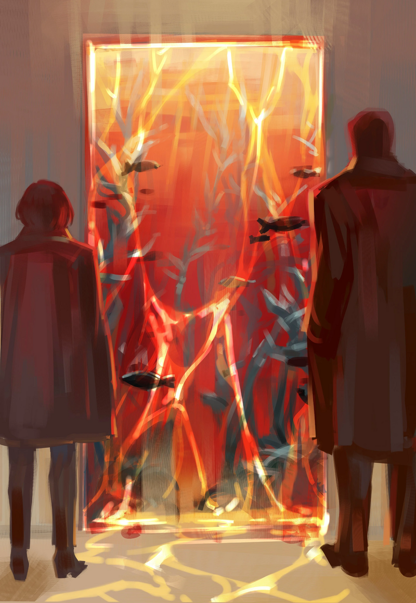

<h2 style="text-align:center;">Пронзительный визг немедленно ударяет мне в уши.</h2>

Чжан Лэй провёл меня к своему дому. В наше время это не так уж и необычно, когда ребёнок запирается в своей комнате; причина, должно быть, заключается в какой-то травме. В таком случае эта проблема с высокой вероятностью связана с Искажением.

"...Кроме того, из комнаты моей дочери каждую ночь доносятся странные звуки."

"Может, вам стоит проявить больше уважения к частной жизни ребёнка?"

"Хаха... Это нечто иного рода, мэм. Я убил уйму людей за свою жизнь. Я слишком хорошо знаю звуки рвущейся плоти и ломающихся костей. Этот жуткий и болезненный шум... Что-то, что не должно исходить из детской комнаты, просачивается наружу вместе с криками моей дочери."

"Уверена, что вы и так уже пытались насильно открыть дверь, верно?"

"Конечно пытался. Но всякий раз, когда я хватаюсь за дверную ручку или пытаюсь выломать всю дверь, она всегда отталкивает меня. И шум становится громче и более изнурительным, чем сильнее я пытаюсь открыть эту дверь. Я в затруднительном положении где иду я нахер, если что-то пытаюсь сделать, и пойду я нахер, если буду бездействовать."

"Сколько лет вашему ребёнку? Как давно она заперта?"

"Семнадцать. Она там уже почти восемь месяцев."

"Поступление в колледж также должно быть причиной для беспокойства, если она застряла там вместо учёбы в школе."

"Видите ли, моя дочь Фэй посещает виртуальную школу. До сих пор она ни разу не пропускала занятия, и её оценки, насколько я проверял, были в порядке."

Виртуальное обучение. Ученики посещают уроки в виртуальном пространстве. Это тип школы, предпочитаемый родителями, которые ценят безопасность своих детей, поскольку им не нужно проходить потенциально опасные переулки, чтобы добраться до школы, — преимущество, общее со школами-пансионами. Такой родитель как он, занимающийся жестокой работой, особенно уделял бы больше внимания благополучию своего ребёнка.

"И есть ещё одна вещь, которую мой мозг просто не может понять."

"И что же это?"

"Через дверь просачивается вода. Не знаю, кровь это или морская вода, но какая-то жидкость понемногу вытекает."

Я приложила руку ко лбу и затянулась из трубки. Искажение, которое уже манифестировало... Это делает решение гораздо более сложным. Придётся самой посмотреть, насколько оно серьёзно.
 
 
 

Дом Чжан Лэя находился в жилом районе Подворотен. Это одно из самых безопасных мест вне Гнезда. Комплекс 30-этажных квартир, выстроенных как пачки сигарет. Он похож на клетку для кур. Я последовала за Чжан Лэем в лифт. Лифт медленно поднимается, со скрипом и дребезгом. Его дом на восемнадцатом этаже. Когда двери лифта открылись, лампы в коридоре засекли наше присутствие и замигали. Чжан Лэй достал ключ из кармана, чтобы открыть дверь квартиры 1807. Скрииип. Дверь открывается с резким скрипучим звуком, и нас встречает неосвещённый холл.

"Вы живёте один?"

"Хахаха. У каждого своя история, мэм."

Чжан Лэй выдавил горький смешок.

"Кьяяяяяяяяяяяяяяяяхххх!"

Пронзительный визг немедленно ударяет мне в уши. Чжан Лэй вздохнул.

"...Вот это звук, о котором я говорил."

"Вашу дочь зовут Фэй, так?"

"Ммхм."

Я прошла в комнату, откуда доносился крик. То, что предстало передо мной, было гигантским аквариумом красного цвета. Двери нет. Комната была полна красной воды, готовой перелиться. Красочные водные растения выстроились внутри, освещённые сверху, словно в потолке была дыра, ведущая в небо. И силуэт чего-то массивного медленно дрейфует вдалеке.
 
 
 

 
 

"Гляди. Красная вода, сочащаяся из двери, прямо как я говорил."

Похоже, Чжан Лэй не может видеть, что в этой комнате. Значит, манифестация ещё не завершена.

"Нам обоим повезло. Похоже, это случай феномена, в котором я эксперт."

"Вот как? Я рассчитываю на вашу помощь, док."

Чжан Лэй низко поклонился мне.

"У меня лишь одна просьба: мне нужно, чтобы вы доверились мне, что бы я ни делала с этого момента. То, что будет происходить, не будет чем-то обычным."

Он кивнул. Стоя перед комнатой, я глубоко вдохнула. Это намочит мой разум как утонувшую крысу. Я зажала свою курительную трубку во рту.
 
 
 

Эта красная вода — проявление депрессии. Я выпустила белое дыхание, которое превратилось в туманную дымку, окутавшую меня. Я помню, что брала похожий запрос раньше. Если бы я вошла в ту комнату неподготовленной, я утонула бы в меланхолии Фэй. Белая пелена, окружающая меня, защищает меня от такого ментального разъедания. Пропитаться чьей-то печалью — это болезненный опыт, несравнимый ни с чем другим. Я коснулась барьера из воды.

"Фэй, я вхожу."

Я шагнула в комнату. Мои уши погрузились вместе с остальным телом, отрезав меня от всех внешних звуков. Внутри это больше похоже на озеро, чем на море. Оно заполнено пресной водой, а не морской. Вода не солёная; значит печаль этого ребёнка не такого солёного, слёзного рода.

"Теперь можешь говорить, ЮРия."

ЮРия выпрыгнула из кармана моего пальто. Я посадила её на плечо.

"Фух... Это было так удушающе."

Поскольку за нами охотится охотник за табу, я запретила ЮРие говорить в большинстве случаев. Он или другие люди могли бы подслушать нас в любой момент.

"Это пространство... Оно довольно похоже на твою мастерскую, не так ли?"

"Определённо. Оно тоже больше внутри, чем снаружи. Здесь может быть что-то охраняющее это место, как мускулистые мишки в моей мастерской. На этот раз у вас нет Эзры-сёнбэ, чтобы защитить вас, так что вам лучше быть осторожной."

Если задуматься, то очень давно я не работала над делом без помощи Эзры. Если бы не она, я бы давно умерла, прежде чем смогла бы решить половину дел, с которыми сталкивалась. Полагаю, ей стало скучно, и она уже уснула одна в гостиничном номере.

"Это место такое жуткое, но красивое."

"Да... Нам следует проявлять дополнительную осторожность с красивыми Искажениями."

Звук смеха доносится откуда-то. Я выдохнула красное дыхание. Трубка приняла форму острого багрового клинка.

"Детектив. Я только что услышала звук, доносящийся оттуда."

"Слабый смех под водой..."

ЮРия указала направо. Когда в загадочном месте слышен звук, следует ли приближаться к источнику звука или удаляться от него... Это проблема, на которую у меня до сих пор нет определённого ответа, даже после столь долгих лет работы. В конце концов, придётся довериться интуиции. Я пошла туда, откуда доносился звук.
 
 
 

"ЮРия, можешь ли ты чем-нибудь мне помочь в этом теле?"

"Боюсь нет."

Тц, бесстыдная маленькая плюшка.

"Вы только что выругались на меня в уме, да? Хотя я не могу вам помочь напрямую, я могу предоставить вам кучу прототипов, которые принесла. Я попробовала сделать ленты для каждого цвета. Если у вас есть функция, которую вы хотели бы использовать, просто скажите мне, и я обвяжу вашу трубку подходящей лентой."

"На какие 'функции' я могу рассчитывать?"

"Ну, есть довольно разнообразный набор функций, и они в основном зависят от ваших эмоций, так что я не могу дать вам подробности. Вы просто можете сразу попросить меня о чувствах, которые вам нужны."

"Буду ждать с нетерпением."

Просить о чувствах, которые я хочу. Не уверена, что это правильный подход для техника.

"Как вы обычно решаете подобные дела, детектив Мозес?"

"Мне следует выяснить причину. В конце концов, всему есть причина. Я прослеживаю за подсказками одну за другой, например, почему эта комната полна воды, почему цвет красный, почему это не солёная вода, пока не смогу определить, что лежит в корне Искажения."

"Считается ли это серьёзным случаем Искажения?"

"...Возможно."

Каждый человек индивидуален; следовательно, Искажение каждого человека отличается. Я не могу даже начать постигать глубину траншеи, которой является человеческий разум. Поэтому трудно поспешно судить о природе Искажения. Мне придётся постучаться в их разум и противостоять им самой, чтобы выяснить. Что, честно говоря, чрезвычайно утомительная работа. Повторяя эти мысли, я продолжала идти вперёд, пока наконец не достигла виновника смеха.
 
 
 

Это русалки, как я и ожидала.
