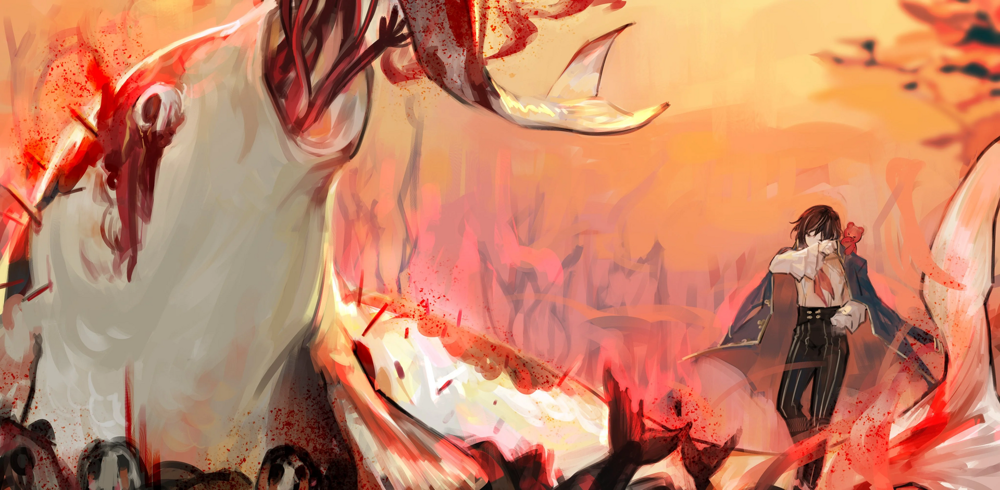

<h2 style="text-align:center;">Карп поёт, рыдая.</h2>

Это русалки с телом карпа-кои. Человеческие лица на телах цветных карпов. Их длинные волосы развеваются.

"Эта большая тупая рыба снова пела. Она ваще намёков не понимает."

"Не кажется ли тебе нудным, как она сочиняет нелепые слова, чтобы петь их этим её голосом?"

"Я бы пела намного лучше, будь я её размера, ты тоже так думаешь?"

Три русалки сидят вместе, громко болтая друг с другом. Их глазницы пусты, совсем как у Чжан Лэя. Возможно, между ними есть связь. Трое русалок, кажется, общаются только голосами, не видя друг друга. Одна из ярких черт русалок — сила их голоса. Каждая русалка, которую я видел на работе, обладала той или иной способностью, связанной с голосом. И способность этих русалок здесь кажется довольно простой. Слова, которые они громко выкрикивают, становятся красными шипами, вылетая из их ртов. Затем шипы летят куда-то. Через некоторое время вдалеке слышен звук.

"Можно присоединиться к вашему разговору? Кто-то там поёт, как я полагаю?"

"А ты кто? Извини, но мы не с тобой разговаривали?"

"Боже, чем этот незнакомец занимается, так нас подслушивать..."

"Вы так громко говорили и смеялись, что мы не могли не услышать."

Скрестив руки, ЮРия парировала.

"Подслушивать других — всё равно грубо. Мы просто разговариваем сами с собой. Занимайтесь своим делом."

"Ужас, какой страшный мир. Даже поговорить спокойно нельзя."

"Приношу извинения. Мы не собирались подслушивать. Поймите, нашим ушам ничего не оставалось, кроме как уловить звук, идущий сквозь воду."

"Нам нужно узнать, что происходит в этом месте."

Добавила ЮРия.

"Вы пришли сверху?"

Спросила одна из русалок.

"Мы пришли извне. Хотя и не с самого верха."

"Я чувствовала, что вы здесь не местные. Вот вам совет: здесь есть несколько правил, которым стоит следовать."

"И каковы же они?"

"Первым делом, вы должны вырвать себе глаза."

"Верно. Мы не видим. Мы только слышим и говорим."

"Видеть — самое опасное, что можно здесь делать."

"Но это место выглядит довольно красивым, нет?"

Спрашивает ЮРия.

"Именно поэтому. Оно такое ослепительное и красивое, что может убить... Так что мы выкололи друг другу глаза."

"Сколько здесь таких русалок, как вы?"

"Хз? Кажется, сегодня я слышала голоса около сотни? Там ещё куча выживших подружек."

"Выживших от чего, собственно?"

"От того огромного монстра, само собой. От чего ж ещё?"

"В любом случае, мы позволили вам услышать слишком много наших голосов. Вы же знаете, что в этом мире ничего не бывает бесплатно?"

"...Что вы хотите получить? Я не против компенсировать вам то, что вы рассказали."

"Ваши голоса."

"Поделитесь с нами вашими голосами. Вы сказали, что вы здесь впервые, так что мы будем совестливыми и возьмём от вас двоих лишь понемногу."

"Мхм. Вы не станете немыми."

"Фу... Детектив Мозес, они начинают меня пугать?"

ЮРия спряталась за моей спиной. Я на мгновение задумалась. Придётся некоторое время следовать их правилам...

"Вы можете взять мой голос, включая долю этого дитя."

"Детектив Мозес!"

"ЮРия, доверься мне."

"Ну. Ладно."

Три русалки по очереди поцеловали меня. Каждый раз, когда их губы касались моих, казалось, будто что-то вытягивают из моего горла.

"Эй, я не ожидала, что твой голос окажется таким вкусным?"

"Говорят, голос приобретает насыщенный вкус с возрастом."

"Это точно!"

Русалки заболтали, их голоса стали намного живее и громче.

"Ах. Ах. Аах."

Мой голос стал вдвое тише, чем раньше. Он кажется довольно хриплым.

"Детектив Мозес. Вы в порядке?"

Тревожно спросила ЮРия.

"...Да."

"Позвольте вам рассказать ещё кое-что. Лучше вам не говорить здесь слишком много. Не все русалки будут обращаться с вашими голосами так мягко, как мы. Да и не так уж и много голоса у вас осталось."

"С другой стороны, наше существование было бы бессмысленным, если бы мы не разговаривали, верно?"

"Поэтому мы говорим без остановки и ищем больше голосов."

"Где можно найти ту гигантскую рыбу, о которой вы говорили?"

"Там, откуда доносятся крики. И там, где сияет так ярко, что раскалывается голова."

"У неё чертовски огромный запас голоса. Не понимаю — он просто не кончается, сколько бы она ни пела?"

Вновь красные слова, вылетевшие из её рта, стали шипами, полетевшими куда-то. Через мгновение слышится крик.

"Спасибо."

Оставив русалок позади, я направилась в ту сторону, откуда доносились крики. Они всё ещё шумно болтают, словно хотят, чтобы их услышали другие.

"Упомянутый ими огромный монстр и источник криков, должно быть, Фэй. Похоже, собственное Искажение Фэй атакует её. ЮРия, возможно ли, чтобы твои плюшевые мишки атаковали тебя?"

"Конечно, возможно. Но я бы никогда не отдала такой приказ. Я управляю мишками, как своими руками и ногами. Ты вполне можешь ударить себя по щеке если захочешь, понимаешь о чём я?"

"...Возможно, это форма членовредительства."

Семнадцать лет. Студентка. Виртуальная школа. Красная вода. Аквариум. Пресная вода. Карп. Русалки. Песня. Голос. Шипы. Селф-харм. Я медленно перечисляю зацепки и строю возможные связи. Конфликт с кем-то в школе? Ранимость подростка в период полового созревания? Желание красивого голоса? Жажда петь? Самоненависть? Попытка самоубийства? Разорванные отношения? Поле для догадок ещё велико. Этот бассейн красной воды создан из чьей-то крови. Истекшей, скорее всего, из раненого сердца. Застойная вода означает меланхолию. В Искажении, уныние обычно проявляется в форме воды. Печаль, полная скорби, проявляется как морская вода, обычно тёмно-синего оттенка. Субъект часто погружается глубоко в собственное сердце — на морское дно. С другой стороны, кроваво-красная вода — разрушительного рода. Это место можно сравнить с аквариумом или мелким прудом. Водоём со стоячей водой, светящийся ярким нежно-розовым, ни тёмный, ни глубокий. Аквариум депрессии, в котором покоятся разрушительные импульсы. Повторяя эти мысли в уме, я медленно иду к эпицентру звуков. Всякий раз, когда крики стихали, я говорила со слепыми русалками, проплывавшими мимо. С каждой русалкой, говорящей о криках, я получала больше информации о том, где находится источник. По мере приближения к звукам мимо меня всё чаще пролетали красные шипы. Я разворачивалась, отражая мечом те, что летели прямо в меня, и продвигалась вперёд.
 
 
 

Вскоре я встретила гигантского карпа, испускающего яркое розовое сияние. Я с облегчением вздохнула. Найти носителя Искажения в обширном пространстве, которое оно создало, — это уже полдела.
 
 
 

Карп излучал такой ослепительный свет, что был подобен драгоценному камню. Мириады красных шипов впились в его тело; исполинский карп издаёт мучительные крики; из ран хлещет кровь. Карп поёт, рыдая. Ужасное Искажение, созданное ею самой. Мёртвые русалки усеивают пол под карпом. Русалки, у которых ещё есть глаза, привлекаются светом. Когда русалки приближаются к карпу, из его рта появляются длинные руки и притягивают их для поцелуя. Затем эти руки вырывают у русалки глаза. Кровоточа из опустевших глазниц, русалка извивается и опускается на дно, не в силах кричать. ЮРия и я наблюдали за этой сценой, затаив дыхание.

Внезапно красный шип пролетел у меня по щеке и вонзился в карпа. Белая пелена, окутывавшая нас, лопнула. Мы медленно пропитываемся красными муками. Без покрова, защищающего разум, красноватый свет карпа напрямую ударяет мне в глаза. Мой рассудок плывёт. Я попыталась заслониться от света ладонью.
 
 
 

 
 

"ЮРия... Ленту, с ощущением чего-то обволакивающего... Фиолетовая подойдёт..."

Я с трудом могу говорить. Мой голос стал таким тихим и грубым.

"Вот...!"

Я обмотала ленту, которую дала ЮРия, вокруг курительной трубки. И выдохнула глубокий, фиолетовый дым. Тёмный дым заклубился из трубки и окружил карпа, удерживая его на месте и сдерживая испускаемый им свет. Я подошла к карпу и стала по одному выдёргивать шипы, застрявшие в его теле. Карп визжал каждый раз, когда я вытаскивала шип. Пронзительные вопли вызывали в моей голове видения прошлого Фэй.
 
 
 

"Ты просто хотела петь."
 
 
 

Я выдёргиваю шип.

"Ты всегда была дома одна."
 
 
 

Я выдёргиваю шип.

"Ты подружилась с другими учениками, которым нравились твои песни."
 
 
 

Я выдёргиваю шип.

"Ты была счастлива, что твои друзья слушают песни, которые ты сочиняла."
 
 
 

Я выдёргиваю шип.

"Но те друзья со временем изменились."
 
 
 

Я выдёргиваю шип.

"Твоим друзьям нравился только твой красивый голос."
 
 
 

Я выдёргиваю шип.

"Их интересовал только твой голос, а не песни, которые ты сочиняла."
 
 
 

Я выдёргиваю шип.

"Ты начала думать, что друзья из-за этого тебе завидуют. Ты думала, что тебя ненавидят."
 
 
 

Я выдёргиваю шип.

"Ты расстроилась. Ты начала ненавидеть своих друзей."
 
 
 

Я выдёргиваю шип.

"Вот почему, Фэй, ты так односторонне оттолкнула своих друзей."
 
 
 

Я выдёргиваю шип.

"Ты осталась совсем одна."
 
 
 

Я выдёргиваю шип.

"Фэй. Русалки, которые причиняют тебе боль, — иллюзии, созданные тобой."
 
 
 

Я выдёргиваю шип.

"Ты создала пространство, чтобы чувствовать боль и выплеснуть гнев."
 
 
 

Я выдёргиваю шип.

"Возможно, злоба твоих друзей — тоже иллюзия. Ты никогда не узнаешь, пока не поговоришь с ними откровенно."
 
 
 

Я выдёргиваю шип.

"Сомнения и гнев, взращённые предположениями, которые ты строишь в одиночку, будут только ранить тебя."
 
 
 

Я продолжала выдёргивать шипы. У меня кровоточат уши. Сознание едва держится. Её можно отнести к типу тех, кто пережил отвержение со стороны других. Они создают пространство для себя и поглощают свой же гнев внутри него. Без выхода, чтобы рассеять ярость, эта эмоция будет разъедать их изнутри.
 
 
 

Последний оставшийся шип выдернут.

"В будущем тебе встретится много похожих трудностей. Пожалуйста, не причиняй себе вреда из-за этого. Нужно иметь смелость выяснять истинные чувства других и собственные. Этот процесс наверняка будет таким же неприятным и болезненным, как сейчас. Не стесняйся обращаться ко мне, когда столкнёшься с подобным. Мы подумаем над этим вместе."
 
 
 

Кровавая вода хлынула из комнаты Фэй. Фэй и меня смыло потоком, и мы оказались в гостиной. Чжан Лэй бросился к Фэй и обнял её. Ещё одно дело закрыто. На лице Фэй всё ещё осталось несколько чешуек, но этот результат достаточно хорош.
 
 
 

"Док. Я не знаю, как выразить вам свою благодарность."

Чжан Лэй продолжал кланяться мне, выражая признательность.

"Уделяйте больше внимания своему ребёнку. Я знаю, что работа отнимает много времени, но вы слишком ею пренебрегали."

"Да... Я и вправду должен. Ещё раз спасибо, док."

*Тук. Тук. Тук.*
 
 
 

Кто-то громко стучит в дверь. Сейчас 2 часа ночи. У меня плохое предчувствие. Чжан Лэй достал поддао из своего перчаточного измерения.

"Док. Останьтесь тут на минутку."

Он направился ко входу. Я подняла Фэй на свою спину и вернулась в её комнату.
 
 
 

Входная дверь с грохотом вылетела из рамы и влетела в дом.

"Здесь есть человек по имени Мозес?"

Веспа Крабро. Это его голос.

"...Ну, а ты кто?"

Грозным тоном спросил Чжан Лэй.

"Веспа Крабро, ассоциированный Корректировщик из Корпорации N, и охотник на нарушителей табу. Уделите мне минутку. У меня здесь дело."

"Дай-к угадаю, кто-то табу нарушил?"

"Верно."

Щёлк. Клац. Ботинки Веспы отчётливо стучат по полу.

"Эу... Может обувь хотя-бы снимешь?"

Щёлк. Клац. Я слышу, как он открывает каждую дверь в доме.

"Ты вообще нихера не слушаешь, да..."

Веспа был уже почти у двери в комнату Фэй.

"Пол пропитан водой. Или это кровь?"
 
 
 

"Док! Беги!"

Жёлтое лезвие мелькнуло у меня перед глазами. гуань дао</a>, с древком длиной 1-2 м / 4-6 футов. Выглядит как нечто среднее между копьём с длинным лезвием и алебардой.">Подао Чжан Лэя заблокировало меч Веспы. Резкий звук пронёсся по дому.

"Чжан Лэй из офиса Доу Гуй... Я читал о тебе отчёт в прошлом."

"Ну, это ли не честь... Доктор Мозес, пожалуйста, позаботьтесь о моей дочери."

Я кивнула. Веспа поправил очки и нахмурил брови в мою сторону.
 
 
 

Некоторое время из дома доносился звук столкновения мечей друг о друга. Грохот ломающейся мебели. Шум борьбы и грубые выкрики. Я поспешно спускалась к подъезду, неся Фэй на спине. Ждать лифта было некогда, так что мы пошли по лестнице. Шум их схватки всё ещё был слабо слышен, пока я спускалась. Мы достигли первого этажа.
 
 
 

Как только я покинула здание, что-то с тяжёлым грохотом вдруг упало сверху, заставив бетонный пол вокруг провалиться передо мной. Я положила Фэй на землю. Тёмная фигура поднялась с земли, попав под свет уличного фонаря. Жёлтая одежда Веспы была запачкана кровью. И кровь была не его. Он держал что-то в руке. Затем он бросил это в нас.
 
 
 

Это была голова Чжан Лэя.
 
 
 

Я взяла курительную трубку в рот и выпустила бледго-голубое дыхание.

 
 

И хлынула алаяаякровь. Едва я успела выдохнуть, как моя правая рука отвалилась и упала на землю вместе с трубкой. Веспа уже вытирал кровь с жёлтого лезвия своего меча. Я даже не увидела, как он вытащил его из ножен.

"Я собрал показания пятидесяти человек. Эта запись — достаточное основание, чтобы приговорить вас к смертной казни в 14-ом Районе, Мозес."

Он убрал жёлтый хвандо обратно в ножны и медленно приблизился ко мне.
 
 
 

"Последние слова?"

Низким голосом произнёс Веспа, поправляя очки.
