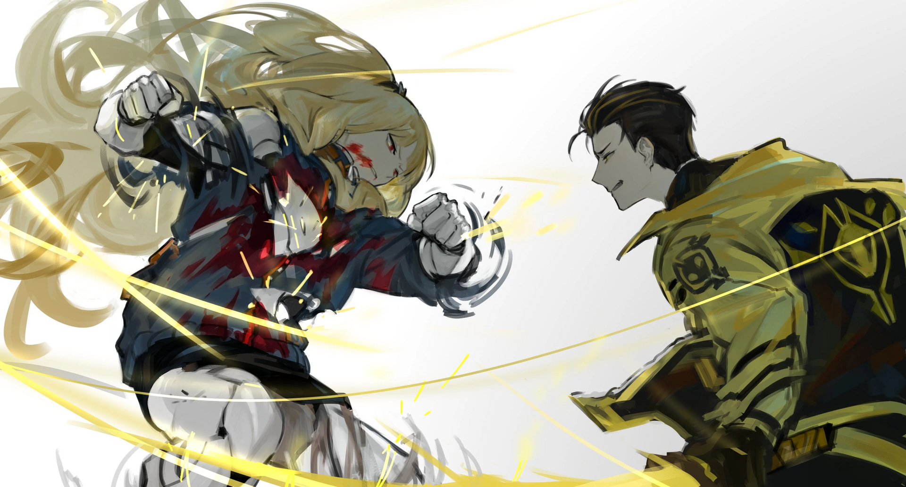

<h2 style="text-align:center;">И всё же, Эзра идёт вперёд.</h2>

"...Потому что, мне кажется, я смогу победить если всё пойдёт хорошо!"
 
 
 

*Хлоп!*
 
 
 

Лезвие меча в левой руке Веспы направлено на Эзру, и она отчаянно удерживает его, не давая приблизиться. Веспа замахивается по рёбрам Эзры своей свободной правой рукой. БУМ. Раздаётся звук. От удара Эзру отбрасывает к стене; но она отталкивается и наносит удар ногой в голову Веспы. Очки Веспы слетают с его лица. Он пошатнулся на мгновение, но быстро восстановил равновесие.

"Тц..."

Эзра стирает кровь с губ.

"У тебя есть талант к бою."

Сверкнул жёлтый свет.

"Но у тебя нет таланта убивать людей."

Кровь хлынула из груди Эзры. Она достала молот мастерской Нестера и замахнулась, но ударила в пустоту. Чёрт. Будь у меня курительная трубка, я могла бы как-то переломить ситуацию в её пользу. Я была на полпути по лестнице. Я абсолютно беспомощна и могу лишь наблюдать за Эзрой.

"Сёнбэ! Вспомни, о чём мы говорили на днях!"

Срочно крикнула ЮРия.

"...Я знаю, младшая!!!"

Если подумать, маска, которая всегда скрывала лицо Эзры, на этот раз отсутствовала. Жёлтый свет сверкнул вновь. Сверкающее лезвие оставило след на талии Эзры.
 
 
 

 
 

*Крииииииии!*
 
 
 

Искры взлетели с оглушительным визгом металла. Левая сторона талии Эзры защищена чем-то вроде стального листа.

"Усиленная броня, что ли... Интересно, почему ты не использовала её до сих пор."

"Хфф... Я её впервые использую, вот!"

"......"
 
 
 

Вспышки жёлтого света сверкают с левой руки Веспы. Часть брони расцветает там, куда попадает удар. Лезвие оставляет жёлтые следы, разрезая броню, но не может пробить её глубоко. Эзра отбивает атаки Веспы и стремительно сближается с ним. Вот такая моя Эзра. Психомент Эзры надёжно защищает её. Она без колебаний вколачивает кулак в грудь Веспы. Сила удара порождает звуковую волну, прокатившуюся по мастерской. Веспа вздрогнул, закашлявшись. Эзра не даёт ему передышки, обрушивая град ударов. Веспу неуклонно оттесняют в угол, он харкает кровью. Теперь битва под контролем Эзры. Она не даёт противнику возможности размахнуться мечом; Эзра хорошо знает, как сражаться с вооружённым клинковым оружием. Но Веспа так же упорен, он не падает и не отпускает своё лезвие. Хотя его лицо уже залито кровью, он не теряет равновесия. Несмотря на то, что Эзра полностью доминирует в схватке, мне не по себе.

"...Мне придётся пересмотреть свои суждения о тебе."

Веспа что-то бормочет. Эзра игнорирует его бормотание и продолжает обрушивать на него удары кулаками и ногами. Пах. Левая часть груди. Кадык. Правая сторона талии. Левая икра. Солнечное сплетение. Левая щека. Солнечное сплетение. Пах. Ребро. Левое бедро. Снова пах. Левая сторона талии. Кулаки Эзры бьют по всем известным уязвимым точкам человеческого тела, удар по которым может быть смертельным. Веспа кряхтит. Но не падает.
 
 
 

ЮРия и я достигли верха лестницы и выбрались из ателье. Снаружи двери мы, затаив дыхание, наблюдали за боем Эзры.
 
 
 

Зииииинь. Раздался резкий, высокий звук. В правой руке Веспа теперь держит гарпун. Секунду назад, этот же гарпун лежал на полу позади Эзры. И в броне, покрывающей левое плечо Эзры, зияет дыра. Из раненого плеча сочится кровь, но Эзра не отступает. Она продолжает лупить Веспу правой рукой. Веспа, укоротив хват, вонзил гарпун в Эзру. Эзра быстрыми шагами уклонилась в сторону, но не смогла опередить выпад. Гарпун глубоко вошёл в бок Эзры. И всё же, Эзра движется вперёд. Она обхватила правой рукой руку Веспы. Хрусь. Это звук ломающихся костей. Она сломала руку Веспы, переломив её. Клинь. Гарпун упал на пол. Однако глаза Веспы не потухли. Он продолжает смотреть на Эзру, даже не моргая. Этот взгляд опасен. ...Эзра не сможет закончить этот бой. Она умрёт, если всё так и продолжится.
 
 
 

Схватку нужно прекратить сию же секунду.

"Эзра! Наверх, сейчас же!!!"

Я крикнула Эзре изо всех сил. Она мгновенно отступила, ударив Веспу ногой в грудь.

"Да! Детектив!!!"

Эзра стремительно бросилась вверх по лестнице.
 
 
 

Веспа не сводит с неё взгляда.
 
 
 

"ЮРия! Запечатай мастерскую!" — закричала я, готовая захлопнуть дверь.
 
 
 

Гарпун поднят перед его глазами.
 
 
 

Эзра взбежала по лестнице за считанные секунды. От неё всего одна ступень.
 
 
 

Перед моими глазами сверкнул жёлтый свет. Это не что иное, как его гарпун, летящий на полной скорости к Эзре и ко мне.
 
 
 

Веря в Эзру, я изо всех сил захлопнула дверь.
 
 
 

Квииииииньг! Вибрация на мгновение потрясла всё здание.
 
 
 

К счастью, я жива.
 
 
 

Гарпун не смог пробить дверь ателье.
 
 
 

А Эзра...
 
 
 

"Детектив! Что нам делать с вашей рукой и ногой! Вам же очень больно?!!"
 
 
 

Она первым делом проверяла, как я, хотя сама была серьёзно ранена.
 
 
 

Мы все пережили охотника.
 
 
 

Я тяжело вздохнула.
 
 
 
 
 

Осмотрев гостиную, я увидела оставшихся в живых Корректировщиков из офиса Доу Гуй.
 
 
 

И Фэй стояла в центре.
 
 
 

...Здесь многое предстоит разгребать.
