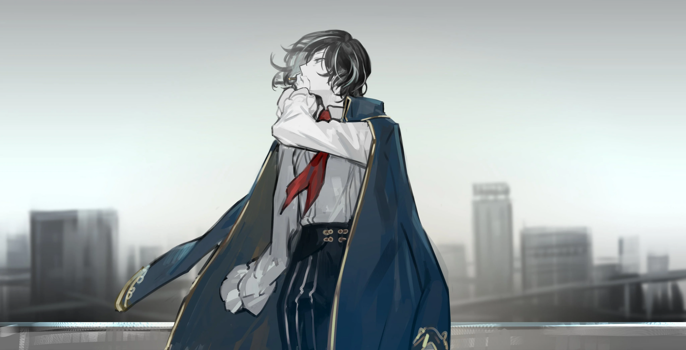

<h2 style="text-align:center;">"Давай хорошенько там покуролесим, когда приедем."</h2>

Похоже, из семнадцати Корректировщиков офиса Доу Гуй в живых осталось пятеро. Они ранены не меньше нас. У некоторых нет рук, большинство залиты кровью. Очевидно, что конечной целью Веспы было не бессмысленное убийство. Он применил ровно столько силы, сколько требовалось для выполнения миссии. Скорее всего, он покинул отель, как только завладел телом ЮРии.

"...Мой отец скончался."

Сказала Фэй.

"Полагаю, вы ответственны за это, но также благодаря вам я смогла покинуть ту комнату."

"...Прости."

"...Мой отец сам выбрал работать в такой опасной сфере."

"...Верно, наша работа сопряжена с риском. Кто сейчас представляет офис Доу Гуй? Я хотела бы урегулировать оплату того запроса."

"Согласно традиции офиса Доу Гуй, мисс Фэй унаследует должность представителя офиса."

Ответил один из Корректировщиков. Наследственный офис... Боевой офис с наследственной системой. Этот офис ставит верность выше всего, как я и предполагала. Более того, новый лидер — ученица, ещё не достигшая совершеннолетия. Печально, но ясно как день, что рано или поздно этот офис распадётся.

"Что ж, тогда Фэй из офиса Доу Гуй. Позволь спросить прямо. Вы намерены возложить на нас ответственность за произошедшее?"

В комнате воцарилась тишина. Мой контракт с Чжан Лэем был устным. Нет документа, подтверждающего, что Чжан Лэй погиб, защищая нас в рамках своей работы. Худшим сценарием было бы, если бы она перевела ситуацию в насильственный конфликт в качестве расплаты. Нам пришлось бы бороться из последних сил с людьми в таком же разбитом состоянии. Наша судьба в руках этого молодого представителя.

"Все. Давайте дадим время залечить раны, прежде чем продолжим разговор. Мне многое хотелось бы от вас услышать."

Предложила Фэй спокойным голосом. Умный ребёнок.
 
 
 

Эзра вскрыла машину Веспы и извлекла тело ЮРии. Её тело не тронуто, как и говорил Веспа. Мы вернулись с ней в наш офис. Веспа, судя по всему, был на удивление аккуратен при обыске нашего пустующего дома. Наш офис выглядел почти так же, как когда мы его покидали. Эзра и я приняли таблетку HP и отправились спать. Нам было о чём поговорить, но мы были на грани физического и ментального истощения. Решили отложить разговоры на следующий день.
 
 
 

Офис Доу Гуй, обеденное время. Мы втроём сидели на диване. Фэй скромно устроилась в кожаном кресле, где часто бывал её отец.

"Президент Фэй. Позволите сначала объяснить нашу ситуацию и позицию?"

"Да. Прошу."

"Я заключила сделку с Чжан Лэем, предыдущим представителем офиса Доу Гуй. Контракт предполагал наём всех Корректировщиков офиса Доу Гуй на две недели. Мне была нужна их помощь, потому что мы нарушили табу 14-го Района, и за нами начал преследование охотник за табу. Я согласилась заплатить столько, сколько они потребуют согласно правилам офиса. Однако мы лишь в общих чертах обсудили оплату и не определили точную сумму. И я не раскрыла им личность преследователя. Если бы я сказала, что за нами следовал охотник за табу... большинство бы отказалось от запроса. Поэтому Чжан Лэй выдвинул дополнительное условие: раскрыть странное происшествие в его доме. Я сообщила ему, что руковожу офисом, расследующим загадки и нераскрытые дела, что, вероятно, и побудило его обратиться за этим. А странное происшествие в его доме было связано с вами, президент Фэй. Я последовала за Чжан Лэем в его дом и спасла вас своим способом, выполнив одно из условий контракта. Вскоре после того, как я раскрыла дело, охотник за табу пришёл в дом, чтобы схватить меня, и Чжан Лэй погиб в процессе моей защиты в рамках контракта. Вот как всё произошло."

"Вы рассказываете об этом таким сухим тоном."

"Я тоже рисковала жизнью, чтобы спасти вашу, имейте в виду. Хотя физических доказательств нет, я с уверенностью могу сказать, что заключила с ним сделку, касающуюся жизней и денег."

"Я знаю. Дело не в недоверии. Я просто надеялась услышать, как вы выразите соболезнования в связи со смертью моего отца."

"...Да. Лично, я тоже очень благодарна Чжан Лэю. Даже узнав, что его противник — охотник за табу, он не колеблясь обнажил против него оружие, чтобы защитить меня. Хотя, справедливее будет сказать, что он сделал это ради вас, Фэй. И я слышала от Эзры, что ей удалось благополучно покинуть отель благодаря Корректировщикам вашего офиса. Моя признательность и соболезнования Чжан Лэю и всем остальным погибшим Корректировщикам офиса безграничны."

Эзра медленно кивнула рядом со мной.

"Да. Надеюсь, ваши слова немного утешили дух моего отца."

Фэй ненадолго опустила взгляд.

"Запрос, за который взялся наш офис, ещё не завершён. Мы будем защищать людей из офиса Мозес оставшиеся 13 дней."

"Так точно, босс!"

Корректировщики офиса Доу Гуй ответили хором. Я тронута её добрым сердцем, но должна сказать, что это больше похоже на ребёнка, играющего в босса. Офис уже потерял большую часть своей силы. Хладнокровный представитель должен аннулировать такой беспочвенный запрос и сосредоточиться на реорганизации.

"Я знаю, что моё решение может показаться взрослым глупым. Вы, наверное, думаете, что в долгосрочной перспективе это нам не поможет. Но вот что мой отец как-то сказал: 'Наш офис связан верностью'. Поэтому я хочу отплатить вам за то, что вы рисковали жизнью, чтобы спасти меня. ...К тому же, вы обещали вместе размышлять над моими проблемами, а для этого вам нужно остаться в живых, верно?"

Вот тут она меня подловила. У этого ребёнка, возможно, ранимое сердце, но она человек воли.

"Крэйн. Свяжись, пожалуйста, с нашими сестринскими офисами. Сообщи, что офис Доу Гуй запрашивает помощь."

Корректировщик, стоявший рядом с Фэй, кивает.

"Спасибо, президент Фэй. Наш офис глубоко вам обязан."

Я встала и официально выразила благодарность.

"Отец научил меня, что делать, если настанет этот день. Отныне... мне придётся учиться у людей здесь."

Фэй ненадолго уставилась в пространство, погружённая в мысли.

"Давайте сейчас же урегулируем оплату запроса. Я установлю сумму, исходя из обычаев офиса Доу Гуй."

По крайней мере, в деловых вопросах она дотошна.

"Эзра, поручаю это тебе."
 
 
 

Я поднялась на крышу. Левой рукой я достала сигарету из пачки и зажала её во рту. Придётся ещё и прикуривать, какая досада...
 
 
 

 
 

Выдувая дым, я размышляла о том, что ждёт нас впереди.

"Детектив Мозес. Что вы будете делать со своей курительной трубкой?"

"Это я хотела бы спросить. Что ты будешь делать со своей мастерской?"

"Моё ателье выйдет из строя на какое-то время. Я выжала все свои мозги, так что даже не смогу открыть ателье в ближайшее время, да и материализация мишек для работы — это тоже умственное напряжение."

"Хфф... И ты, и я стали бесполезными. Хотя, нет. По крайней мере, я всё ещё могу видеть Искажение."

"...Я буду пахать как собака, как только моё ателье снова заработает."

ЮРия проговорила тоненьким голоском.

"Детектив! Детектив! Мне сделали огрооомную скидку! Хехе..."

Эзра подбежала с сияющим видом. Похоже, переговоры прошли успешно. Я вытащила из пачки ещё одну сигарету. Эзра ловко прикуривает сигарету у меня во рту.

"Детектив! Где мы возьмём вам новую руку? Ой... а что насчёт курительной трубки?!"

"Ты вовремя, мы как раз об этом говорили. Мне нужно будет обзавестись новой рукой, прежде чем мы отправимся в 11-ый Район. Эзра, могу я поручить тебе выбрать подходящую модель протеза?"

"Да! Конечно! Я найду ту, что вам идеально подойдёт, детектив!"

Я сниму его, когда получу обратно свою настоящую руку от этой назойливой пчелы. В последний раз, когда я видела свою правую руку, он поместил её в куб стазиса.

"Может, этот тупой шершень подохнет с голоду, если мы продержим его в моём ателье достаточно долго?"

"Выжидание — вариант, конечно. Но Корректировщик уровня Веспы может пройти процедуры, позволяющие долго обходиться без еды и воды. Мы не знаем, какие именно аугментации есть у Веспы, а значит, не знаем, когда и умрёт ли он вообще от голода. Скажи, как буйство Веспы в твоей мастерской на тебя повлияет?"

"Прежде всего, восстановление ателье займёт какое-то время... И под 'каким-то временем' я подразумеваю весьма значительное... Я буду бесполезным грузом довольно долго..."

"По крайней мере, утешает, что с твоим телом и разумом всё будет в порядке. Я использую свои мозги, чтобы придумать, как нам разделаться с Веспой, так что своим ты можешь дать отдохнуть. А, и Эзра, как тебе удалось проявить свой Психомент?"

Эзра снова в своей маске. Её искажение снова стало видимым. Я зажала во рту новую сигарету. Как же мне не хватает моей трубки.

"Эхехе... Вообще-то я консультировалась по этому поводу с нашей младшей! Я думала, может, смогу стать сильнее, если научусь использовать Психомент! Так что она научила меня, как это делается!"

"ЮРия, я не верю, что одного лишь умения достаточно, чтобы проявить Психомент?"

"Я ей ещё кулончик дала вдобавок. Ещё один мой прототип. Я пересматривала запись, как Эзра-сёнбэ сражалась со скелетом-титаном в компании «Тэ-Юнг» снова и снова, и вырезала кулон, который, как я подумала, может с ней сработаться. Кулон, который я сделала, — это катализатор для проявления Психомента. Он также помогает формировать Психомент в соответствии с вырезанным мысленным образом."

"Это может быть весьма полезно в будущем."

"Но вырезание одного такого — процесс трудоёмкий, для которого мне нужно моё ателье чтобы даже начать..."

"Я смогла стать сильнее благодаря тебе, младшая!"

Обе наши проблемы сводятся к тому, что Веспа заперт внутри ателье. Мне нужно вернуть мою курительную трубку, а ЮРии нужна её мастерская, чтобы полностью реализовать свои возможности. Ничего по сути не изменилось. Мне нужно встретиться с Хан Хи-Джуном в 11-ом Районе и сбагрить ему этот осиный улей.

"Что нам делать с твоим телом, ЮРия?"

"О! Насчёт этого, когда я объяснила её ситуацию Фэй, она сказала, что позаботится о теле, пока мы не вернёмся!"

Она слишком добра к нам. Возможно, она хочет увериться, что жизнь её отца была отдана не зря, обеспечивая безопасность и комфорт людям, ради которых он погиб. В любом случае, я не в том положении, чтобы отказываться от её гостеприимства. Я вынула сигарету изо рта и потушила её в пепельнице. Пора начинать готовиться к поездке.
 
 
 

В течение трёх дней проходили похороны Чжан Лэя и его погибших подчинённых. Церемония проводилась согласно восточным традициям, региону происхождения Чжана. Фэй оставалась в траурном зале от начала до конца церемонии. Глядя на портрет Чжан Лэя, улыбающегося в камеру, я не могла не вспомнить одного фотографа, с которым встречалась некоторое время назад.
 
 
 

Мне пришлось какое-то время сопровождать Эзру в её походах по мастерским. Корректировщики офиса Доу Гуй и его сестринских офисов сопровождали нас на протяжении всего выхода, словно мы знатные особы. На самом деле, сопровождение не прекращалось и по возвращении. Они бдительно охраняли периметр нашего офиса и следили, чтобы ни один незваный гость не посмел приблизиться или причинить нам вред. Остальное время я провела беседуя с Фэй об Искажении. О том, что с ней произошло, и как ей следует жить дальше... Время текло неспешно.
 
 
 

30 минут до отправления ВАРП-поезда. Я докуривала последнюю сигарету в курительной комнате. ВАРП-поезда... Они всегда достигают пункта назначения в мгновение ока. Эзра машет мне с перрона, держа на плече свою пространственную сумку. Должно быть, она в восторге. Я усадила ЮРию в карман пальто. Я заранее предупредила её притворяться куклой какое-то время. Фэй и Корректировщики офиса Доу Гуй пришли проводить нас.

Эзра и я устроились на своих местах в поезде.

"Мы наконец-то уезжаем."

Мы пережили столько перемен до этого отъезда. Но, увы...

"Эхехе. Путешествие, я так его жду!"

"Эзра, то, что ждёт нас там, может оказаться ещё более суровым, чем то, через что мы недавно прошли."

"И еда тоже! Я видела блюда южных районов только на картинках, так что всегда хотела попробовать их сама!"

"...Да. Давай хорошенько там покуролесим, когда приедем."

"О да!"

Я закрыла глаза.
 
 
 

А когда открыла их, мы уже были на месте.
 
 
 

ВАРП-станция в 11-ом Районе, где расположено Гнездо Корпорации K.
 
 
 

Где находится Хан Хи-Джун.
 
 
 

И где находится та самая особа.
