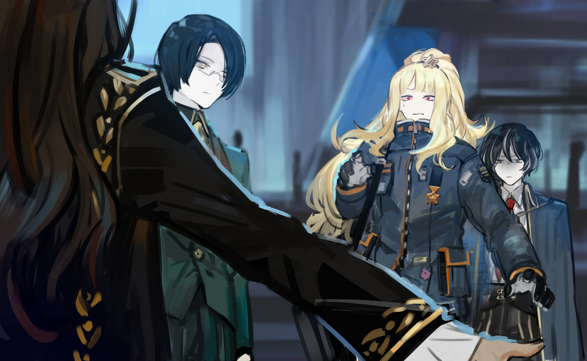

<h2 style="text-align:center;">Это встреча с прошлым; рано или поздно мне бы предстояло с ним столкнуться...</h2>

"Приветствую, доктор Мозес. Вы наконец-то прибыли."

Знакомая пара высокомерных глазных яблок ждёт меня прямо у выхода из терминала ВАРП. А манера речи бесит меня ещё больше. "Наконец-то", — говорит он, словно у меня был выбор. Я попала в расставленную им ловушку. Эти слова вполне могут означать "как я и ожидал".

"Разве ты не сказал нам прийти в твою мастерскую в Ассоциации?"

"Я сам приехал вас встретить, потому что у нас нет времени терять. ...Что случилось с вашей правой рукой?"

Противно видеть, как он принимает вид обеспокоенного.

"Эзра, разберись с тем, что бы он там ни хотел сказать, за меня. Я ненадолго в курительную."

"Поняла, детектив!"

"...Мозес? Это правда ты, Мозес?!"

Этот голос... Этот сукин сын Хан Хи-Джун подставил меня больше, чем одним способом. Возможно, настоящее значение его "наконец-то" — это "несмотря ни на что".

"...Детектив!"

Эзра быстро встаёт между мной и незваной гостьей.
 
 
 

 
 

"Эзра тоже здесь! Я так по вам двоим скучала."

Её отвратительный голос. Её хитрые глаза. И её полный жалости взгляд, обращённый к нам.

"Диас... Пожалуйста, просто уйди, мы не можем сейчас с этим справиться, не сегодня..."

Умоляет Эзра дрожащим голосом.

"Мозес, дорогая! Я совсем позабыла о том, что случилось в тот день! Так давайте же вернёмся к тому, как было в старые добрые времена, ну пожалуйста?"

Эта особа ничуть не изменилась с того дня. Ни внешне, ни в манерах.

"Верно, Хи-Джун? Всё это в прошлом, не так ли?"

Хан Хи-Джун молчит. В тот день я привела сотни людей к гибели. Я хотела спасти их из рук Диас. Но не смогла.

"Диас... Какую тёмную херню ты затевала с компаней «Тэ-Юнг» в 14-ом Районе?"

Сдерживая чувства, я тихо спросила.

"Ах, это?! Вообще-то..."

"Леди Диас. Боюсь, нам придётся перенести этот разговор. Доктор Мозес должна сейчас заняться срочным делом для Ассоциации."

Хан Хи-Джун вмешался со смешком.

"...Оу, правда? Какая досада... Пригласите этих двоих ко мне домой позже, хорошо?"

"Понял. Устрою, как только доктор выполнит свою миссию."
 
 
 

Мы сидели на заднем сиденье машины Хан Хи-Джуна. Никто из нас не хочет говорить первым. Я смотрю в окно. Причина, по которой я приехала в 11-ый Район... Не в том, чтобы заработать денег, сохранить имя в Ассоциации или раскрывать Искажения. Это встреча с прошлым; рано или поздно мне бы предстояло с ним столкнуться...

"Как я объяснял два месяца назад, Ассоциации Севен нужно Искажение целиком, доктор. ...Вы меня слушаете?"

"М-м-м! По крайней мере, я слушаю, Хи-Джун-сёнбэ!"

Эзра отвечает за меня.

"Мы направляемся в сельскую деревню. Наша Ассоциция наблюдает за этим местом последние два месяца. И время собирать плоды созрело."

"...Вы хотите сказать, что город уже пострадал от Искажения?"

Я открыла рот.

"Нет, это спокойное место. Но оно искажено. Даже я смог это понять, а я не способен видеть Искажение."

Машина остановилась перед улицей.

"Мы прибыли. Можете выходить."

Эзра и я вышли с заднего сиденья. Хан Хи-Джун опустил окно со стороны водителя.

"Идите по этой улице около пятнадцати минут, и вы найдёте небольшую деревню."

"И что именно я должна там делать? Мне не предоставили никаких документов с деталями миссии?"

Я достала пачку сигарет из внутреннего кармана пальто и зажала сигарету во рту. Эзра прикуривает.

"...Доктор Мозес. Ваша курительная трубка?"

Удивлённо спросил Хан Хи-Джун.

"...Это долгая история. Так не напомнишь, что мы должны здесь сделать?"

"...Вы поймёте, как только войдёте в деревню. Ваша работа — исследовать это место и сделать убедительные выводы. После чего сообщить Ассоциации о том, что произошло в деревне."

Я взмахнула рукой в сторону Хан Хи-Джун, жестом показывая, что он сказал достаточно и может теперь сваливать.

"...Доктор Мозес. Это будет паршивая работа."

Я выпустила дым в воздух. Хан Хи-Джун поднял окно обратно.

"...Пожалуйста, выживите."

Он не перестаёт быть зловещим типом. Оставив нас позади, он отъехал.
 
 
 

"Эзра! ЮРия! Приготовьтесь."
 
 
 

"Да! Детектив!"

Эзра крепче сжала ремень своей пространственной сумки.
 
 
 

"Там было так тесно."

ЮРия выбралась из кармана и устроилась на моём плече.
 
 
 

Мы пошли по узкой улице, направляясь в деревню.
