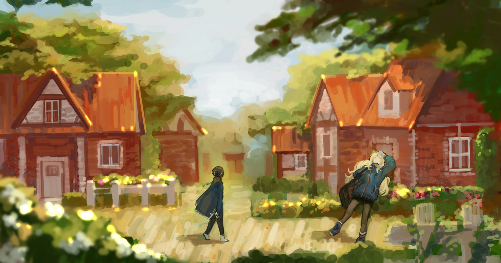

<h2 style="text-align:center;">Ах, сейчас как раз сезон праздника урожая в нашем городке.</h2>

Десять утра. Солнце освещает мрачный переулок. Мы шли по извилистой улице. В Подворотнях много таких неизвестных троп; не нанесённых ни на одну карту улиц. Войти на незнакомую улицу — большой риск. Как и в случае с Гнёздами, каждый район Подворотней имеет свою культуру. А за углом может поджидать неожиданная жестокость.

Пройдя по улице около пятнадцати минут, как и указал Хан Хи-Джун, я увидела указатель с надписью «Деревня Кверкус». Он не утрудился дать мне подробное описание этого городка. Каковы культурные особенности деревни, есть ли какие-то табу, что-либо... Будет ли нам безопасно ступить в эту деревню? Наверное, да. Каким бы скользким типом Хан ни был, он не из тех, кто заведёт нас в ловушку смерти таким примитивным способом. Я задержалась у входа, чтобы покурить, прежде чем войти в деревню.

"Детектив! Детектив! Хотите, я подготовлюсь к бою на всякий случай?"

Спросила Эзра, и я покачала головой.

"Поскольку мы не знаем, что это за место, нам не следует выглядеть напряжёнными. Давайте вести себя естественно и притворимся путешественниками."

"Сёнбэ идеально подошла бы на роль гастрономического туриста, исследующего местные забегаловки."

Добавила ЮРия. Я усмехнулась. Это действительно подходит Эзре.

"Звучит неплохо. Замаскируемся под путешествующих писателей, которые посещают маленькие ресторанчики, спрятанные в переулках и на улицах по всему Городу. Моя работа — обзор заведения и оценивание качества еды. Что касается тебя, Эзра, ты можешь быть моей спутницей и телохранительницей. Человеку, шастающему по углам Подворотней, нужен эскорт, что оправдывает применение тобой силы."

"Божечки... Мне нравится эта идея! Хочу быть телохранительницей, которая ещё и оценивает еду!"

"Делай как знаешь. А, и ЮРия, ни слова без крайней необходимости, и говори тихо, если уж придётся. Объяснять местным, как плюшевый мишка может двигаться и говорить, будет хлопотно."

"Учту."

Я стряхнула пепел в портативную пепельницу.

"Ладно... Пора заходить."
 
 
 

Когда я вошла в городок, не могла поверить своим глазам. Это тихое и уютное место. И улицы усажены пышными цветами и травой. Я вижу дома и здания ярких цветов, не соответствующих серым тонам Города. Кирпичные дома высотой около 2-3 этажей. Деревянные крыши. Такие красота и покой, какие ожидаешь увидеть в каком-нибудь Гнезде. Как городок за пределами Гнезда может быть настолько спокойным и приятным? Я знаю, что есть много переулков, известных лишь немногим, но я никогда не посещала места в Подворотнях, столь уютные и безмятежные, как этот сказочный городок. Возможно, мои познания поверхностны. Может, таких мест больше.

"...Вау!"
 
 
 

 
 

Эзра, кажется, тоже поражена. Я осмотрелась в поисках жителей, с которыми можно поговорить. Ни единой души на улице. Возможно, это очевидно. Будний день. У горожан, вероятно, есть работа и деньги, которые нужно зарабатывать. И всё же здесь зловеще тихо. Похоже, придётся пошарить по зданиям в городке. Ресторан должен быть идеальной отправной точкой.

"Эзра, поищи поблизости забегаловки."

"...Ах! Сделаю!!"

Эзра возглавила путь бодрыми шагами. Она явно в приподнятом настроении. Я не спеша следую за ней. В этом городке, кажется, около пятидесяти домохозяйств. Население будет около 80 человек. Закусочная, кафе или паб. Должно быть хотя бы одно такое заведение.

"Детектив! Детектив! Сюда, я нашла одно!"

Эзра машет мне рукой. Похоже, она что-то нашла. Я вижу дверь с вывеской «Чайная Дэ Мар». Со звоном колокольчиков, Эзра и я вошли в кафе. Это маленькое заведение с четырьмя столиками и площадью в 15 пхёнов.

"...О? До-Добро пожаловать!"

Голос, казалось, не ожидал гостей.

"Сейчас открыто?"

Спросила я.

"Да, да. Конечно~"

"Полагаю, в этот час у вас нечасто бывают клиенты?"

"А-ха-ха, видите ли, наш городок находится в довольно удалённом месте, так что у меня редко бывают посетители, кроме местных жителей."

Ох. Они немного насторожены. Полагаю, это закрытая деревня, как я и подозревала.

"Должна признать, я тоже удивилась. Не думала, что наткнусь на такой красивый городок в неожиданном месте. Ах, простите за бестактность, позвольте представиться. Я Момо, путешествующий гурман, который ищет неизвестные рестораны в глухих местах. А это мой напарник..."

"Я спутница мисс Момо в путешествиях! Меня зовут Эзез!"

Выдуманное имя ничуть не менее замысловатое, как и моё.

"Значит, вы путешественники! А-ха-ха, наш городок, конечно, красив, но боюсь, он не славится своей едой."

"Ничего страшного. Находить новые рестораны на улицах, которые я посещаю впервые, — для меня уже само по себе настоящее удовольствие."

"Я Дьюи, владелец чайной «Дэ Мар». О, позвольте принести вам меню."

Мы выбрали столик и сели. Это очаровательная маленькая чайная. Чувствуется тепло деревянной постройки. Послеполуденное солнце светит сквозь окна. Чувство безмятежности и расслабленности, редкость для Города. Это словно роскошь, которую могут вкусить лишь жители благополучных районов.

"Вот наше меню. Не торопитесь и дайте знать, когда определитесь."

"Вау! Разве настоящий знаток закоулочных ресторанчиков не обязан перепробовать все блюда в меню, правда, мисс Момо?!"

Эзра, обжора...

"Ха-ха-ха, полегче, мисс Эзез. Ты забыла, что наше правило — пробовать только три блюда, которые рекомендует шеф?"

Я слегка ущипнула Эзру за руку. Она в ответ немного поморщилась. Дьюи смотрит на нас с улыбкой, кажется, позабавленный нашей легкой перепалкой.

"О, эй! Разве эта кукла... не Красный Мишка Ккоми?! Это плюшевый мишка, персонаж, который был популярен какое-то время, пока его не сняли с производства!"

Кко... что? Я была озадачена вопросом, который возник совершенно неожиданно.

"...Что такое Ккоми?"

Наивно спрашивает Эзра. Идиотка... Мы должны плыть по течению, а не сразу спрашивать о том, что для них является общеизвестным. Это только вызовет больше подозрений.

"Ах, точно, вы же сказали, что путешественники. Полагаю, вы приехали издалека. Хотя персонаж в своё время был довольно популярен..."

ЮРия слегка дрожит у меня на плече. Должно быть, ей есть что сказать по этому поводу.

"Ха-ха, это на самом деле подарок от моего знакомого. Насколько я понимаю, ты большая поклонница таких милых персонажей, мисс Эзез, разве ты не знала об этом?"

Я дала Эзре незаметный сигнал.

"О, э-э... Ккуми! Красный Мишка Ккуми! Да, знаю. Для меня было бы преступлением не знать Ккуми."

"Его называют Ккоми..."

Наступает неловкая пауза. Честность — единственный выход из этого положения.

"Ха-ха-ха... Мы с северной стороны Города, так что мало что знаем о том, что происходит здесь, на юге."

"С севера?! Вы приехали так издалека! На протяжении всей своей жизни я никогда не покидал 11-ый Район, не говоря уже о том, чтобы побывать где-то рядом с северными районами."

"Что ж, то же самое можно сказать о большинстве людей в Городе."

Я дала подходящий ответ. Пора сменить тему.

"Ну, тогда, Дьюи. Я бы хотела заказать три блюда по вашему выбору."

"Хорошо, пожалуйста подождите немного."

Дьюи ушёл на кухню. Я слышала звуки звякающей посуды. Я посмотрела в окно. На улицах городка по-прежнему никого нет.

"В этом городке всегда так тихо?"

Я обратилась в сторону кухни достаточно громким голосом.

"Ах, сейчас как раз сезон праздника урожая в нашем городке. Люди, у которых есть свободное время, готовят церемонию в ратуше."

Праздничный период... Закрытая деревня и уникальные обычаи. Не лучшая комбинация. Подобные вещи обычно следуют шаблону. И этот шаблон часто заканчивается жуткими каннибальскими церемониями или культовыми кровавыми оргиями. Однако, если бы это был один из таких предсказуемых случаев, Второй отдел Севен не стал бы поручать мне это расследование. Я выберу прямой подход.

"Праздник урожая? Мы могли бы присоединиться к этому празднику, если вы не против?"

В зависимости от реакции жителя, это можно будет отнести к одному из двух типов: отвергающие посторонних или активно приглашающие их поучаствовать. В случае последнего высока вероятность, что посторонний окажется жертвенным ягнёнком. Если этот окажется приветливым типом, нам будет гораздо удобнее выполнить эту миссию. Просто было бы слишком хлопотно пытаться проникнуть на праздник, который исключает посторонних.

"Конечно! Праздник становится веселее, когда его разделяет больше людей."

Дьюи вышел из кухни с едой для нас. Чёрный чай, блинчики и омлеты. Выглядит просто. Глаза Эзры загорелись.

"Что ж, тогда приятного аппетита. Я пойду спрошу всех в ратуше."

"Спасибо."

Улыбаясь, Дьюи покинул заведение.
 
 
 

"Эзра, как тебе?"

"Довольно по-обычному."

"Значит, ты тоже так думаешь."

"Агась. Весьма сладкий блинчик с ванильным вкусом, умеренно мягкий омлет и умеренно ароматная чашка чёрного чая. Всё стандартно."

Ха-ах... Я приложила руку ко лбу. Пожалуй, просто оставлю её наполнять желудок. Я снова осмотрела чайную. Я всё ещё не вижу явных аномалий. Это не более чем уютная чайная. Прошло некоторое время. Дверные колокольчики зазвенели, когда Дьюи вернулся.

"Мисс Момо, мисс Эзез. Все горожане с радостью согласились позволить вам поучаствовать. Пройдём в ратушу, когда закончите есть?"

Очень гостеприимный тип. У меня нет причин отказываться. Чем быстрее разделаемся с этой работой, тем лучше.

"Хорошо. Мисс Эзез, как тебе еда?"

"Она была невероятно удовлетворительной, мисс Момо."
 
 
 

Мы вышли из заведения и последовали за Дьюи. Время только что перевалило за час дня. Эта деревня представляет собой завораживающее зрелище. Если я когда-нибудь заработаю право на пенсию и доживу до старости, возможно, именно здесь я выберу провести остаток дней. Пока я была погружена в такие мысли, мы прибыли в ратушу. Это, кажется, самое просторное здание в городке.

"Друзья! Это мисс Момо и мисс Эзез, посетители, о которых я говорил ранее."

Эзра и я кивнули в знак приветствия. В здании около 40 человек. Каждый из них приветствует нас. ...Это нехорошо. Я глянула на Эзру и снова на горожан.
...Теперь я поняла, почему Хан Хи-Джун дал мне эту работу.

"Приятно познакомиться. Я Домис, глава этой деревни. Я слышал от Дьюи, что вы двое — путешественники."

"Да. Мы путешественники, которые ищут ресторанчики по углам улиц. Я Момо, а это Эзез."

"Привет!"

Эзра бодро приветствует их.

"Спасибо, что позволили таким незнакомцам, как мы, присоединиться к празднику вашей деревни."

"Ха-ха, в этом ведь и прелесть путешествий, не так ли? К тому же праздники веселее, когда есть с кем их разделить."

Горожане делают кукол из веток деревьев.

"Мы хотели бы помочь вам с подготовкой."

"Нет-нет. Вы приехали издалека, вы заслужили отдых."

"Я считаю, что участие во всех этапах праздника, начиная с подготовки, — это способ по-настоящему насладиться им, как вы и упомянули."

Домис рассмеялся.

"Хорошо подмечено! Тогда я скажу людям здесь, что вы двое тоже помогаете."

Мы некоторое время помогали горожанам готовиться к празднику. Я внимательно наблюдала за ними во время работы. То, что я вижу, подтверждает, что моё подозрение — не просто игра воображения.

"Есть ли в этой деревне место, где можно покурить?"

Спросила я у жителя, стоящего рядом.

"О, вы можете курить на улице, если рядом никого нет. Только не бросайте окурок на землю."

"Конечно."
 
 
 

Я вышла из ратуши. Часы пробили четыре. На улицах городка, которые я вижу, по-прежнему ни души. Я отправилась в укромное место и достала сигарету. И приложила руку ко лбу.

"Детектив Мозес, вы что-то поняли?"

Шепчет ЮРия.
 
 
 

Я выдохнула дым.
 
 
 

"Да... Я не вижу Искажение ни у кого из здешних горожан."
