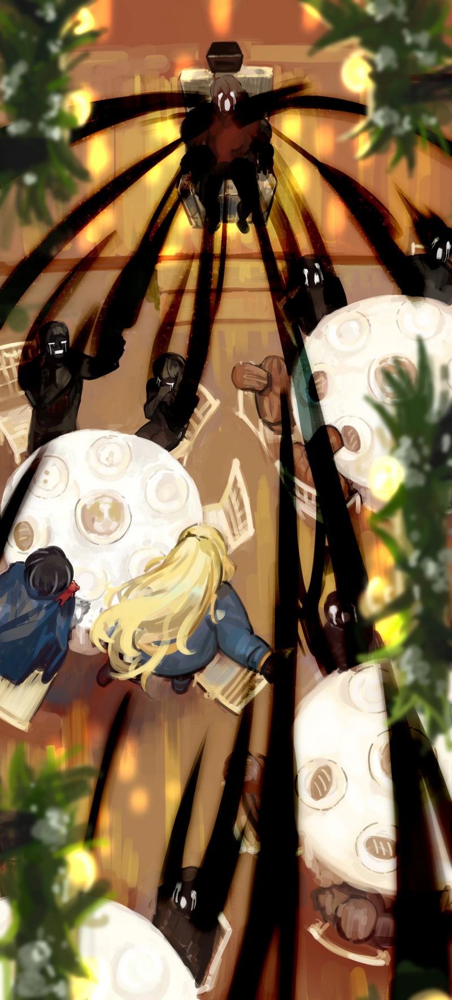

<h2 style="text-align:center;">Праздник вот-вот начнётся.</h2>

"Ты не видишь их Искажений? Но это должно означать, что у всех жителей деревни есть Психомент, согласно нашей текущей теории..."

"Скоро увидим."

Я уставилась на сигаретный дым, который только что выдохнула. Будь у меня моя курительная трубка, я могла бы использовать белое дыхание, чтобы чуть легче постичь истину этого праздника и ситуации. Трубка... И Веспа. Это как думать о просроченном домашнем задании, которое откладывал всю ночь. Я вернулась в ратушу.

"Мисс Момо~!"

Эзра машет мне рукой, словно ждала моего возвращения. Рядом с ней Дьюи.

"В чём дело, мисс Эзез?"

"Видите ли, мисс Момо. Уже почти время ужина, и они просят помочь им с приготовлением еды для праздника. Они подумали, что гурманам вроде нас понравится увидеть процесс своими глазами."

Ох... Я не создана для готовки.

"О! Но мисс Момо ужасно готовит, что же нам делать?!"

...Как же я хочу дать ей по голове.

"А-ха-ха, я помогу вам рядом, так что не волнуйтесь."

Добродушно сказал Дьюи.

"И моя жена здесь, чтобы помочь."

"Приятно познакомиться. Я Мию. Давайте все вместе приготовим еду!"

Я не вижу искажения и у этого человека тоже.

"Я попробую. Хотя, как упомянула мисс Эзез... я не слишком сильна в кулинарном искусстве."

"Не беспокойтесь об этом слишком сильно. Мы готовим особенные блюда для праздников."

Особое блюдо, сказала Мию. Человеческое мясо было бы слишком клишированно для этого дела. Эзра и я последовали за ними на кухню внутри ратуши. Около десяти человек собрались на кухне, подготавливая ингредиенты. Кухня кажется такой же уютной, как и остальная деревня. Воздух наполнен землистым запахом теста. Дьюи и я встали перед кухонной стойкой. Эзра отправилась помогать Мию с подготовкой ингредиентов. Мы вымыли руки с мылом. И я надела фартук, который дал Дьюи.

"Итак, что мы будем готовить?"

"Хлеб и суп."

"Довольно просто для еды, подаваемой на празднике."

"В этой простоте и заключается наша цель. Ваш разум загрязняется, когда вы набиваете желудок вкусной, изысканной едой."

..."Поедание изысканной еды загрязняет разум" — не то выражение, которое обычно используют люди.

"Загрязняет разум? Какое странное выражение."

"А-ха-ха, вы тоже так думаете? Это слова нашего главы деревни. Он неустанно трудится для душевного здоровья наших горожан. Этот праздник — часть его усилий."

"Разум станет здоровым после участия в празднике?"

"Конечно! Вы тоже это испытаете, мисс Момо. Во время праздника мы смываем всю грязь со своих умов. Может, именно поэтому в нашем городке вообще не было преступлений, в отличие от большинства других."

Пока Дьюи говорил... что-то появилось у него из груди. Крошечные чёрные ручки выползают наружу. Искажение проявляется. Что это? Человек только что сказал что-то, что задело его собственный разум? Эзра и Мию приносят нам очищенные ингредиенты, и Дьюи кладёт их в кастрюлю, один за другим. Он выжидает некоторое время, прежде чем добавить каждый ингредиент. Есть ли какой-то определённый порядок, которому нужно следовать?

"...Этот праздник проводится каждый год?"

"Нет, он проходит ежемесячно."

"Это несколько отличается от большинства известных мне праздников. Должно стоить немало, чтобы проводить его каждый месяц."

"Ха-ха, хотя мы и называем это праздником, на самом деле всё довольно просто и скромно. Мы подаём на этих праздниках только хлеб и суп, как раз то, что мы сейчас готовим. Но это не значит, что мы мало заботимся о приготовлении!"

Праздник, на котором очищают разум, проводится раз в месяц. Пахнет религиозным обрядом. Более того, в этом супе нет мяса или любого другого животного белка. Он приготовлен исключительно из зелени и овощей. Морковь, картофель, грибы и так далее. Обычная вегетарианская еда. Осуждение мяса как нечистой пищи — убеждение, часто встречающееся во многих религиозных практиках.

"Ладно, мисс Момо. Давайте теперь приправим еду щепоткой соли..."

Праздник, на котором очищают разум. Горожане, чьи Искажения не видны. Внезапное проявление Искажения у Дьюи. Мне нужно ещё несколько улик, чтобы прийти к ответу.

"...Погодите, мисс Момо! Это сахар, а не соль!"
 
 
 

Приготовление почти закончено. Я не видела, чтобы в суп на протяжении всего процесса добавляли какие-либо подозрительные ингредиенты вроде галлюциногенов. Праздник вот-вот начнётся.
 
 
 

Люди рассаживаются за столиками на шесть человек в столовой ратуши. На каждый стол поставлены миски с приготовленным нами супом. Перед каждым из нас лежит булка испечённого хлеба. За нашим столиком сидели Эзра, Дьюи, Мию, я, и наконец, глава деревни. А также... несколько деревянных кукол размером в человеческий рост. Это те фигуры, которые горожане делали днём. Перед куклами тоже поставлены суп и хлеб. Я осмотрелась. В передней части обеденного зала есть сцена. На сцене — стальной стул. Столовая устроена так, что люди со своих столов могут видеть сцену.

"Хнык, хнык... Мисс Момо... Тут совсем нет мяса..."

Хнычет Эзра, сидящая напротив меня. Я проигнорировала её. Есть более важные вопросы. Теперь я вижу Искажение у горожан. Степень их Искажений незначительна и мала, как у Дьюи.

"Полагаю, не все в городке присоединились к этому празднику?"

В этой столовой 57 человек, не считая Эзры и меня.

"Нет, это не так. Все жители деревни собрались здесь."

Ответил глава деревни. В деревне, казалось, было около пятидесяти домохозяйств. Если эти люди и правда всё население городка, значит, большинство из них живут поодиночке. Однако, если учесть деревянных кукол, общее количество становится 102. Это недалеко от моей недавней оценки. Вполне возможно, что эти куклы занимают места, где раньше сидели другие горожане. Куда они исчезли? Мне нужно это выяснить.

"Вы, должно быть, необычайно чисты сердцем, мисс Момо."

Любезно сказал глава деревни.

"...Я не вижу в вас никакой скверны."

Загадочная фраза.
 
 
 

"Ну что ж, народ! Да начнётся праздник урожая!"

Глава деревни встал и объявил громким голосом.
 
 
 

"Для начала, посмеёмся!"

Все горожане одновременно разразились смехом, включая Дьюи и Мию. Я рассмеялась вместе с ними. На празднике, в котором участвуешь впервые, нужно уловить настроение и поведение людей, и следовать им. Эзра неловко смеялась. Коллективный приступ смеха длился десять минут. Когда глава деревни внезапно перестал смеяться, горожане одновременно замолчали. Глава деревни сел. Искажения людей немного продвинулись.
 
 
 

"Поедим супа."

Проговорил лидер величаво. Суп имеет чистый, насыщенный вкус. Миска не была слишком большой, так что я смогла съесть всё до истечения пяти минут.

"Выплеснем же наш гнев!!! Вы, грязные, гнусные выблядки!!!"

Глава деревни обрушился на деревянную куклу, сидящую за нашим столом. Люди тоже выкрикивали в адрес кукол за своими столами ругательства, слишком вульгарные для описания. На что они злятся? Дьюи и Мию делают то же самое, ругаясь с суровыми выражениями лиц. Эзра и я последовали их примеру. Искажения горожан продвигаются дальше. Вновь, когда глава деревни прекратил ругаться, вся столовая затихла.
 
 
 

"Поедим хлеба."

Сказал глава деревни, замедляя своё прерывистое дыхание. Это обычная булка хлеба из муки с маслом. Размером примерно с кулак. Не имеет особого вкуса. Люди тихо ели хлеб.
 
 
 

*Храмк*

Рядом со мной я услышала громкий звук зубов, вгрызающихся во что-то твёрдое.

"Ах..."

У Дьюи пошла кровь изо рта. В хлебе, который он держал, был чёрный предмет. Похоже, это то, что сломало его зубы. ...Что-то в этой штуке кажется знакомым.
 
 
 

"...Аплодисменты!"

Вслед за словами главы деревни все люди захлопали в унисон.
 
 
 

"Дьюи. На стул."

"...Да."

Дьюи медленно поднялся с места и направился к передней части столовой. Он поднялся на сцену и сел на стальной стул.
 
 
 

"Давайте все поплачем за Дьюи, который примет на себя всю нашу скверну..."

Говорит глава деревни, стиснув зубы и роняя слёзы. Все в столовой стенают. Люди выплакивают своё горе за Дьюи. ...Кое-что начинает происходить. Искажения горожан становятся серьёзными. Лидер надевает на голову Дьюи крошечную чёрную коробочку. Эта штука очень напоминает коробку, которую мы видели в компании «Тэ-Юнг». Единственное отличие — размер. ...Теперь я поняла. Мне нужно остановить это сейчас, если я хочу спасти Дьюи. Голова звенит от всех этих рыданий. Коробка начинает вибрировать.

"Детектив Мозес... Это...!"

Прошептала ЮРия.

"Эзра! Вытащи Дьюи из стула прямо сейчас!"

"Поняла, детектив!!!"

Эзра без промедления рванула с места.
 
 
 

Это похоже на случай в компаниии «Тэ-Юнг»; Искажения вытекают из людей. Образуется поток Искажений, подобный реке. Извлечённые Искажения просачиваются в Дьюи, который плачет. Мию кричит, когда Искажение манифестирует на её теле. Это Искажение затем вытягивается из неё, устремляясь к Дьюи. Дьюи принимает на себя все Искажения горожан. Если на их языке, то он принимает их скверну. Место заполнено звуками стенаний. Тело Дьюи постепенно раздувается неустойчивым образом. ...Это сводит меня с ума.
 
 
 

 
 

Эзра бросилась выручать Дьюи, но вскоре споткнулась и опустилась на колени. Даже Искажение Эзры вот-вот вытащат. Что происходит с человеком, у которого извлекают Искажение? Сотрёт ли это ментальные шрамы, связанные с ним…? Нет, сейчас не время думать об этом. Я со всей силы врезала правым локтем по столу. Из моего протезного предплечья выдвинулось лезвие. По столовой всё ещё раздавались скорбные рыдания.
 
 
 

"Прекращай это немедленно!"

Я приставила лезвие своего протеза к горлу главы деревни.

"Все! Давайте теперь возрадуемся! Возрадуемся!"

Крикнул глава деревни, даже не дрогнув. Горожане ликовали. Их возгласы радости больше походили на вопли.

"Простимся с ними! Сделаем их расставание радостным!"

Как только он закончил говорить, пол сцены под Дьюи раздвинулся, и он провалился в образовавшийся проём. Через мгновение раздался глухой звук. Судя по паузе между падением и эхом, подвальное пространство находилось неглубоко. Поток Искажений следует за Дьюи в пространство под сценой. Люк начинает закрываться. Вопли блаженства продолжали звучать.

"Эзра! Нам нужно идти за Дьюи!!!"

Я рванула вперёд и помогла Эзре подняться.
 
 
 

Проклятие. Люк вот-вот закроется. Я изо всех сил взобралась на сцену, неся Эзру, которая была на грани обморока. Я столкнула её в проём, прежде чем прыгнуть самой.
 
 
 

*Бух*
 
 
 

Я упала сверху на Эзру. К счастью, мы упали не с большой высоты. Когда я подняла голову, потолок уже захлопнулся над нами. Я всё ещё слышу слабые ликующие вопли горожан.
 
 
 

Гнилостный запах щекочет нос. Я осмотрелась.
 
 
 

"Детектив Мозес... Посмотрите туда."

Сказала ЮРия, её голос дрожал.
 
 
 

...Вы должно быть шутите.
 
 
 

Я приложила руку ко лбу.
 
 
 

Это тюрьма.
 
 
 

Искажение из Искажений. Это не Искажение одного человека; это слияние Искажений многих людей. Здесь сорок пять таких Искажений. Это соответствует количеству деревянных кукол, которые я видела наверху. Это множественные Искажения, слившиеся в большие массы; я не могу даже начать строить предположения о причине или способностях этих существ.
 
 
 

Дьюи стонет и извивается. Его плоть расширяется и разрывается. Из разрывов вырастают руки и ноги. Вылетает рой бабочек. Изливается мыльная пена.
 
 
 

Совершенно непостижимые Искажения начинают ползти в нашу сторону.
 
 
 

У меня нет с собой трубки. Эзра лежит без сознания.
 
 
 

К счастью, позади нас была дверь.
 
 
 

"...ЮРия, ты можешь сейчас открыть свою мастерскую?"

Тихо спросила я.

"А? Да, могу!"

"Тогда открой её сейчас!"

"Поняла, детектив Мозес!"

ЮРия спрыгнула с моего плеча и коснулась стальной двери.
 
 
 

Теперь... Если бы я могла открыть эту дверь...
 
 
 

Я потянула ручку стальной двери. Однако она не сдвинулась ни на йоту. Я использовала Фею, которую держала во внутреннем кармане пальто, и попробовала снова. Стальная дверь по-прежнему не поддаётся. Значит, это не запертый проход, ведущий в другое пространство. По сути, она ближе к стене. Её запечатали снаружи, превратив в дверь, которой никогда не суждено будет использоваться по назначению.
 
 
 

Искажение приближается к нам.
 
 
 

Я продолжала тянуть дверную ручку изо всех сил. Моя правая рука была напряжена до предела. Нет ничего на что можно было бы понадеяться, кроме двигательной силы моего протеза. Это дорогой протез, который выбрала для меня Эзра. Надеясь, что выбор Эзры был верен, я потянула дверную ручку, используя всю свою силу. Сталь, трущаяся о дверную раму, издала громкий скрежещущий звук. Пронзительный визг привлёк внимание звериного Искажения, которое затем побежало ко мне. Чёрт... Винты в моей правой руке скрипят. Соединения, крепящие протез к моему плечу, начинают ломаться от напряжения, кровь сочится из образовавшихся щелей. ...Это адская боль. Я крепко зажмурилась и выжала из себя силы ещё раз.
 
 
 

КРРРАНГ!!! С оглушительным металлическим грохотом дверь распахнулась.
 
 
 
 
 

Вспышка жёлтого света пронзила комнату по прямой линии.
 
 
 

Зияющая дыра была проделана в теле звероподобного Искажения, которое почти добралось до меня.
 
 
 

Жёлтый гарпун вонзился в стену на противоположной стороне комнаты.
 
 
 
 
 

Веспа стоял перед открытой дверью, с растрёпанными волосами и измождённым видом.
 
 
 

Он немного огляделся, затем выхватил свой жёлтый хвандо.
 
 
 

"...Доктор Мозес. Вам придётся ответить за содеянное."

Уставившись на меня, глухим голосом произнёс Веспа.
