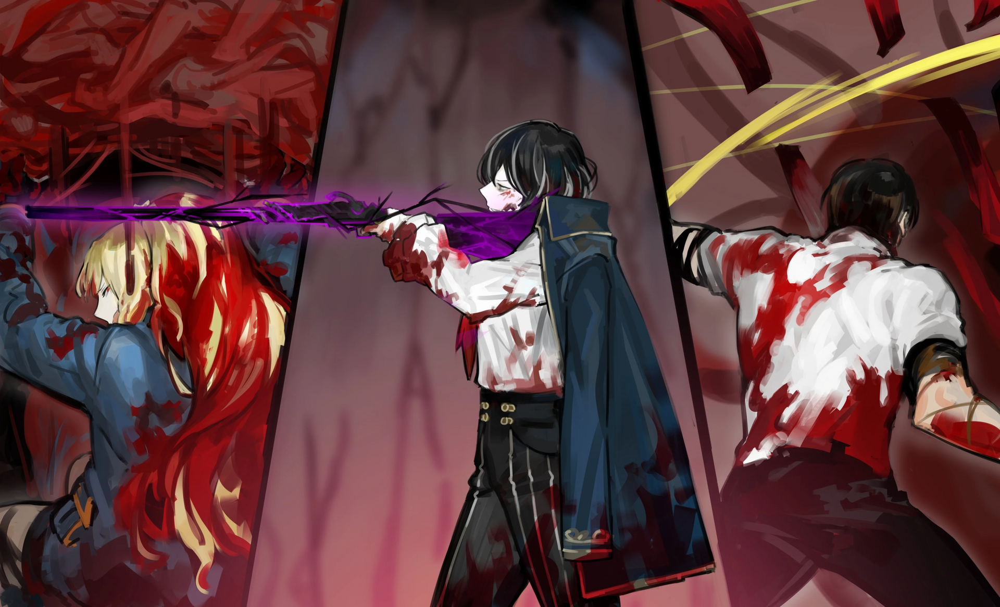

<h2 style="text-align:center;">Не поймите неправильно. На этот раз я не предлагаю вам сделку. Это угроза.</h2>

"...Но сначала нам нужно разобраться с этой ситуацией. Полагаю, эти существа той же природы, что и то, что было заснято на вашей записи."

Веспа размышлял вслух, прежде чем броситься на Искажения. Существа, каждое искажённое по-своему, разрубаются тем самым лезвием, оставляющим жёлтый след позади. Когда Веспа поднимает правую руку, гарпун, застрявший в стене, возвращается к нему. Кажется, его сломанная рука полностью зажила. Он с фееричной, но дисциплинированной манерой разрубает одно Искажение за другим. Острое щупальце, стремительно вытягивающееся из Искажения, оказывается рассечено прежде, чем достигает его. Звериная лапа, замахнувшаяся на него, падает на пол, когда через неё проходит жёлтый след. Обезвредив каждое Искажение, Веспа вонзает в них меч и гарпун, чтобы добить окончательно. Усмирённые Искажения вскоре возвращаются к человеческой форме, правда, в виде жестоко изрубленных и рассечённых трупов. Полагаю, это неумолимый закон данного феномена. По мере их превращения обратно в людей, Искажения, которые их окутывали, рассеиваются. Скорее всего, они возвращаются к людям, которым изначально принадлежали. Веспа продолжает наступать без запинки, создавая жёлтые следы своим лезвием. Если мой прогноз верен, самое опасное Искажение должно таиться в самом дальнем углу этой комнаты; жертва первого праздника, которой пришлось принять на себя Искажения сотни людей. Их форма будет поистине невообразимой. В нашем текущем состоянии нет причин рисковать, сталкиваясь с таким существом. Всё, что нам нужно сделать, — это найти выход из этого подземелья.

"Веспа! Искажения здес—"

Зиинг. Летящий жёлтый гарпун задел моё лицо и вонзился в стену позади меня. Кровь потекла из пореза на левой щеке.

"Молчите, доктор Мозес. Я не желаю беседовать с человеком, который нарушил моё доверие."

...Ожидаемые последствия.

"Если вы посмеете ещё раз открыть рот в мою сторону, прежде чем я спрошу... Моё лезвие в следующий раз перережет вам горло."

Ни одно моё слово сейчас не достучится до Веспы. Я похлопала по щеке Эзру, которая всё ещё была без сознания. На лице Эзры нет маски. Что означает, Дьюи завладел Искажением Эзры среди многих других. Чтобы Эзра вернулась в своё обычное состояние, Дьюи должен умереть. Такова причинно-следственная связь. Здесь я не смогу решить проблему Искажений привычным способом. Это — Искажения множества людей, слитые воедино; невозможно пройтись по прошлому каждого из них. Остаётся лишь физически распороть их, как это делает Веспа. Однако в результате... хотя Эзра и сможет вернуться в норму... нам придётся убить всех 45 человек, заточённых в этом подвале. И что станет с горожанами, на которых разом обрушится накопленный груз их собственных Искажений, хлынувших обратно? Возможно, удастся решить те Искажения, что обладают одной, не смешанной текстурой — в отличие от тех, что здесь внизу... Но даже они будут крайне серьёзными, мягко говоря.

Искажение единого образца... Теперь картина проясняется; это был замысел того сукиного сына Хан Хи-Джунa. Ассоциации нужны не Искажения, переплетённые с примесями. Нужна чистая форма — Искажение, проявившееся от одного человека. Если мы уничтожим все Искажения в этом подвале, наверху появится 57 не смешанных Искажений, готовых к сбору. Спасти всех изначально не было возможным вариантом. Этот город был безнадёжен с того самого момента, как жители начали передавать друг другу свои Искажения. Самое разумное решение, которое я могу принять, — это помочь уничтожить все Искажения в этом подвале. А не смешанные Искажения, которые манифестируют в ратуше наверху, решить уже своими методами. Если я разбужу Эзру и просто сбегу с ней, я не спасу никого. ...Мне нужна моя курительная трубка. Но трубка находится у Веспы...
 
 
 

"ЮРия, есть ли в твоей мастерской какое-то снаряжение, которое я могла бы использовать?"

"А? Вы собираетесь использовать его сами, детектив?"

"Да."

"Эти штуковины были все сделаны с расчётом на силу Эзры-сёнбэ... Отдача будет слишком сильной для вас."

"Мне просто нужно что-то, что может нанести один мощный удар. Этот протез справится с отдачей..."

"Тогда подождите секундочку. Я принесу что-нибудь полезное из своего ателье."

ЮРия побежала в свою мастерскую. Я обыскала комнату в поисках Дьюи. ...Эзра сможет прийти в сознание, как только с Дьюи будет покончено. С пробудившейся Эзрой я смогу поговорить с Веспой, не рискуя головой. Много раз в жизни я жертвовала меньшим ради большего. Всякий раз, делая такой выбор, я не могу избавиться от чувства, будто от моего сердца отрезают по кусочку. Я вижу Искажение, похожее на Дьюи, ползущее в углу. Оно не враждебно. Оно извивается на стене, изрыгая из своего тела бабочек, пузыри, краску и прочее.

"Вот, детектив Мозес. Вы можете надеть это на правую руку."

ЮРия протянула мне гигантскую перчатку. Она похожа на силовую рукавицу, сделанную для Эзры.

"Осторожно, детектив. Это устройство было создано исключительно для использования Эзрой-сёнбэ."

Я надела рукавицу.

"ЮРия, как ей пользоваться?"

"Сожмите и разожмите руку дважды, а затем сожмите её в кулак. Нанесите удар, когда рукавица покраснеет."

Всё, что я могу для них сделать, — это покончить с ними одним ударом и сделать это максимально безболезненно. Дьюи, возможно, сейчас не агрессивен, но может яростно контратаковать, если я его спровоцирую. Я сжала и разжала руку, как проинструктировала ЮРия. Перчатка завибрировала, выпуская горячий пар. Мою руку всегда принуждали. Даже когда, казалось, был выбор, всегда был "правильный ответ", который я была обязана выбрать. Перчатка накалилась. Струйки пара вырываются наружу, создавая интенсивный шум. Веспа поворачивает голову, чтобы мельком взглянуть на меня, затем возвращается к нарезанию Искажений. Я нанесла удар кулаком в стену.
 
 
 

Звуки раздавливающейся плоти и взрывающихся механических частей прокатились по подвалу.
 
 
 

"Детектив Мозес...!"

Крикнула ЮРия.
 
 
 

"Кхнгх..."

Я схватила обезболивающее из кармана и вколола себе в грудь.
 
 
 

Дьюи вернулся к человеческой форме, по крайней мере, его нижняя половина. Никто не сможет сказать, что этот кадавр принадлежал Дьюи, с отсутствующей верхней половиной. Моё лицо и одежда испачканы кусочками плоти и крови. Протезная рука была разорвана на части от отдачи, её компоненты разбросаны по полу. Моё правое плечо исчезло вместе с рукой. Как и ожидала ЮРия, сила устройства была попросту слишком велика для моего тела. ...Однако оно послужило своей цели. На лице Эзры появилась маска. Пошатываясь, я подошла к ней, и, собрав все силы, растолкала её левой рукой, чтобы разбудить её.

"Мнгх... Детектив?"

"...Ты очнулась."

"Ах! Что на этот раз случилось с вашей рукой, детектив?! Ох, детектив... Ну вот опять! Получаете увечья, пока меня нет...!"

Эзра отчитала меня сквозь слёзы.

"Не то чтобы я добровольно лезу под удар. Ладно, теперь мне нужно вернуть мою трубку у Веспы."

"Веспа...? Господи! Чего, как, что он здесь делает?!"

Он уже довольно далеко продвинулся. Что называется, неудержим.

"Я объясню подробности позже."

Эзра не сможет проявить Психомент, как в прошлый раз, потому что ЮРия не могла использовать свою мастерскую, чтобы сделать больше кулонов. Но мы всё ещё можем блефовать.

"Эзра, будь настороже и приготовься к бою. Через мгновение в нашу сторону полетит гарпун."

Я тихо прошептала Эзре, и она кивнула, надевая свою боевую перчатку.

"Эй! Веспа!"

В глазах сверкнул жёлтый свет. Зиинг. Гарпун понёсся в мою сторону. Эзра быстро отбила его, ударив по древку правой ногой. Гарпун не достигает меня и застревает в полу.

"Я, кажется, предупреждал вас не обращаться ко мне..."

Веспа оказался передо мной, прежде чем я успела это осознать. Он тоже покрыт кусочками Искажений.

"Вы намерены... положить конец нашему конфликту прямо сейчас?"

Спросил Веспа, откидывая растрёпанные волосы. Он выглядит измождённым и осунувшимся, но совсем не кажется уставшим. Его глаза всё ещё горят энергией.

"Думаешь, справишься с нами в таком состоянии?"

Стряхивая пыль с рук, похвасталась Эзра.

"Не поймите неправильно. На этот раз я не предлагаю вам сделку. Это угроза."

Я посмотрела Веспе в глаза.

"Если ты не последуешь моим приказам, ты умрёшь здесь. А ещё, мы в 11-ом Районе."

"Ха-ах... Вы только что сказали 11-ый Район...?"

Веспа испускает глубокий вздох. Понятно, что эта новость поразила его как гром среди ясного неба. Опять же, мы лишь делали то, что могли, чтобы выжить, а Веспа охотился на нас, чтобы выполнить свою работу. Я не должна позволять эмоциям вмешиваться в этот фактический вопрос.

"...Чего вы хотите на этот раз, доктор Мозес."

"Мою трубку."

Веспа достал трубку из своего пальто и бросил её мне. Я поймала её левой рукой.

"А мою правую руку?"

"Я её съел. В конце концов, мне нужно было выжить любыми средствами."

В тот же миг Эзра с невероятной скоростью бросилась на Веспу. Эзра врезала кулаком в его правую щёку; Веспа мгновенно ответил, ударив левым коленом ей в грудь. Двое сцепились в рукопашную, не обращая внимания на получаемые удары. Какая собачья перепалка.

"Похоже на драку между золотистым ретривером и доберманом."

ЮРия облекла мои мысли в слова.

"Эзра, достаточно!"

Я потеряла правое плечо. Даже если я верну свою руку, прикрепить её к телу уже будет невозможно. И я не пуристка в вопросах частей тела. Эзра быстро отступила и встала передо мной.

"Веспа, ты сказал, что видел запись, верно?"

"...Да."

Ответил Веспа, сплюнув на пол кровь.

"Существа здесь по сути во многом схожи с тем созданием, которое ты видел на том видео. Знающие люди называют их 'Искажениями'. Однако это не обычные Искажения. Они были созданы искусственно и фактически являются Искажениями нескольких людей, смешанными вместе. Будет проще понять, если рассматривать их как нечто подобное печально известному Пианисту."

"...Разве они не похожи на монстров с Окраин в любом случае?"

"Можно и так сказать. Суть в том, что простой физической силы может быть недостаточно, чтобы справиться с некоторыми из них. И нет гарантии, что их собственные атаки будут физическими. Разве ты не почувствовал этого, продвигаясь дальше?"

"Как же нам тогда уничтожить их? Сжечь?"

"Нет. Тебе понадобятся силы моей курительной трубки. ЮРия, мне бы пригодилась обвивающая лента."

"Да, детектив Мозес."

ЮРия ушла в свою мастерскую.

"...Доктор Мозес, какова цель заниматься таким ремеслом?"

"Чтобы изучать Искажение."

"Вы хотите сказать, что действовали из простого любопытства. Вы довольно эгоистичны. Из-за вас я немало потерял."

"Не стану отрицать. Я эгоистичный человек, как ты и сказал. Я действую лишь ради самоудовлетворения. Ты должен понимать, что ни один из нас с самого начала не преследовал никаких благородных целей. Вы же не ищете у меня сочувствия, не так ли?"

Веспа уставился на меня и наложил лёгкую улыбку.

"Вы правы. Мы просто делали свою работу."

"Детектив Мозес. Вот она. Я работала как можно быстрее, чтобы сделать её."

ЮРия тряхнула мою ногу, чтобы привлечь внимание, и протянула мне оранжевую ленту.

"Эзра, привяжи эту ленту к моей трубке."

"Поняла!"

Я взяла в руку курительную трубку, украшенную оранжевой лентой. Я скучала по этим ощущениям. Я вдохнула белое дыхание в трубку. Белый дым окутывает Веспу и Эзру, а также проникает в его жёлтый хвандо и её перчатки.

"А это ещё что..."

"Это защитит тебя от психологического урона, который могут нанести некоторые Искажения. И твои атаки будут наносить не только физический ущерб."

Это метод, придуманный мной и ЮРией. Основываясь на способности белого дыхания защищать от ментальных атак, мы пришли к идее, что его, возможно, можно использовать и в атакующих целях, чтобы причинять тот же тип урона. Подготовка завершена. Мы отправимся глубже в подвал и разберёмся с каждым Искажением в этом месте. И решим Искажения горожан наверху.

"Веспа, когда всё закончится, я сделаю всё возможное, чтобы уладить твою ситуацию."

"...Признаю, вы умеете подбирать слова."

"Что ж, теперь давайте двинемся вглубь."

"Да, детектив!"

Веспа и Эзра шли впереди, а ЮРия и я следовали за ними. Чем глубже мы продвигались, тем более беспорядочные формы принимали Искажения. Эзра крушила их своими кулаками, а Веспа срубал тех, что стояли на его пути, одного за другим. Пройденные нами участки были усеяны телами людей, освобождённых от Искажения в смерти. Я приложила руку ко лбу. Я до сих пор не стала равнодушной к тяжести подобных действий. Такое чувство, будто я постоянно совершаю грехи. Несмотря на это, мы должны двигаться вперёд.

Объединёнными силами Веспы и Эзры, с Искажениями справлялись легко. Вскоре мы столкнулись с последним оставшимся Искажением, обитавшим в самой глубине. Несмотря на белое дыхание, обвивающее нас, один лишь взгляд на него заставляет голову пульсировать. Оно принимает форму сферы из плоти, парящей в воздухе. Я даже не могу вообразить то запустение и муку, которые, должно быть, чувствовал этот человек, храня Искажения сотни людей. Веспа немедленно бросает в него гарпун. Из раны, оставленной на его теле, брызжет кровь. Однако гарпун не смог глубоко войти. Он лишь застрял на поверхности. В ответ из шаровидного Искажения разом вырастают десятки рук. Все руки разной формы, каждая состоит из разных типов материи. Веспа стремительно отсекает руки и щупальца, приближающиеся к нам. Эзра отступает и накапливает силу в руке, затем обрушивает кулак на гарпун, застрявший в Искажении, сокрушительным ударом. Под действием удара гарпун сумел проделать в теле Искажения изрядную дыру. Обнажилось гигантское сердце, лежащее в его центре. Его нужно уничтожить. Отверстие медленно закрывается.

"Эзра! Не дай этой ране закрыться! Веспа, руби руки, пытающиеся схватить Эзру! ЮРия, обвяжи мою трубку пронзающей лентой!"

Эзра прыгает в Искажение, чтобы силой раздвинуть разрыв. Веспа отбивает угрозы, приближающиеся к Эзре. ЮРия спрыгнула с моего плеча на мою руку и обвязала трубку фиолетовой лентой. 

Я сделала глубокий фиолетовый вдох.

Трубка приняла форму мушкетона.

"Детектив! Стенки смыкаются слишком плотно!"

Я изо всех сил пыталась упереть ружьё в плечо, используя только левую руку.

"Доктор Мозес, вам нужно действовать быстро."

У меня только один выстрел, и он должен быть точным. Я сосредоточила все свои силы.

"Нннннгх! Детектив!!!"
 
 
 

 
 

Я спустила курок.

 
 
 

Пуля пролетела мимо головы Эзры и попала в сердце Искажения. Шаровидное Искажение короткое время извивалось и бурлило, затем взорвалось с оглушительным грохотом. Поток Искажений хлынул оттуда, где оно было, и устремился прочь.
 
 
 

Заляпанные кровью и плотью, мы стояли перед трупом молодого человека с пробитым сердцем.
