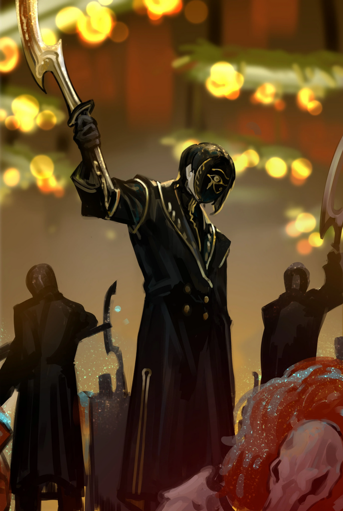
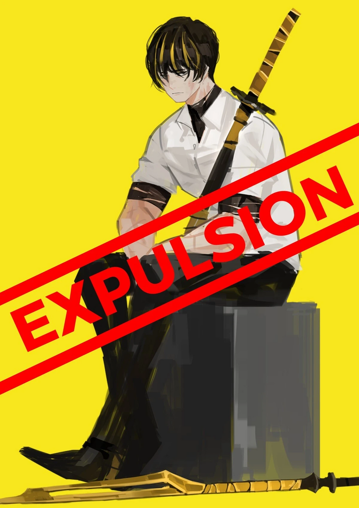

<h2 style="text-align:center;">Я выпустила глубокое, бледное дыхание.</h2>

В подвале не осталось ни одного Искажения. Остались лишь тела сорока шести человек.

"...А теперь расскажите, что нам делать дальше, доктор Мозес."

Спросил меня Веспа саркастическим тоном.

"Хфф... Нам нужно подняться наверх, конечно же."

Я больше не могу приложить руку ко лбу или покурить из трубки. Кажется, моё левое плечо перестало меня слушаться. Я изо всех сил пыталась прицелиться из ружья одной рукой, вертя и двигая всем, чем могла, но этого, видимо, было недостаточно, чтобы смягчить отдачу. Моё левое плечо вывихнуто, а правое отсутствует. Я совершенно беспомощна.

"Эзра, пожалуйста, понеси меня на спине."

"Конечно, детектив!"

"Веспа, я хочу, чтобы ты какое-то время действовал вместо меня. Я смогу понести за тебя ответственность только когда мы закончим с этой работой."

"...Как пожелаете."

Веспа ответил ледяным тоном. Эзра подняла с пола курительную трубку и взяла меня на руки.

"Эзра... Я просила на спине."

"Так мне проще реагировать на опасность!"

Не верится, что меня в таком возрасте несут на руках, как невесту. Я покорилась объятиям Эзры. ЮРия уже уместилась на голове у Эзры прежде, чем я смогла заметить.

Покинуть этот подвал будет довольно легко. Люк на сцене, через который мы упали, не казался особо прочным, да и высота невелика, так что Эзра и Веспа смогут без труда проломить его и обеспечить нам выход. Настоящая проблема в том, что ждёт нас наверху. Честно говоря, я боюсь представить, какая картина может нас ожидать. Мы вернулись назад к месту падения. ЮРия закрыла дверь в свою мастерскую и убрала её. Когда мы вновь открыли стальную дверь, на другой стороне нас ждала куча камней. Стена из больших камней, грубо и упорно наваленных друг на друга, напоминала мне о яростном пренебрежении жителей городка.

"Выход прямо над нами, Веспа."

"Мне что, разрубить потолок?"

"Да."

Не задавая лишних вопросов, Веспа взмахнул своим клинком. После нескольких жёлтых вспышек в воздухе, пол на сцене обрушился. Эзра ловко уклонилась от падающих сверху обломков. Мы выпрыгнули на первый этаж.
 
 
 

Когда мы поднялись, перед нашими глазами разворачивалась бойня. Пёстрая картина одновременно будоражила и перегружала мой разум. Адский пейзаж, который мы не в силах исправить. Возможно, это один из пяти самых отвратительных видов, что я видела в жизни. Верно... Такова судьба, когда Искажения переплетаются друг с другом. Это не похоже на то, что происходило в подвале. Там Искажения были подобны людям с множеством голов, каждая из которых отстаивала свои мысли; здесь же — это независимые существа, выражающие свои чистейшие, откровенные желания. Я должна была знать это лучше кого бы то ни было, но упустила из виду. Нет, я лишь похоронила это в глубине сознания, не желая вновь к этому возвращаться.

"Доктор Мозес. С сожалением вынужден сообщить, что моих способностей недостаточно, чтобы взять под контроль эту ситуацию."

Веспа сказал низким голосом.

"Детектив Мозес... Ситуация здесь выглядит ещё хуже, чем в подвале...?"

Сказала ЮРия, спрятавшись за головой Эзры. Я слышала, как Эзра нервно сглотнула. Искажения, каждое непохожее на другие, убивают друг друга уникальными способами. Сильные издеваются и разрывают слабых, словно желая продемонстрировать и похвастаться своей силой. Эта картина — самое истинное проявление коллективного сознания этого городка, подавлявшегося до сих пор. Ослепительное разнообразие красочных Искажений, которые хватают и разрывают друг друга; вот что я назвала бы праздником этого городка. ...Неужели я действительно смогу спасти хоть кого-то из них? Заметив наше присутствие, некоторые Искажения повернулись к нам и устремили взгляды. Белошёрстный зверь в форме обезьяны без глаз. Красный тетраэдр с восемью глазами. Жёлтый богомол с головой льва. Я чувствую враждебность от этих трёх существ. С обезьяной и богомолом Веспа и Эзра как-нибудь справятся. А вот с тетраэдром... Понадобится моя трубка. Я закрыла глаза. И приняла решение.

"...Эзра, вложи трубку мне в рот, пожалуйста."

"Да! Детектив!"

Я должна спасти хотя бы одно из этих Искажений. Иначе выбор, сделанный мной в подвале, окажется бессмысленным. Эзра, как я просила, поднесла трубку к моим губам.
 
 
 

Я выпустила глубокое, бледное дыхание; это ощущение уходящей жизненной силы. Это дыхание прекрасно, ибо оно выдыхается ценой жизни. Полупрозрачный бирюзовый порошок, принимающий цвет апатита, рассыпался по залу ратуши. Отбрасывая голубое свечение, порошок прилипал к Искажениям. Вскоре они начали замедляться. Это порошок смерти. Он приближает живое к смертному концу. Смерть означает безмолвие и прекращение. Всякое живое существо останавливается.

...Моих лёгких недостаточно, чтобы выдохнуть дыхание, способное одновременно остановить такое количество Искажений. Однако этого хватит, чтобы выиграть время для встречи хотя бы с одним Искажением. Даже если я смогу спасти лишь одно из них, я обязана сделать, что могу. Чёрт возьми, возможно, это моё последнее дыхание.

"Детектив! Ты же обещала не использовать это дыхание!!!"

Эзра вышла из себя. Я проигнорировала её яростную ругань.

"...Веспа. Не атакуй Искажения, если они не нападут первыми."

"Боюсь, я не смогу подчиниться этому, доктор Мозес."

Веспа потянулся к рукояти своего клинка.

 
 

Кажется, его терпение иссякло.

 
 

И всё же я думала, что смогу в какой-то мере договориться с этим молодым человеком...

 
 

'БАХ!' Снаружи ратуши раздался взрыв, похожий на фейерверк.

 
 

И в тот же момент по земле прокатился топот. Я слышала шаги множества людей, обутых в ботинки.

 
 

Знакомые шаги, что слышала в прошлом.

 
 

Группа людей в чёрных длинных плащах и золотых масках, украшенных единственным символом — глазом, ворвалась в здание.

 
 

...Корректировщики под непосредственным началом Диас.

 
 

Уадже́т.

 
 
 

 
 

Они образуют тёмную волну, размахивая ятаганами и безжалостно бросаются на Искажения.

 
 

...Так вот оно значит как.

 
 

Искажения, обездвиженные бледным дыханием, один за другим беспомощно обезвреживались.

 
 

"Простите за внезапность, доктор Мозес. И должен сказать, вы не разочаровали. Я знал, что могу доверить вам усмирение Искажений этого городка без лишних жертв."
 
 
 

Хан Хи-Джун направился к нам со входа в ратушу.
 
 
 

Этот запрос исходил не от Ассоциации Севен.
 
 
 

...Хан Хи-Джун. Он снова служит покорным щенком на поводке у Диас, как и всегда.
 
 
 
 
 

Я лицемерка.
 
 
 

Вновь я не смогла никого спасти.
 
 
 
 
 
 
 

Наша группа и Веспа были отведены в угол городской площади, где мы зализывали раны. Уаджет, частные военные силы под командованием Диас, быстро и чисто разобрались с ситуацией в городке. Они поместили Искажения в клетки и тщательно готовили их к транспортировке, а также заботливо обработали наши раны. Эзра не проронила ни слова. Она, кажется, всё ещё расстроена из-за того, что я использовала бледное дыхание. Затем к нам подошёл Хан Хи-Джун.

"Доктор Мозес. Выпейте эту чашку тёплого чая, пока отдыхаете."

"Что Диас планирует делать с Искажениями?"

"Как я могу знать, что у неё на уме."

"......"

"В любом случае, я не ожидал, что вы будете с Веспой Крабро, охотником за табу из Корпорации N."

"Он настолько известен?"

"Те, кто в теме, знакомы с ним. Я же работаю на Ассоциацию Севен, верно?"

Эзра и Веспа сидели рядом со мной, по-прежнему сохраняя молчание.

"У меня есть новости и для вас, господин Веспа Крабро."

Есть ли хоть капля искренности в словах Хан Хи-Джунa? Он знает всё, что ему нужно знать. Даже то, что Веспа будет с нами.

"...Какие."

Хан Хи-Джун передал Веспе конверт. Тот вскрыл его, вынул письмо и вскоре смял его, затем швырнув на землю.

"Хан Хи-Джун. Дай этому бедолаге рубашку или любую одежду. Смотреть неловко, сам знаешь."

Пиджак и рубашка, которые были на Веспе, превратились в лохмотья после многочисленных схваток.

"Как пожелаете, доктор Мозес."

Хан Хи Джун поманил пальцем одного из Уджат, который принёс ему белую сорочку.

"Я приглашу вас и ваших спутников к леди Диас, когда здесь всё будет улажено."

"Позволь задать тебе вопрос, Хи-Джун."

"Что такое, доктор Мозес?"

"Приятно тебе маяться хернёй, сидя у меня на голоев?"

"Честно говоря, не очень."

Попрощавшись, Хан оставил нас и направился к месту задержания Искажений.
 
 
 

"...Я слышал, вы можете видеть Искажение людей?"

Глядя на меня, спросил Веспа.

"Да."

Я ответила, закуривая сигарету своей залатанной левой рукой.

"Тогда скажите, доктор Мозес, что вы видите во мне сейчас..."

"...Я вижу на твоей спине истрёпанные крылья пчелы."
 
 
 

Веспа был изгнан из Корпорации N.
 
 
 
 
 

 
 
