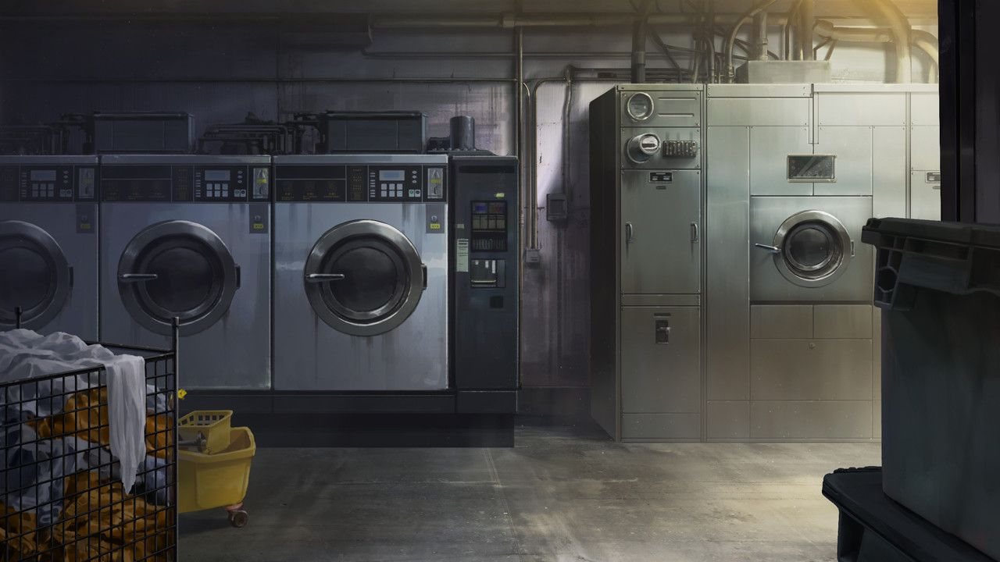

<h2 style="text-align:center;">"Это прямо как решение проблем в человеческих отношениях."</h2>

Стеклянная дверь со скрипом поддалась, когда мы вошли в прачечную самообслуживания. Просторное и обветшалое помещение с двадцатью шестью фронтальными стиральными машинами. Поблёкшие люминесцентные лампы освещают побуревший кафельный пол. Несколько насекомых жужжат у света, а из динамика на потолке доносится старая поп-песня.
 
 
 

 
 

"Полагаю, вы сочли, что это Искажение не представляет для нас угрозы, раз вошли сюда добровольно, доктор Мозес."

Произнёс Веспа, осматривая окружение глазами. Эзра разглядывает что-то перед одной из стиральных машин.

"Жертвами здесь пали Корректировщик 3-го ранга и его коллеги."

"Весь офис был уничтожен, а люди пропали без вести, верно, детектив?"

"Ненадолго. Их нашли в другом месте, ставшими совершенно другими людьми."

"Что именно вы имеете в виду, говоря, что они стали 'совершенно другими людьми'."

"В самом буквальном смысле. Их внешность осталась прежней, но внутри они были полностью иными. Никто не мог узнать, кем они стали."

"Детектив! Сюда! Я нашла стиральную машину, которая сейчас работает!"

Эзра поманила меня. Машина грохочет, бельё переворачивается и крутится внутри. Я вложила курительную трубку в рот. Бельё... Уж точно не обычное. Хотя, пока она работает, трудно разглядеть, что внутри. Однако останавливать машину силой было бы довольно безрассудно. Пока что нужно осмотреть место подробнее.

"Доктор Мозес. Я вижу там кладовую и подсобное помещение."

Я выпустила дым и направилась к двери, на которую указал Веспа. Разве эта прачечная не с самообслуживанием? Если владелец присутствует, то это будет другой тип Искажения, не тот, что я ожидала. Наличие комнаты, предназначенной для сбора белья, намекает, что владелец прачечной вручную стирает одежду, которую ему доверяют клиенты. Однако я не вижу кассы или какого-либо другого места, где бы работал сотрудник.

"Веспа, открой ту дверь. А Эзра, осмотрись ещё немного."

"Есть~!"

При открытии двери в кладовую в воздухе повис освежающий аромат кондиционера для белья. Однако открывшееся зрелище было чем угодно, только не освежающим. Это мясная лавка. На вешалках развешана человеческая кожа.

"Теперь я понимаю."

Я выдохнула облачко табачного дыма.
 
 
 

Содрать с человека кожу и вычистить его изнутри. Вот что такое эта "Прачечная мечтаний", типично для Города. Провокационные процедуры вроде сдирания кожи с живых людей или тому подобного уже не удивляют. Следующий вопрос — её цель. Интересно: акт стирки означает очищение или же изменение? У меня ощущение, что последнее более вероятно. Желание стать кем-то другим и выделиться среди стереотипных горожан. Оно должно быть сильнее, чем желание очиститься, по крайней мере. В такой прачечной самообслуживания акт стирки прост — положить одежду в машину и бросить монету. Глядя на человеческие шкуры, развешанные здесь, похоже, люди, посетившие это место, снимали собственную кожу и оставляли её тут. Когда это происходило? Сразу после входа в прачечную? После того, как бросили монету? Но разве бельё не должно сначала оказаться внутри машины? Пока это туманная загадка. Если бы это пространство обманывало восприятие людей, мои глаза уловили бы процесс. Пока что признаков такой иллюзии не видно. Полагаю, стоит снова исследовать стиральные машины.

"Вернёмся обратно."
 
 
 

"Детектив! У меня не получается запустить стиральные машины обычными монетами!"

Эзра, бестолочь...

"Кто тебе велел возиться со стиральной машиной? Не трогай Искажение, пока меня нет рядом."

"Ладно..."

Эзра ответила унылым голосом. Есть несколько проблем, когда человек, не видящий Искажения, участвует в расследовании дел об Искажении. Например, он может зайти в зияющую пасть, полную зубов, которую я отчётливо вижу, или быть заманенным сделать что-то, не осознавая, что его увлекают тёмные руки. Таким образом, для правильного обращения с Искажением нужен тот, кто видит его различные грани.

"...Детектив. А ничего страшного, если я взяла монету из разменного автомата вот тут...?"

Я приложила руку ко лбу. Эзра из тех, кто сначала действует, а потом думает. Я собираю мысли, пока Эзра действует. Чтобы раскрыть Искажение, кому-то нужно стать подопытным. Ха-ах. И всё же любопытство и смелость этого ребёнка сейчас — вызов даже для меня.

"Дай это мне."

"Хорошо!"

Грохот. С оглушительным шумом комната затряслась вверх-вниз. Монета выскользнула из руки Эзры, когда она пыталась передать её мне.

"Эзра! Поймай эту мон—!"

Не успела я закончить фразу, как Эзра быстро подставила ладонь под монету. Казалось, она приземлилась на её руку, но падение не прекращалось. Она проделала дыру в её ладони и достигла пола, будто так и должно было быть. Монета покатилась по полу, прежде чем провалиться в сливное отверстие.

Бряк.

"Айй..."

Простонала Эзра, держа пробитую правую руку.

"Доктор Мозес. Посмотрите назад..."

Последовав словам Веспы, я обернулась. Дверь в кладовую исчезла. Вдалеке раздался громкий механический шум. Что-то уже происходит. Монета, которую достала Эзра, не могла быть выдана торговым автоматом просто так. Разменный автомат. Что-то было обменено на монету. Я зажала курительную трубку во рту. Пространство искажается.

"Потолок только что поменялся местами с полом?"

Я выдохнула табачный дым. Как заметил Веспа, комната медленно скручивается и вращается.

"Детектив... Это только со мной, или ваше тело тоже кажется каким-то противным и тяжёлым? Ух..."

Тело Эзры медленно заполняется грязью, напоминающей вязкую кровь. Поскольку я вижу Искажение, мне нужны быстрая сообразительность и чутьё. Я должна уметь определить, вижу ли я знак, заметный только мне, или же проявление, которое могут воспринять все. Ответ — в опыте. И опыт подсказывает, что, скорее всего, только я могу видеть эту грязь.
 
 
 

"...Детектив. Вы помните? Я была трусихой во время войны... Меня ведь тоже не простят, правда...?"

Снова эта тема. Воспоминания того дня — одна из тем, которые часто всплывают, когда Искажение затрагивает травмы Эзры. Воспоминания о Дымной войне. Они постоянно преследуют Эзру и меня. Благодаря этому я стала экспертом в обращении с подобными травмами. Воспоминания будут для неё невыносимы, и в результате она устроит какую-нибудь проблему.

"Гах! Прочь, грязное тело!!"

Я услышала звук расстёгивающейся молнии. Кожа человека, известного как Эзра, была стянута с неё с головы до плеч, коленей, затем до пальцев ног. Та сторона человека, которую никто не желает видеть. Это можно описать лишь как форму, на которую я не смею смотреть. Груда желаний. Я не могла вынести это зрелище и крепко зажмурилась.

Ха-ах. Эзра...

"Веспа! Держи глаза закрытыми."

Я вцепилась в курительную трубку и выдохнула белое дыхание. Комната наполнилась дымкой; разум Веспы мог пострадать, если он увидит её нынешнюю форму. Я сразу же вдохнула и выпустила 
фиолетовое дыхание. Я обвила фиолетовым кнутом силуэт, который, как я думаю, был Эзрой.

"И постарайся изо всех сил не двигаться. Я не справлюсь с двумя людьми, творящими глупости одновременно."

"Понял."

Ответил Веспа. Я уловила схему. Как только человек снимает свою кожу, он кладёт её в одну из стиральных машин. Затем он направляется в кладовую и надевает чужую оболочку. Надев чистую и новую "одежду", он покидает прачечную как совершенно новый индивид. Если Эзра достигнет этой стадии, я мало что смогу сделать; я потеряю её навсегда. Чтобы избежать этого, я как-то остановила её на месте.
 
 
 

Искажения разрешаются через противоречие. Действия, считающиеся здесь естественными и обязательными, должны быть отвергнуты и обращены вспять; нужно заставить человека надеть обратно свою загрязнённую оболочку, прежде чем её постирают. Такое действие ослабит Искажение "Прачечной мечтаний". Что же мы можем сделать, чтобы она надела свою кожу обратно? Насильно надеть её? Нет. Она должна сделать это добровольно. Она должна надеть свою собственную оболочку, зная, что она всё ещё грязная. Вот как мы можем отвергнуть это место.

"Это пространство... Нельзя ли его просто разрубить?"

"Нет гарантии, что это не приведёт к обратным последствиям. Разрушительные меры следует применять в крайнем случае."

"Значит, это не исключено полностью. Я приготовлюсь на такой случай."

Веспа держал глаза закрытыми и положил руку на ножны своего меча. Огромное облегчение, что на него не подействовало влияние Искажения. У меня нет зацепок о прошлом Веспы или его травмах. Изучение его прошлого, без сомнения, будет процессом проб и ошибок. Придёт время, и это будет неизбежно. Мне придётся не спеша узнать его. То есть, я хорошо знаю, как обращаться с Эзрой, проведя с ней много времени.

"...Скажи, ты считаешь своё нынешнее 'я' грязным?"

"На моих руках слишком много крови... Я грязная! Я ненавижу себя!"

"Ты мне нравишься такой, какая ты есть, даже если ты считаешь себя нечистой."

Прямо, без лишних слов, я говорю Эзре именно то, что о ней думаю.

"Правда...?"
 
 
 

Ответ прост, но для меня всегда испытание — произнести его вслух.

"Правда."

Эзра осознаёт внимание других, особенно моё. Мне нравится эта её сторона. И учитывая всё, что произошло, я не могу заставить себя ненавидеть её. Эзра — моя сотрудница и подчинённая, и моя ответственность — заботиться о ней. Масса плоти, которая, вероятно, была Эзрой, поднимает вонючую, грязную оболочку и снова надевает её. Прачечная перестаёт вращаться и изгибаться, постепенно возвращаясь к прежнему виду. Вскоре пространство начинает сжиматься.

"Веспа! Хватай Эзру и сваливайте отсюда к чёрту!"

Мы быстро рванули к выходной двери. Холодный вечерний воздух и влажность моросящего дождя ударили в нос. Нам удалось безопасно выбраться. "Прачечная мечтаний" осталась позади, уменьшившись до размеров маленького игрушечного домика.

"Дело закрыто?"

Спросил Веспа, неся Эзру на плечах.

"Вполне."

"Всегда так? Это было не так драматично, как я ожидал. Мне даже не пришлось помогать."

"Только потому, что я знала, с кем имею дело. Вот почему мы с Эзрой работаем вместе."

Я вложила трубку в рот. Это дело было спокойным и простым по сравнению с другими недавними событиями.

"И оставаться неподвижным уже было достаточной помощью. Будь ты на месте Эзры, я, возможно, ничего не смогла бы сделать. Кроме того, Искажение, в конечном счёте, — человеческое дело. Часто вещи скрывают, а детали сглаживают."

"Звучит как человеческие отношения."

Я выпустила дым. Он попал в точку. Это прямо как решение проблем в человеческих отношениях. Если я попытаюсь игнорировать корень проблемы и отвернуться от неё, можно закончить на неопределённой ноте. В этом случае я не стала вникать в причину или процесс Искажения, не пыталась заставить субъекта понять это. Потому что это не моё дело... Потому что не было необходимости.

"Доктор Мозес. Если бы нашей целью было разрешить Искажения, а не захватить их, можно ли было бы вернуть ту прачечную в человеческое состояние?"

"Должно быть возможно. Шаги будут сложнее, чем то, что мы сделали только что. Тебе интересно?"

Искажение также похоже на человеческие отношения тем, что проблема усложняется, если попытаться встретиться с ней лицом к лицу и привести к определённому заключению.

"Неважно. Если это то, что я должен знать, вы разъясните когда придёт время."

Я подняла "Прачечную мечтаний" и убрала в багажник. При таком размере нет нужды вызывать Уджат для помощи. Веспа уложил Эзру на заднее сиденье автомобиля.

"Вы двое участвовали в Дымной войне?"

"Мне не хочется говорить об этом сейчас."

"Понял."

Веспа занял место водителя. Я стряхнула пепел с курительной трубки и села на переднее пассажирское сиденье. Затем я активировала свой протез руки.

*Би-биип—*
 
 
 

"Хан Хи-Джун."

"Да, доктор."

Из руки раздаётся противный голос.

"Мы разобрались с 'Прачечной мечтаний', переходим к делу 'Человеческой молнии'."

"Похоже, вы благополучно закрыли дело."

"Заканчиваю звонок."

"Погодите, доктор. Вы не имели ли дело с кланом Курокумо, случаем?"

"Имели."

Значит, он каким-то образом выяснил. Безусловно, он компетентный информатор, и он определённо собирается меня отчитать за это.

"Клан Курокумо — дочерняя организация Большого Пальца. Я предлагаю избегать конфликта с Пальцем, если вы хотите завершить миссию в..."

Как будто я ребёнок, нуждающийся в его нравоучениях.

*Бип-бии—*
 
 
 

Большой Палец по сравнению с Указательным ещё ничего. По крайней мере, я не буду разговаривать со стеной.

"...Доктор Мозес."

"Боишься, что нам, возможно, придётся столкнуться с Пальцем?"

"Если нам случится противостоять Большому Пальцу, пожалуйста, позвольте мне приложить силы."

У этого парня есть свои истории, как я погляжу.
 
 
 

"Это мне решать, в зависимости от ситуации."

Веспа, кажется, на мгновение задумался с закрытыми глазами.

"Хорошо."

Машина медленно поползла сквозь туман.
