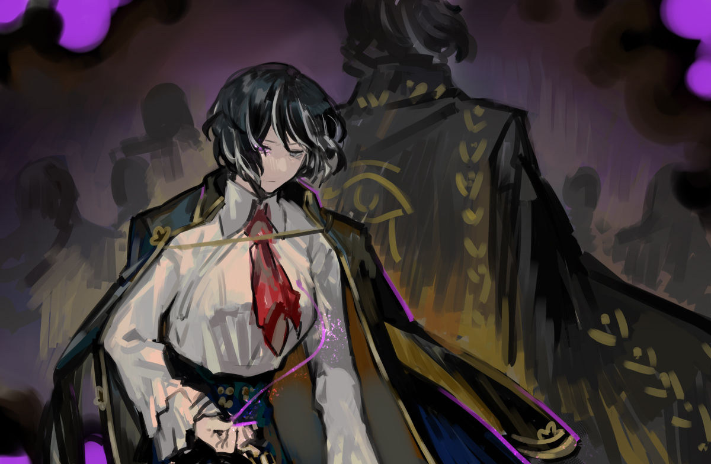

<h2 style="text-align:center;">Оно активно перемещается, вгрызаясь в находящихся рядом и управляет ими.</h2>

Невроз: копьё стресса, вредоносное излучение, тюрьма что одновременно сжимает самого себя, симптом, который усиливается чем больше ранишь других; переменчивые мозговые стимулы и раздражение получают физическую форму электричества. Когда это электричество протекает через тело, оно сжигает неконтролируемым гневом. Оно не совсем взрывное; оно, скорее, резкое. От лёгких тычков до выпадов, создающих полости в разуме. Невроз течёт через ближайшие проводники. Он меняет атмосферу окружения. Чья-то истерия изливается на других. Создаётся ложное впечатление, что это всё исправит. Однако это лишь заставляет собственный разум тлеть и вызывать нетерпение. Пока другие полыхают ещё сильнее. Это свойство необходимо понять. Бесконечный выброс раздражения и гнева, мегаломании и ментальности жертвы; оно активно перемещается, вгрызаясь в находящихся рядом и управляет ими. И движется оно быстро.

Пять сотен трупов движутся на нас. Это всего лишь останки умерших. Электрические стимулы, введённые в их мозг Человеческой молнией, заставляют их двигаться в чисто механическом смысле. Со скоростью света — Человеческая молния дрейфует между этими пятьюстами людей на максимально возможной скорости. Это, по сути, биологические машины, не чувствующие боли или страха. Их также нельзя считать подчинёнными сущностями Искажения. Мы должны уловить момент, когда оно перепрыгивает с одного обугленного тела на другое. Самый лёгкий метод — выпустить бледно-голубое дыхание, дым смерти и прекращения. Но это должно быть абсолютно крайней мерой. Фиолетовое дыхание для фиолетового существа. Для меня это стандартная методология. Как сильно я смогу связать? Как сильно, с той тяжкой виной, что дана мне? Фиолетовые воспоминания, что душат моё сердце и тащат мой разум на дно. Эти воспоминания необходимо извлечь.
 
 
 

В тот день я привела коллег к смерти. Человек по имени Мозес участвовал в Дымной войне как капитан Уаджет. Всё, что мне нужно было делать, — выполнить миссию. Не было места для интерпретации или милосердия в этом процессе. Подчиняться приказам Диас. Подчиняться ради её мечты. Я запятнала свои руки такой кровью в этой жизни — даже кровью тех, с кем работала. То, что я несу, — это бремена других, не моё собственное. Эта курительная трубка — не моя; она принадлежит им. Я держу трубку и затягиваюсь дымом. Я закрываю глаза, затягиваясь дымом. Когда я закрываю глаза, они появляются. Я должна вдохнуть их воспоминания и агонию. Мне нужно найти фиолетовое воспоминание среди смутной, но интенсивной массы. Воспоминания, подобные тёмным шипам; глаза и жесты, что упрекают меня. Моё чувство вины. Моя вина проявляется как невроз. Я не люблю шум. Я не люблю разговорчивых людей. Звук напоминает мне голоса, что полны обиды на меня. Звук напоминает мне обстрелы войны и заставляет мой разум кровоточить. Мелкие обиды и презрительные замечания. Обмен словами, полными гнева. Колкие слова, которые я небрежно бросала. Дни в моей жизни, когда я толкнула кого-то, когда довела кого-то до слёз; если бы я была добрее, если бы я была более понимающей. Я не заботилась о своих подчинённых. Мои глаза были прикованы к Диас. Всё, что происходило в процессе, было для меня мелочами. В Городе, где нет добра или зла, я провела своё различие: чего желает Диас, а чего нет. Это был единственный критерий, отделяющий хорошее от плохого. Так что же сделало меня такой отчаянной? Я слышу крики и вопли моих подчинённых. Я игнорировала их и шла своим путём. Мне не следовало оборачиваться тогда. Оглянувшись однажды, кровавый путь, по которому я шла, стал так откровенно виден — я не могла не заплакать. Почему я передумала в последний момент? Почему во мне так внезапно расцвело чувство альтруизма к коллегам? Я хочу даровать спасение им — тем, кто дрейфует в моей голове. Каждый раз, когда я раскрываю дело об Искажении, их крики замолкают один за другим. Но тишина длится недолго. Почему я бросила их? Почему я отдала им тот бессердечный приказ — лишённый даже крупицы того, что можно было бы назвать сердцем, — а затем пришла, пытаясь их спасти? Почему я толкнула их в пасть ада? Я разрешаю Искажения, потому что не могу выносить эти голоса, обвиняющие меня. Это как наркотик, от которого я не могу отказаться. Как только я перестаю принимать наркотик под названием "разрешение Искажений", боль снова начинает сжимать мою голову. Это не добровольная служба или благотворительность; это лишь наркотик, который я принимаю, чтобы облегчить свою вину. И всё же у меня хватает наглости называть себя детективом и просить плату. Отклонённые мной запросы и клиенты — всё это становится громоздкой и болезненной цепью, что снова сдавливает моё сердце. Это та цепь, которую я хотела найти. Я сжимаю хватку вокруг своего разума. Цепь можно извлечь, если душить своё сердце, пока из него не выжмут кровь и гной до конца. Моё тяжкое раскаяние — обиды 2142 человек, которых я привела к смерти. Какими бы быстрыми и острыми ни были неврастения Человеческой молнии, они не будут больше, чем вес и мука цепей, что я чувствую глубоко в своём сердце. Я смотрю в лицо реальности: всё, что я считала правильным, было просто детской попыткой самоудовлетворения, чтобы вырезать свой невроз. Унижение и ненависть к себе... Досада и гнев на себя... Я выжимаю всё это.
 
 
 

<strong>Я выдохнула фиолетовое дыхание.</strong>

 
 

Курительная трубка превратилась в тонкую, как волос, заострённую иглу. Нить, продетая в ушко иглы, соединяется с моей грудью, словно нить вытягивается из моего сердца. Это не просто нить. Это цепь, кандалы.
 
 
 

 
 

"У нас 30 секунд."
 
 
 

Эзра и Веспа напрягают каждый нерв, сдерживая орду обугленных трупов. У моих ног — изобилие кусков и частей обгоревших тел. Один из этих кусков ползёт ко мне с последними следами электрических стимулов, оставшихся в нём.
 
 
 

Я вонзила тяжёлую и острую иглу в руку ползущего трупа. В мгновение ока мой фиолетовый невроз протёк через все трупы со скоростью света.
 
 
 

Все трупы разом замерли. Цепь двигалась от тела к телу и связала их вместе. Чем длиннее становится нить, тем сильнее кровоточит моё сердце. Ощущение, будто колючая проволока сжимает и раздавливает мой мозг. Я должна выдержать это. Не прошло и секунды, но моему телу причиняется столько физической и душевной боли, что это могло бы оборвать мою жизнь.
 
 
 

*Вжжж—*
 
 
 

Мощное жужжание пчелы.
 
 
 

Жёлтый гарпун взмыл в воздух и пронзил грудь Человеческой молнии, когда та замерла между трупами.
 
 
 

"Всё сделано. Доктор Мозес."
 
 

Трупы обмякли и рухнули на землю.
 
 
 

"Детектив! Вы в порядке?!!"
 
 
 

Спросила Эзра, сама получившая множество ранений. Я кивнула в ответ. Работа ещё не закончена. Удлинившиеся цепи разума теперь нужно втянуть обратно туда, откуда они пришли. Погрузившись в воспоминания и агонию, я медленно втягивала цепи обратно в своё сердце. Эзра смотрит на меня с беспокойством, но ничего не поделать. Никто не может помочь мне с этим. Я должна сделать это сама. Это одинокая, разрывающая сердце задача. Когда я втянула последнее звено цепи в грудь, то потеряла сознание.
 
 
 
 
 

"Вы уже очнулись?"

Низкий, раздражённый голос разбудил меня. Похоже, я не умерла.

"...Вы извлекли Искажение?"

"Да, детектив! Мы загрузили его в фургон!"

"Понятно. Спасибо за работу, вы оба."

"Доктор Мозес. У нас проблема."

"Что такое?"

"Ну... Машина перестала работать; может, из-за электричества..."

Сказала Эзра тревожным тоном.

"Мы можем связаться с Хан Хи-Джуном и вызвать сюда Уаджет. Они починят нам машину."

Голова всё ещё кружится после использования фиолетовой нити и иглы. Честно говоря, я не уверена, где я и который час. Всё ещё лёжа на земле, я взяла курительную трубку и затянулась.

"Детектив... Сейчас... ночь..."

"Который час?"

"3:26 утра."

"...И наше местоположение?"

"Где-то в Подворотнях, кажется..."
 
 
 

Я приложила руку к голове и выпустила дым.
 
 
 

Ночь в Подворотнях. Время Чистильщиков.
