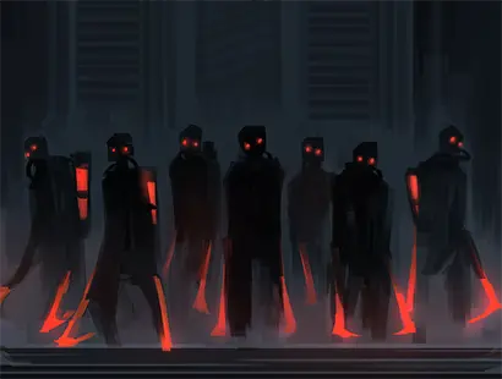

<h2 style="text-align:center;">И никто не откроет нам дверь.</h2>
 
 
 

 
 

Чистильщики приходят тремя волнами. Нам нужно продержаться всего три волны.
 
 
 

"Эзра, Веспа. Справитесь?"

"...Эхехе. Вообще-то я только что потратила все силы на битву с Человеческой молнией..."

Эзра посмотрела на меня с неловкой улыбкой. Я неохотно перевела взгляд на Веспу.

"Доктор Мозес, вы сейчас не в состоянии участвовать в бою. И, похоже, мисс Эзра едва сможет защитить себя."

"И какой вывод?"

"Невозможно. Мы смогли бы пережить две волны, я полагаю."
 
 
 

Мастерская ЮРии была бы идеальным укрытием, но она не в форме, когда мы в ней нуждаемся. Я вложила курительную трубку в рот. Издалека доносятся мерзкие звуки. Звуки уборщиков улиц. Жестокие схватки и гнусные убийства — обычное дело в Подворотнях, но к утру всё это смывается начисто. Это благодаря им. Чистильщики чистят Подворотни, а значит, за их пределами безопасно. Я постучала по своему протезу.
 
 
 

"Хан Хи-Джун."

Протез на секунду вспыхнул.

"...Трудитесь денно и нощно, не так ли, доктор."

"Прости, что нарушила твой крепкий сон."

"Проверяя ваше местоположение... Вы в Подворотнях в это время ночи."

"Перейду к делу: Уаджет. Ты можешь вызвать их сюда?"

"Если речь о том, чтобы остановить Чистильщиков, сомневаюсь, что они успеют помочь."

"Тогда позволь спросить кое-что об этом павшем Гнезде. Граница между Подворотнями и территорией Гнезда всё ещё существует?"

"Уверен, ветеран войны вроде вас знает это лучше меня?"

"...Какой самый короткий маршрут?"

"5 километров на запад как ворона полетит."

"...Закончить звонок."
 
 
 

Выход из этой ситуации прост: нам нужно попасть в Гнездо. Павшее Гнездо — всё ещё Гнездо; Чистильщики убирают только в Подворотнях.
 
 
 

"Будем двигаться по прямой. Пробивайте любые стены на пути и рубите любую помеху."

"А как же машина?"

Спросил Веспа низким тоном.

"Оставим здесь до конца ночи. С ней всё будет в порядке, пока нас нет внутри."

"Разве они не обращаются с Искажениями как с людьми?"

"Не спрашивай меня, что у них на уме."
 
 
 

Другого выбора нет. Даже если мы потеряем два добытых Искажения, на первом месте — спасти свои жизни.
 
 
 

"Времени нет. Эзра!"
 
 
 

Эзра достаёт свои перчатки и молот, готовясь пробивать путь. Когда дело касается разрушения ради выживания, она должна подходить для этого лучше, чем Веспа.
 
 
 

"Младший, подхвати детектива!"

Крикнула Эзра. Веспа взял меня под руку. Как бы неприятно это ни было, полагаю, это к лучшему.

"Погнали, детектив и младший!"

Другой рукой Веспа обнажил меч.
 
 
 

К западу путь преграждает кирпичная стена. Прорвёмся через неё первой. Эзра пробила стену кулаком. Она легко рухнула. А прямо за ней стоит двухэтажный дом. Когда она пытается пробить и эту стену, Веспа останавливает её.
 
 
 

"Жилые районы нельзя разрушать во время Ночи в Подворотнях."

"Табу."
 
 
 

Я не подумала о жилом районе. Все наши проблемы могли бы решиться, войди мы в этот дом. Но сначала нам нужно разрешение владельца.
 
 
 

"Это не просто табу в Гнезде. Это табу Города."
 
 
 

Это значит, что нарушение не закончится просто погоней одного-двух охотников на табу. Ночь в Подворотнях — час абсолютного беззакония. Из этого есть одно исключение, которое остаётся безопасным: жилой район. Неприкосновенная территория. Глава Города не позволяет этому убежищу рухнуть. И никто не откроет нам дверь.
 
 
 

"Детектив... Что нам делать?"
 
 
 

Мы не посмеем нарушить табу, которое не нарушают даже Пальцы. Я слышу, как внутри дома всхлипывают трое или четверо людей. Группа незнакомцев, ломающих стены и стоящих перед их домом, — несомненно, ужасающее зрелище для них. Звук приблизился. И из тумана появились Чистильщики.
 
 
 

Чистильщики просачиваются в углы переулков, как вода, текущая по игрушечному городку. Они проходят везде, где есть путь. Они настойчивы и живучи. Они не боятся умереть. Они роятся вокруг цели и цепляются за неё, пока та не будет "убрана" с улицы. Если Чистильщик умирает, они убирают и этот труп, продолжая движение. Их оранжевые крюки впрыскивают в того, кого пронзают, странное топливо. Это загадочное топливо разжижает жертву. Оставшаяся жижа затем перерабатывается в топливо. Сгустки жидкости. Вот что такое Чистильщики. Кто знает, что творится у них в головах. Честно говоря, странно, что Глава вообще считает этих существ людьми. Я не уверена, способны ли они вообще мыслить нормально.
 
 
 

"Детектив! Я приготовлюсь к бою!"

"Опусти меня, пожалуйста."
 
 
 

Веспа поставил меня на землю. Я закусила курительную трубку. Двор жилого дома. Чистильщики протискиваются сквозь разрушенную стену. Хотя мы этого не планировали, мы оказались в выгодной позиции для отражения множества врагов. Веспа рубит подползающих Чистильщиков одного за другим. Эзра использует кулаки и молот. Её ускоренный кулак врезается в голову Чистильщика, и из разбитой башки брызжет жидкость. Та же жидкость вытекает из торса Чистильщика, разрубленного Веспой пополам. И жидкость впитывается в тела следующих Чистильщиков, просто когда те наступают на лужу. Двое. Пятеро. Десять. Двадцать три. Клинок Веспы тупится, кулаки Эзры замедляются. Чистильщиков нужно разрубать надвое или взрывать с одного удара. Они восстановятся от ран, нанесённых тупыми мечами и вялыми кулаками, впитывая жидкость из туш павших собратьев. Мне остаётся только верить, что эти двое справятся.
 
 
 
 
 

Первая волна стихла. Время 3:40, вторая волна начнётся примерно через 10 минут. Нам нельзя здесь оставаться. Нужно продолжать двигаться на запад. Однако мы не смогли пройти и 100 метров. Я знаю, что это не сработает, но всё равно нужно попытаться: я постучала в дверь жилого дома.
 
 
 

"Меня зовут Мозес, я Корректировщик 5-го ранга из Ассоциации Севен. Не могли бы вы открыть дверь? Нам лишь нужно место, чтобы ненадолго отдохнуть. Нас трое, включая меня."
 
 
 

"......"
 
 
 

Изнутри доносился звук чьих-то рыданий.

"Мы просто укроемся до утра! Мы можем и заплатить!"

В отчаянии крикнула Эзра.

"Мы хотим жить... Пожалуйста, оставьте нас..."

"Детектив... Похоже, не выйдет..."
 
 
 

Сказала Эзра упавшим голосом. Они слишком напуганы, чтобы договориться. Так что у нас нет выбора, кроме как снова бежать.
 
 
 

"Что теперь будете делать?"

"Нужно двигаться. На запад."
 
 
 

Веспа снова подхватил меня и побежал на запад, а Эзра последовала прямо за ним.
 
 
 

"Будем перепрыгивать или обходить препятствия, встречающиеся на пути. Мы не можем позволить себе проверять, является ли каждая стена перед нами частью жилого района в этом густом тумане."
 
 
 

Это займёт больше времени. Веспа и Эзра, возможно, быстры, но преодолеть 5 километров за 10 минут в их нынешнем состоянии будет трудной задачей. Мы перебирались через стены и бежали по узким проходам в Подворотнях. Надо сказать, этот парень Веспа невероятно быстр. Он мчится как зверь, одновременно выискивая открытые пути. Эзра тоже не отстаёт. 3:47. Осталось три минуты... или нет. Время вышло.
 
 
 

"Эзра! Веспа!"
 
 
 

Чистильщики появляются роями с обоих концов длинной аллеи. Я постучала по руке.
 
 
 

"Хан Хи-Джун!"

"Да, доктор."

"У этой руки есть боевые функции?"

"Нет."

"Тогда в чём заключалось твоё хвастливое заявление о том, что эта рука вся уникальна и дорогá?"

"Потому что действительно нет другого такого протеза. Он оснащён технологией, позволяющей нам отслеживать вас, где бы вы ни находились. Не говоря уже о его прочности."
 
 
 

Я отключилась. Рои Чистильщиков обступают Эзру и Веспу. Двоих медленно оттесняют; это как пытаться остановить протекающую дамбу одной ладонью. Рано или поздно, вода неизбежно хлынет. Столкнуться с Чистильщиками сразу после битвы с армией трупов Человеческой молнии. Что за полоса невезения.
 
 
 

"Детектив! Я постараюсь их сдержать! Я не подпущу их к вам!"
 
 
 

Сейчас у меня нет сил справиться даже с одним Чистильщиком. Эзра и Веспа как-нибудь выживут. На этот раз я абсолютно бесполезный груз. Я вложила курительную трубку в рот. Позади меня — дверь здания в жилом районе Подворотней. Если бы мы выломали эту дверь и вошли, возможно, смогли бы пережить ночь. Однако нарушить табу Города — это совсем другой уровень, чем нарушить табу Гнезда. Максимум, что можно сделать — отсрочить неизбежную смерть. Непревосходимая сила будет преследовать нас. Смерть к каждому когда-нибудь приходит. Возможно, причина, по которой я живу, — уладить то, что начала, до того как это время придёт. Это то что заставляет меня хотеть оставаться в живых.
 
 
 

Я выпустила красное дыхание.

 
 

"Доктор Мозес. Даже не думайте."
 
 
 

Жёлтый гарпун выбил курительную трубку из моей руки.

 
 

"Я говорил вам, что могу остановить первые две волны."
 
 
 

Веспа нахмурился, глядя на меня, его тело покрыто ранами. Я подняла трубку и постучала в дверь позади себя. Это максимум, что я могу сделать, пока эти двое служат живыми щитами.
 
 
 

"Я Мозес, Корректировщик 5-го ранга из Ассоциации Севен. Если вы позволите нам ненадолго укрыться здесь, мы щедро заплатим."
 
 
 

Снова нет ответа. Это значит либо в доме никого нет, либо нам отказывают.
 
 
 

*Крррррруууууньк.*
 
 
 

Старая стальная дверь открылась с металлическим скрипом.
 
 
 

"Эзра! Веспа! Быстро сюда!"
 
 
 

Крикнула я двоим.
 
 
 

"Оки! Детектив!"
 
 
 

Эзра и Веспа медленно отступили к двери, сражаясь с Чистильщиками перед собой. После того как они вошли в стальную дверь, я быстро захлопнула её. Теперь мы в безопасности. Какое облегчение.
 
 
 

"Спасибо за вашу доброту."
 
 
 

"...Мозес из Ассоциации Севен, верно? Я хотела бы заключить сделку."
 
 
 

Золотая эмблема. Это символ, отличающий Пальцы. Эти тёмно-красные пальто. Они... Большой Палец. Я немедленно повернулась к Веспе и покачала головой. Какая бы история ни была у этого парня, сейчас определённо не время. Около двадцати человек в красных пальто смотрят на нас.
 
 
 

"Позволь представиться. Я Изабель, подвергаться сомнению</a>.">капо Большого Пальца."
 
 
 

Она затушила сигару в пепельнице и протянула руку для рукопожатия. Я Корректировщик 5-го ранга. Я должна подчиниться авторитету капо. Опустив голову, я пожала её руку, не глядя в глаза.
 
 
 

"В этом Гнезде творятся странные вещи, как вы могли заметить. Мы не могли добыть никакой нормальной информации из-за этого тумана, и тут я встречаю Корректировщика из Ассоциации Севен. Я такая удачливая девушка."
 
 
 

Изабель протянула мне стакан с ликёром. Я опрокинула напиток в горло. Меня уже давно мучила жажда.
 
 
 

"А какие ранги у твоих друзей рядом?"

"Эта девчуха — Эзра, Корректировщик 3-го ранга из Ассоциации Севен. А..."

Я бы предпочла не раскрывать настоящее имя и ранг Веспы. Представить его как Корректировщика 3-го ранга, как Эзру, будет уместно.
 
 
 

"Корректировщик 1-го ранга. Веспа. Никакой принадлежности."
 
 
 

Произнёс Веспа, проведя рукой по своим окровавленным волосам. Я приложила руку ко лбу. Корректировщик 1-го ранга находится в том же классе, что и капо.
 
 
 

"Корректировщик 1-го ранга... Вы случайно не врёте?"
 
 
 

Веспа сунул руку во внутренний карман пальто. Двадцать головорезов Большого Пальца мгновенно нацелили на нас свои мушкеты. Изабель сделала жест, останавливая их. Затем Веспа достал свою лицензию Корректировщика и бросил её перед ней. Это, без сомнения, подлинная лицензия Корректировщика, выданная Ассоциацией Хана.
 
 
 

"Приятно приветствовать такого ценного гостя. Пожалуйста, чувствуйте себя свободно, отдыхайте здесь. Поговорим больше, когда взойдёт солнце."
 
 
 

Как только она перестала говорить, головорезы убрали оружие. Они быстро меняют отношение, когда кто-то раскрывает свой ранг. Вот что такое Большой Палец: банда гангстеров, одержимых классом и авторитетом.
 
 
 

"Обеспечьте их одеялами и подушками и покажите комнату, где они будут отдыхать."
 
 
 

Пара членов Синдиката проводила нас. Это небольшой дом площадью 70 квадратных метров. Большой Палец ни за что не стал бы использовать такое жильё как базу. Солдаты Большого Пальца остановились у двери и обернулись, чтобы вежливо кивнуть Веспе. Это жест просьбы разрешения говорить у вышестоящего. Веспа ответил безучастным кивком.
 
 
 

"Комната сейчас немного грязная, так что мы приберём её для вас."
 
 
 

Члены Синдиката открыли дверь. Эзра поморщилась, увидев, что было в комнате. Три тела разного размера лежали на полу. Они даже не стреляли. Просто использовали приклады, чтобы забить их насмерть. Они заняли жилой дом в Подворотнях до наступления Ночи. ...Большому Пальцу это сходит с рук.
 
 
 

Веспа положил руку на рукоять своего меча.
 
 
 

Я уставилась на Веспу, качая головой.
 
 
 

Веспа сверкнул на меня острым взглядом.
 
 
 

Затем он убрал руку с клинка.
